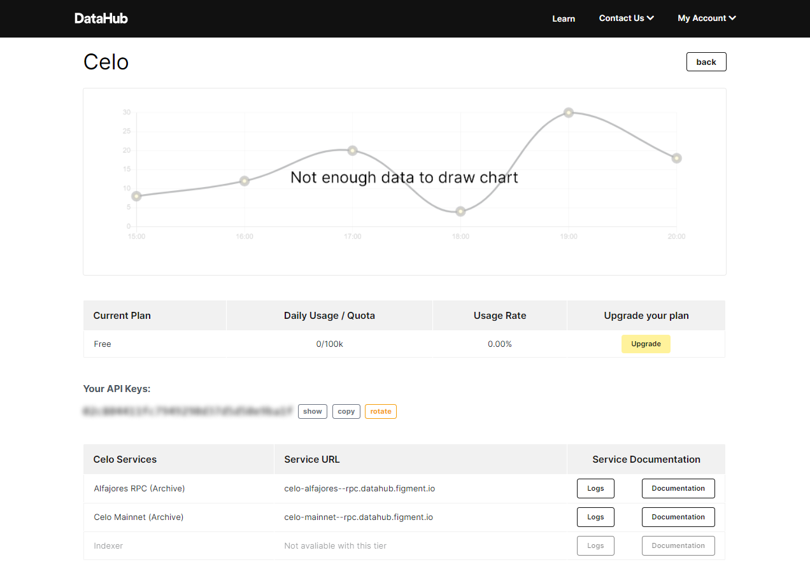
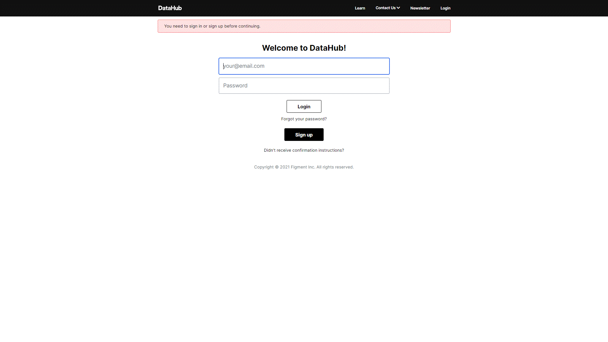

# 🏁 Get Started With DataHub

## **1. Creating an Account**

**Step 1:** Users are able to sign up on DataHub and select the network they will be building on. 

When completed, you will receive an invite link such as:

https://datahub.figment.io/users/confirm?token=$NumbersAndLetters

**Step 2:** Click on this link and you will be redirected to the DataHub website where you will be redirected to your network’s services page.

## **2. User Dashboard**

**Step 1:** After logging in, you will see all the services that you are currently subscribed to. In the screenshot below, you can see Celo Alfajores and Mainnet RPC. 

**Step 2:** You are then able to click on the “documentation” button to get more info regarding the integration.

## **3. Accessing a Network**

In this example, we’ll access the Celo Mainnet at https://celo-mainnet.datahub.figment.network/

**Step 1**: When clicking on the “documentation” button, you will be provided with the URL for this service. This URL should be a drop in replacement for any other full node URL you are currently using with the addition of the DataHub API key to access it.

**Step 2**: Depending on your setup, there are two ways to use your API key.

You can specify your API key with the Authorization header. Here is an example curl:

`curl -H "Authorization: $YOUR_API_KEY" https://celo-mainnet.datahub.figment.io/the/path`

Or you can specify your API key as a prefix to the path like, /apikey/YOUR\_API\_KEY/the/path. If choosing this option, the full path for curl would look like:

`curl https://celo-mainnet.datahub.figment.network/apikey/YOUR_API_KEY/the/path`

**Step 3**: Documentation for all available endpoints for each network can be found linked within DataHub page for each network.

## **4. Managing API Keys**

**Step 1:** Each service has a unique API key. When required, a user can rotate the API by clicking the “rotate” button within a service group.

This will display a new “API Key” and also the “Old Key”. To help with a smooth release process, both keys will be valid until the Old Key is removed by clicking the “remove” button.

\*\*\*\*[**Sign up now**](https://datahub.figment.io/sign_up) ****to start building in minutes and discover the superpowers Datahub can offer you! 

[**Subscribe**](https://datahub.figment.io/subscribe) to the DataHub newsletter to be the first to know about new protocols launches and new features! 

