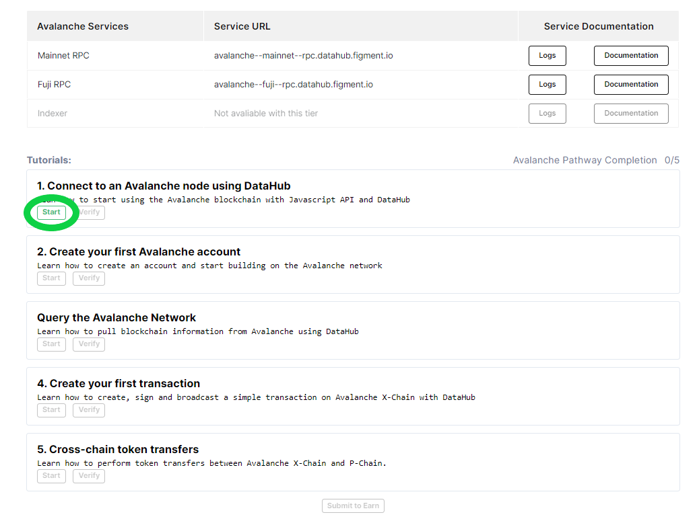
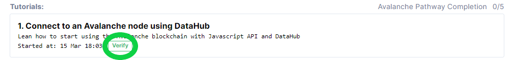

# 🗺 Avalanche Pathway

##  Welcome to the **Avalanche** Pathway

[Avalanche](https://avax.network) is an open-source platform for launching decentralized applications and enterprise blockchain deployments in one interoperable, highly scalable ecosystem. Avalanche is the first smart contracts platform that processes 4,500+ transactions/second and instantly confirms transactions. Ethereum developers can quickly build on Avalanche as Solidity works out-of-the-box.

A key difference between Avalanche and other decentralized networks is the consensus protocol. Over time, people have come to a false understanding that blockchains have to be slow and not scalable. The Avalanche protocol employs a novel approach to consensus to achieve its strong safety guarantees, quick finality, and high-throughput, without compromising decentralization. Learn what makes it unique and build your first project to **earn $20 in AVAX**!

## **🏁** Get started by signing up for DataHub 

Once you are ready, get started by [**setting up an account on DataHub**](https://datahub.figment.io/sign_up?service=avalanche) to put your skills to the test and follow-along the tutorials to start building on Avalanche. Make sure to click on "Start" on the first tutorial before starting to code!

Verify each tutorial as you complete them and make sure to click on "Submit to earn" when you are done with the five tutorials to access the completion form.

[**Learn more about DataHub**](https://learn.figment.io/guides/datahub-products)**.**

\*\*\*\*[**Make sure to read our Terms of Use before starting**](https://learn.datahub.figment.io/terms-of-use)**.**

## \*\*\*\* **Avalanche** Pathway Tutorials

###  [Get started by signing up to DataHub](https://datahub.figment.io/sign_up?service=avalanche)!


Make sure to use a browser that does not hide your IP address, we will deny submissions with hidden IPs.

We also do not accept "Google phone numbers" or any online SMS number.


### 💡 1. Connect to an Avalanche node using DataHub



### 💡 2. Create your first Avalanche account



### 💡 3. Query the Avalanche Network



### 💡 4. Create your first transaction



### 💡 5. Create your first cross-chain token transfers



##  Extra Avalanche Pathway Challenges 

Avalanche is providing Bonus Activity Rewards for additional activities following the completion of the Avalanche Pathway tutorials. Complete any of these challenges and earn more AVAX tokens!

Simply fill [**this form**](https://forms.gle/nVNBbSEghuH9aUzx5) and include direct links for our reference. Bonus Activity Rewards will be given out at the discretion of the reviewer. Please provide any context you would like us to consider to maximize your Bonus Activity Reward.

### ​  Twitter \($5 in AVAX each\) 

1. Post a lesson learned about the Avalanche platform, tools, community, etc.
2. Post a screenshot of what you just built with Avalanche
3. Share a public link to a repository with your code
4. Start a debate about the pros / cons of Avalanche
5. Launch a meme war with Avalanche prominently featured

Make sure to refer to Figment Learn in your tweet!

### ​  Medium \($20 in AVAX each, `1500-2000` words each\) 

1. Recount your Avalanche learning experience
2. Share your ideas for improving the Avalanche developer experience
3. Describe the business case for a DApp that should be built on Avalanche
4. Write a list of the key features you discovered about Avalanche
5. Compare Avalanche with another technology, blockchain or otherwise

Make sure to refer to Figment Learn in your post!

### ​  Github \(`$50` in AVAX each up to `1` max of `meaningful` piece of software\) 

1. Build a demo of an interesting Avalanche feature
2. Integrate Avalanche with a popular framework
3. Adapt a popular, existing system to use Avalanche
4. Extend an existing Avalanche sample into something better
5. Contribute to the Avalanche codebase

#### ​[Join our community today](https://discord.gg/PtkKz5) if you want to interact with other Avalanche builders and become a part of this growing ecosystem! 

