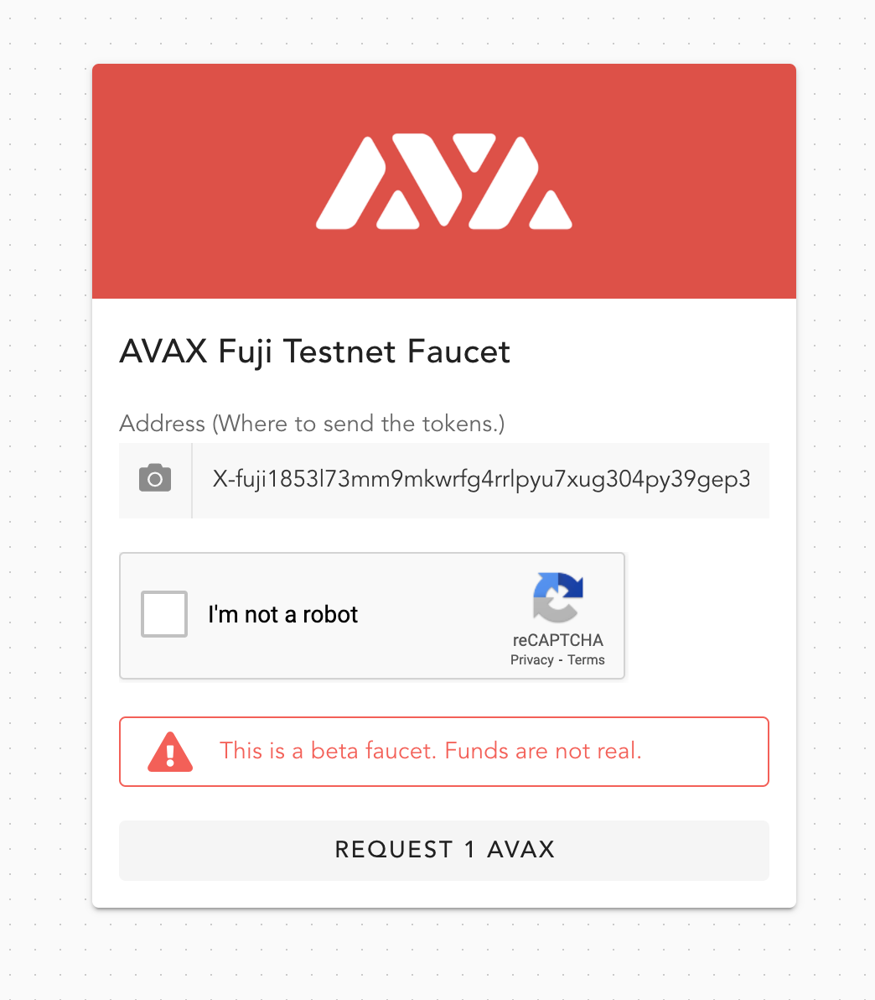
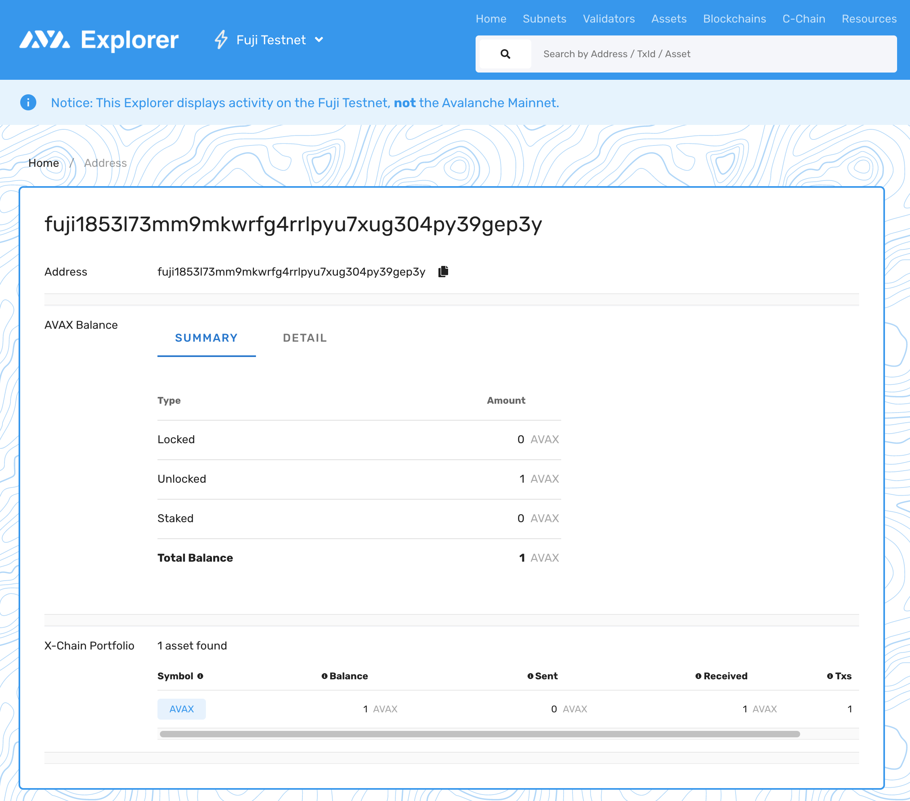

# 2. Create your first Avalanche account

## Introduction

In this tutorial we will be creating your first Avalanche account on X-Chain using the Avalanche JavaScript API and DataHub.

Unlike other popular blockchain, Avalanche comes with a set of different chains, each for its own purposes:

* **X-Chain** - For asset transfers.
* **P-Chain** - For network validators and staking.
* **C-Chain** - For smart contract execution.

### X-Chain

The X-Chain acts as a decentralized platform for creating and trading digital smart assets, a representation of a real-world resource \(e.g., equity, bonds\) with a set of rules that govern its behavior, like "can’t be traded until tomorrow" or "can only be sent to US citizens."

One asset traded on the X-Chain is AVAX. When you issue a transaction to a blockchain on Avalanche, you pay a fee denominated in AVAX.

### P-Chain

The P-Chain is the metadata blockchain on Avalanche and coordinates validators, keeps track of active subnets, and enables the creation of new subnets. The P-Chain implements the Snowman consensus protocol.

### C-Chain

The C-Chain allows for the creation of smart contracts using the C-Chain’s API, and is an instance of the Ethereum Virtual Machine powered by Avalanche.

## Prerequisites

Please make sure that you have completed the tutorials:

* [Connecting to Avalanche node with DataHub](https://learn.figment.io/network-documentation/avalanche/tutorials/pathway/1.-connect-to-avalanche-node-with-datahub)

We will be building on top of the Node.js application created in these tutorials.



## Creating an Account

We are finally ready to jump in and create our first Avalanche account. There are currently a few ways to create a new account on Avalanche network:

* Programmatically, with Avalanche Javascript API \(this tutorial\).
* In browser, by using the [Avalanche Wallet](https://wallet.avax.network/).

We will be creating our account programmatically using the Javascript client package, however you might find it useful to explore other options.

Let's start by creating a new file `create_account.js`:

```javascript
const fs = require("fs")

// Load and configure Avalanche client
const client = require("./client")

// Path where we will keep the credentials for the pathway
const credentialsPath = "./credentials"

async function main() {
  // 1. Configure keychain
  // 2. Generate private key
  // 3. Check address balance
}

main().catch((err) => {
  console.log("We have encountered an error!")
  console.error(err)
})
```

If this looks familiar, it is because we used the same code in the first tutorial! We will be adding our code within the body of the `main` function.

### Configure keychain

Before we can issue transactions on the network we'll need to create our private key. A private key is used to sign transactions on any Avalanche chain \(X/P/C\), and for educational purposes we'll use a single private key during the Pathway. To manage the keys we first configure the Keychain, a component for managing private/public key pairs and addresses.

We will be storing the secret key in `./credentials/keypair.json` file, so make sure to create the directory `credentials` first. On Mac/Linux you can do that with:

```text
mkdir credentials
```

Onto the code, let's replace the `// 1. Configure keychain` inside our `main` function with:

```javascript
// Initialize the X-Chain client and keychain
const chain = client.XChain()
const keyChain = chain.keyChain()
const keyPath = `${credentialsPath}/keypair.json`
```

Great, we can move onto the next part.

### Generate private key

We have instantiated the X-Chain client and the Keychain. Next, let's add the part to create a new key, or read an existing key from the JSON file.

Replace `// 2. Generate private key` inside our `main` function with:

```javascript
// Check if we already have an existing key
if (!fs.existsSync(keyPath)) {
  console.log("Generating a new keypair...")
  const key = keyChain.makeKey()

  console.log("Saving keypair to", keyPath)
  fs.writeFileSync(keyPath, JSON.stringify({
    pubkey: key.getPublicKeyString(),
    privkey: key.getPrivateKeyString(),
  }, null, 2))
}

console.log("Loading credentials into keychain...")
const data = JSON.parse(fs.readFileSync(keyPath))

const key = keyChain.importKey(data.privkey)
console.log("Imported X-chain address:", key.getAddressString())
```

The key functionality above is:

* `keyChain.makeKey()` generates a new private key. You can have as many private keys as you like, for different purposes, like staking or token transfers.
* `keyChain.importKey(...)` loads an existing private key. Could be loaded from an environment variable or a file \(in our case\).

### Check address balance

So far, we have generated a private key and can print out its X-Chain address. We want to know the address so we can use Avalanche Faucet to request funds for testing.

[Avalanche Faucet](https://faucet.avax-test.network/) is a service run by Avalanche to fund accounts on Fuji Testnet for development purposes. Funds are not real and can be requested at any time \(provided that you can pass the captcha\).

Finally, let's add the last chunk of code to perform balance checking of our X-Chain address. We're replacing `// 3. Check address balance` part of the `main` function:

```javascript
console.log("Fetching address balances...")
const balances = await chain.getAllBalances(key.getAddressString())

if (balances.length > 0) {
  console.log(balances)
} else {
  console.log("Address does not have any associated balances yet.")
  console.log("==============================================================")
  console.log("Visit https://faucet.avax-test.network/ to pre-fund your address.")
  console.log("==============================================================")
}
```

An address on Avalanche network might have balances for different assets, not just `AVAX`. For that particular reason it's easier to use `chain.getAllBalances` method instead of `chain.getBalance(address, assetID)` as one must know the real asset ID \(and not its symbol\) before a call like that could be made. We will cover that part later in the Pathway track.

### Running code

Great, we have covered all parts of the process, from keychain configuration to balance checking. Let's fire it up:

```bash
node create_account.js
```

You should be able to see a similar output:

```text
Generating a new keypair...
Saving keypair to ./credentials/keypair.json
Loading credentials into keychain...
Imported X-chain address: X-fuji1853l73mm9mkwrfg4rrlpyu7xug304py39gep3y
Fetching address balances...
Address does not have any associated balances yet.
==============================================================
Visit https://faucet.avax-test.network/ to pre-fund your address.
==============================================================
```

Looks like everything worked! However, our X-Chain address does not have a balance, which means we will not be able to send funds to another address until we get some test tokens.

Head over to the [Avalanche Faucet](https://faucet.avax-test.network/) page, enter the address from the output above \(must be your own address!\) and click on "Request 1 AVAX". You should see the successful confirmation page, meaning that your address is now funded with `1 AVAX`.



Re-run the `node create_account.js` command. We should be getting the balance output this time:

```text
Loading credentials into keychain...
Imported X-chain address: X-fuji1mgphwmvjyru6mrvpzkv4ve3rrj6n6xjz4qz0mg
Fetching address balances...
[ { asset: 'AVAX', balance: '1000000000' } ]
```

Success, we've got some money in the bank! Avalanche native currency uses 9-digit denomination, so a value like `1000000000` is really a `1` in human readable form.

You can also check your newly created address using [Avalanche Explorer](https://explorer.avax-test.network). Enter the address into the search input \(top right\) and it should be able to find your account info.



## Conclusion

You now have an account \(or an address\) on the Avalanche Fuji Testnet, and your private keys are stored in the `credentials/keypair.json` file. Your account is also loaded with test tokens that you can use for testing purposes. You have also learned how to check account balances using the DataHub node.

## Next steps

In the next tutorial, we will be looking at different queries we can run against the network node to get the following information:

* Validator set
* Address balances
* Current block height
* Minimum fees for transactions

If you had any difficulties following this tutorial or simply want to discuss Avalanche tech with us you can join [**our community**](https://discord.gg/fszyM7K) today!

