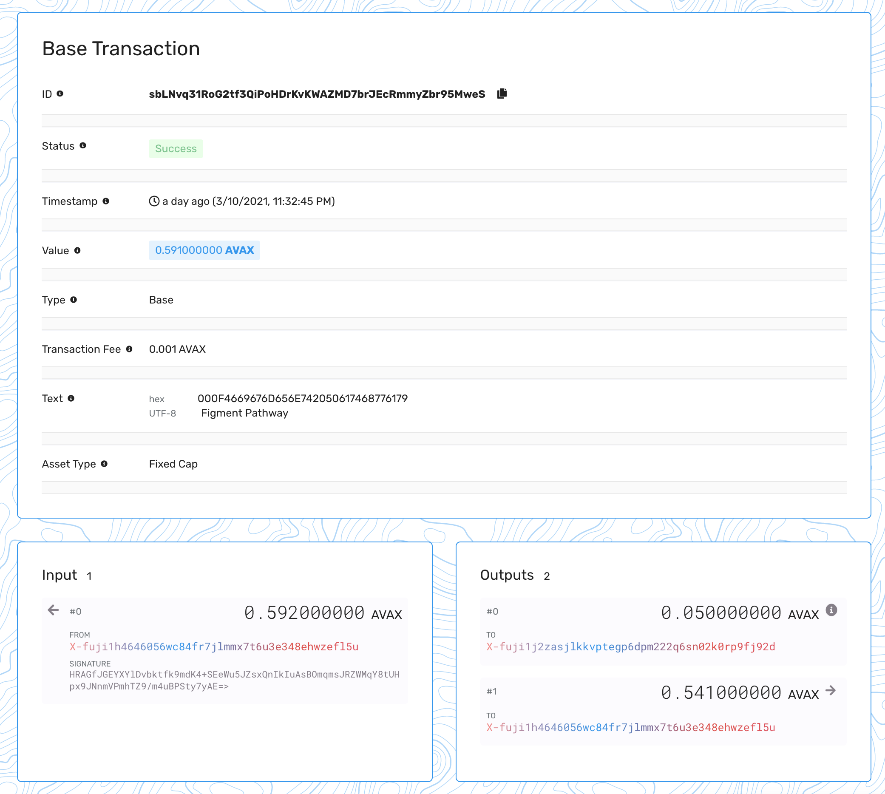

# 4. Create your first transaction

## Introduction

We've got a basic knowledge on how to interact with the blockchain, but so far we've only performed read operations. In this tutorial we will learn how to create a simple transactions, sign and broadcast them on the Avalanche network.

## Prerequisites

Please make sure to have completed the previous steps of the Pathway:

* [Connecting to Avalanche node with DataHub](https://learn.figment.io/network-documentation/avalanche/tutorials/pathway/1.-connect-to-avalanche-node-with-datahub)
* [Creating your first Avalanche account](https://learn.figment.io/network-documentation/avalanche/tutorials/pathway/2.-create-your-first-avalanche-account)
* [Querying the Avalanche network](https://learn.figment.io/network-documentation/avalanche/tutorials/pathway/3.-query-the-avalanche-network)



## Creating a transaction

We already know that Avalanche is not your typical blockchain, with P/X/C chains supporting various operations. Each of these chains also has its own set of transaction types, however, we are looking to create a very simple one - a token transfer, and specifically on X-Chain.

In layman's terms: We will be sending some AVAX tokens from address A to address B to simulate a payment for goods/services. Simple as that.

Let's start by creating a new file `transfer.js`:

```javascript
// Load libraries and helpers
const fs = require("fs")
const client = require("./client")
const avalanche = require("avalanche")
const binTools = avalanche.BinTools.getInstance()

// Path where we keep the credentials for the pathway
const credentialsPath = "./credentials"

async function main() {
  // 1. Init keychain
  // 2. Prepare transaction
  // 3. Send transaction to network
}

main().catch((err) => {
  console.log("We have encountered an error!")
  console.error(err)
})
```

A few new imports in sight: `avalanche` is the core Avalanche package, we already use it in the `client.js` file, but we'll need it for other things this time. `binTools` is a helper utility to perform encoding/decoding operations on certain data types, like Base58 strings.

### Init keychain

Just like in the second tutorial \(creating account\) we are going to load the private key into the keychain, so we can create and sign the transaction.

Add the following code to the `// 1. Init keychain` part of the `main` function:

```javascript
// Initialize chain components
const chain = client.XChain()
const keychain = chain.keyChain()

// Import X-chain key from the previously created file
const data = JSON.parse(fs.readFileSync(`${credentialsPath}/keypair.json`))
const key = keychain.importKey(data.privkey)
```

Nothing really new here. Moving on.

### Prepare transaction

Next, before we can build a transaction, we need to find UTXOs for our address. Whats a UTXO?

A [UTXO](https://medium.com/bitbees/what-the-heck-is-utxo-ca68f2651819) is an unspent transaction output. In an accepted transaction in a valid blockchain payment system, only unspent outputs can be used as inputs to a transaction. When a transaction takes place, inputs are deleted and outputs are created as new UTXOs that may then be consumed in future transactions.

Code from this section goes into `// 2. Prepare transaction` part of the `main` function.

We can obtain the UTXOs with the following code:

```javascript
// Fetch UTXO (i.e unspent transaction outputs)
const address = key.getAddressString()
const { utxos } = await chain.getUTXOs(address)
```

These outputs will be used as inputs for our new transaction. Now, let's prepare some details about the transaction:

```javascript
// Prepare transaction details
const receiver = "X-fuji1j2zasjlkkvptegp6dpm222q6sn02k0rp9fj92d" // Pathway test receiver address
const amount = "50000000" // Total amount we're transferring = 0.05 AVAX
const asset = "AVAX" // Primary asset used for the transaction (Avalanche supports many)
```

You can pick any X-Chain address as a receiver \(including your own\), though for testing purposes we're also providing Figment's test address so you can track your progress. Transaction amount is `0.05` AVAX - remember, AVAX asset is using a 9-digit denomination. AVAX is the primary asset on the X chain, so we'll be using that.

Next step is to determine the real asset ID for symbol `AVAX`:

```javascript
// Determine the real asset ID from its symbol/alias
// We can also get the primary asset ID with chain.getAVAXAssetID() call
const assetInfo = await chain.getAssetDescription(asset)
const assetID = binTools.cb58Encode(assetInfo.assetID)
```

Because the following `buildBaseTx` expects an ID instead of symbol, we can even hardcode the asset ID into the code to reduce amount of API calls. Asset ID does not change after its creation. Still, we want to know how to properly translate a symbol into its ID. BinTools helper does the conversion of raw response data into the Base58 encoding format.

Now is a good time to print out our current balance, so we can see any changes after our transaction is submitted:

```javascript
// Fetch our current balance
let balance = await chain.getBalance(address, assetID)
console.log("Balance before sending tx:", balance)
```

We have everything we need to prepare our transaction:

```javascript
// Generate a new transaction
const unsignedTx = await chain.buildBaseTx(
  utxos, // unspent outputs
  new avalanche.BN(amount), // transaction amount formatted as a BigNumber
  assetID, // AVAX asset
  [receiver], // addresses to send the funds
  [address], // addresses being used to send the funds from the UTXOs provided
  [address], // addresses that can spend the change remaining from the spent UTXOs
  binTools.stringToBuffer("Figment Pathway") // memo, totally optional
)
```

At this point our transaction is ready to be signed and broadcasted on the network.


Transaction builder method `buildBaseTx` calculates transaction fees automatically.


### Send transaction

A transaction does not really exist until it gets processed by the network. Before we can broadcast a transaction, it must be signed with a private key. The process of signing transactions is specific to each blockchain, and can be rather technical. Here, we use [avalanche.js](https://app.gitbook.com/@figment-learn/s/learn-docs/~/drafts/-MVZIu39Z0TUAZCEqKos/network-documentation/avalanche/tutorials/pathway/4.-create-your-first-transaction/@comments/57c067fa0a6b492c8a6c73977a42ae63/avalanche.js) to condense it into a single line of code.

Code from this section goes into `// 3. Send transaction to network` part of the `main` function.

Sign the transaction:

```javascript
// Generate a signed transaction
const signedTx = unsignedTx.sign(keychain)
```

That's it! We're ready to broadcast the transaction:

```javascript
// Send transaction to network
const txID = await chain.issueTx(signedTx)
console.log("Transaction submitted!")
console.log("----------------------------------------------------------------")
console.log(`Visit https://explorer.avax-test.network/tx/${txID} to see transaction details`)
console.log("----------------------------------------------------------------")
```

Avalanche has a very short transaction finality timeframe \(ie how fast a transaction is approved\), usually within seconds, which makes it great for almost real-time payment processing.

Next, we'll check if our transaction gets accepted:

```javascript
// Check transaction status
let status = await chain.getTxStatus(txID)
console.log("Current transaction status:", status)

// Wait 2s
setTimeout(async function() {
  // Check status again
  status = await chain.getTxStatus(txID)
  console.log("Updated transaction status:", status)

  // Final balance check
  balance = await chain.getBalance(address, assetID)
  console.log("Balance after sending tx:", balance)
}, 2000)
```

We're checking the transaction status, waiting a short amount of time, updating the transaction status and finally displaying the balance. When the transaction is accepted and confirmed, you will see the status change to `Accepted` and the balance update.

## Running code

Time to see our code in action:

```javascript
node transfer.js
```

Here's an example output:

```javascript
Balance before sending tx: {
  balance: '592000000',
  utxoIDs: [
    {
      txID: 'uAMRpSBfVNmHTMjNAdNyrMJ7HH4RYCN17p4PpsRj8L8zXTPjf',
      outputIndex: 1
    }
  ]
}
Transaction submitted!
----------------------------------------------------------------
Visit https://explorer.avax-test.network/tx/sbLNvq31RoG2tf3QiPoHDrKvKWAZMD7brJEcRmmyZbr95MweS to see transaction details
----------------------------------------------------------------
Current transaction status: Unknown
Updated transaction status: Accepted
Balance after sending tx: {
  balance: '541000000',
  utxoIDs: [
    {
      txID: 'sbLNvq31RoG2tf3QiPoHDrKvKWAZMD7brJEcRmmyZbr95MweS',
      outputIndex: 1
    }
  ]
}
```

Everything worked out so far. You can check the provided explorer link to see all transaction details.



Looking at the before/after balances, we can determine the TX fee from calculation: `592000000(before)-541000000(after)-50000000(tx amount)`. Fee amount is `1000000` or `0.001` AVAX. We already know the base TX fee from the previous tutorial.

## Conclusion

We've learned how to prepare, sign and broadcast a simple transaction on Avalanche. With basically a few lines of code you can transfer funds on the network, though Avalanche.js provides a wide range of examples on how to construct a transaction with a bit more complex properties, for different use cases. See [examples on Github](https://github.com/ava-labs/avalanchejs/tree/master/examples/avm).

## Next Steps

Our next topic is the cross-chain transfers. Since Avalanche operates on 3 chains \(X/P/C\), it allows users to transfer tokens in each direction. We'll be concentrating our efforts on X-&gt;C swaps, with C-Chain being used for smart contract deployments.

If you had any difficulties following this tutorial or simply want to discuss Avalanche tech with us you can join [**our community**](https://discord.gg/fszyM7K) today!

