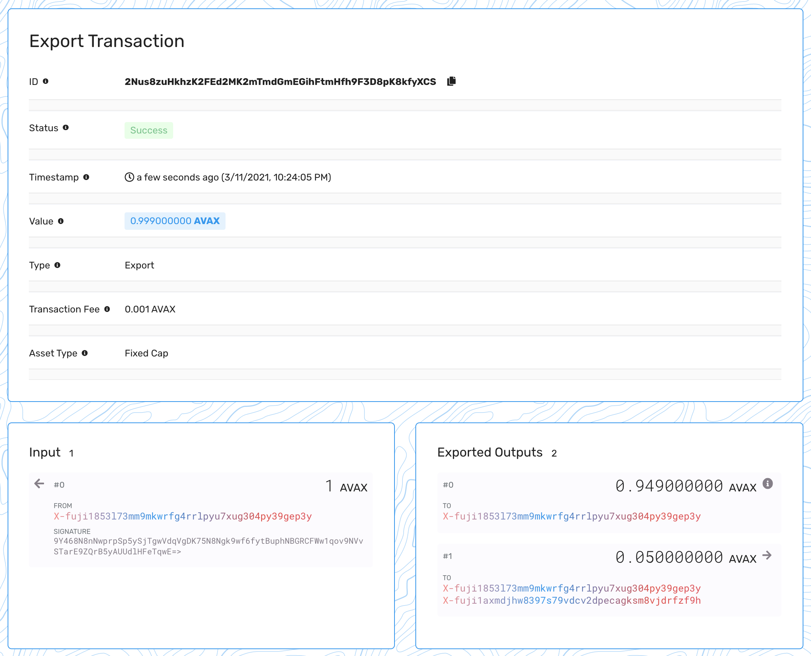
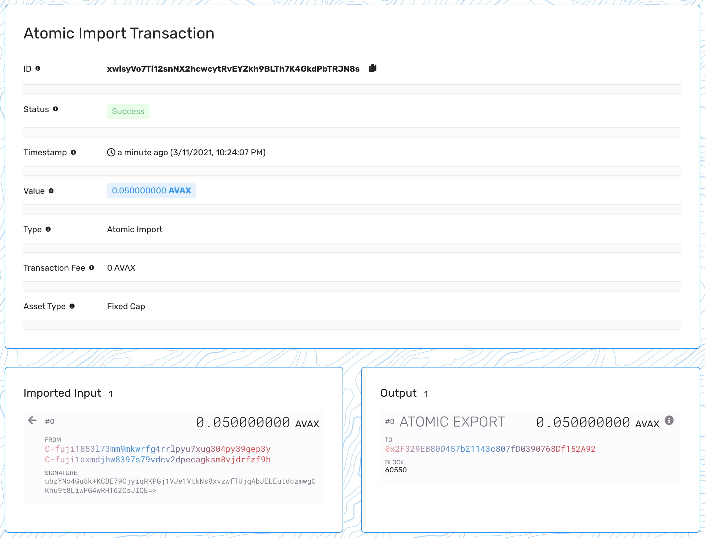

# 5. Create your first cross-chain token transfers

## Introduction

In the previous tutorial, we've covered some basic token transfers within the Avalanche X-Chain.

AVAX tokens exist on the X-Chain, where they can be traded, on the P-Chain, where they can be provided as a stake when validating the Primary Network, and on the C-Chain, where they can be used in smart contracts or to pay for gas. Avalanche supports movement of AVAX between these chains, and in the future, Avalanche will support more generic atomic swaps between chains. In this tutorial, we’ll send AVAX tokens form the X-Chain to C-Chain.

Interchain transfers are performed via a 2-step process:

* Create X-Chain export transaction
* Create C-Chain import transaction

## Prerequisites

Please make sure that you have completed the tutorials:

* [Connecting to Avalanche node with DataHub](https://learn.figment.io/network-documentation/avalanche/tutorials/pathway/1.-connect-to-avalanche-node-with-datahub)
* [Creating your first Avalanche account](https://learn.figment.io/network-documentation/avalanche/tutorials/pathway/2.-create-your-first-avalanche-account)
* [Querying the Avalanche network](https://learn.figment.io/network-documentation/avalanche/tutorials/pathway/3.-query-the-avalanche-network)
* [Create your first transaction](https://learn.figment.io/network-documentation/avalanche/tutorials/pathway/4.-create-your-first-transaction)



## Transferring tokens

Avalanche C-Chain is a new chain we're going to work with. Unlike the X/P chains, the C-Chain is powered by the Avalanche EVM \(Ethereum Virtual Machine\) and is compatible with existing Ethereum tools and ecosystem. The C-Chain is used to deploy smart contracts, though we're not covering that part in the tutorial. Still, if we ever need to operate on C-Chain, we must first set up an address and fund it. Funding is possible via a testnet Faucet \(for development purposes\) or via an interchain transfer.

First, we are going to import a new javascript package `ethereumjs-util` to deal with Ethereum-based credentials. Avalanche.js library does not provide such functionality out of the box, so let's go ahead and install it:

```bash
npm install --save ethereumjs-util
```

Next, create a new file `interchain_transfer.js` with the following content:

```javascript
// Load libraries and helpers
const fs = require("fs")
const avalanche = require("avalanche")
const client = require("./client")
const ethUtil = require("ethereumjs-util")
const binTools = avalanche.BinTools.getInstance()

// Path where we keep the credentials for the pathway
const credentialsPath = "./credentials"

async function main() {
  // 1. Init keychain
  // 2. Init Eth key for the C-Chain
  // 3. Perform transfer
}

async function createExport(client, xChain, xKeychain, cKeychain) {
  // Will fill later
}

async function createImport(client, cChain, cKeychain, address) {
  // Will fill later
}

main().catch((err) => {
  console.log("We have encountered an error!")
  console.error(err)
})
```

### Init keychain

Let's configure the keychain. In addition of X keychain we will need to init one for the C-Chain. Replace the `// 1. Init keychain` in the `main` function with the following code:

```javascript
// Initialize chain components
const xChain = client.XChain()
const xKeychain = xChain.keyChain()
const cChain = client.CChain()
const cKeychain = cChain.keyChain()

// Import keypair from the previously created file
const data = JSON.parse(fs.readFileSync(`${credentialsPath}/keypair.json`))
xKeychain.importKey(data.privkey)
cKeychain.importKey(data.privkey)
```

Looks almost identical to the X-Chain init.

### Init Ethereum key

Addresses on AVM \(Avalanche Virtual Machine\) have a format like `X-fujiXXXX` / `C-fujiXXXX` \(on Testnet that is\) but on EVM the address has a different format like `0x572f4D80f10f663B5049F789546f25f70Bb62a7F`. We'll need to derive our Eth-like address from Avalanche private key.

Replace the `// 2. Init Eth key for the C-Chain` part of the `main` function with:

```javascript
// Derive Eth-like address from the private key
  const keyBuff = binTools.cb58Decode(data.privkey.split('-')[1])
  const ethAddr = ethUtil.Address.fromPrivateKey(Buffer.from(keyBuff, "hex")).toString("hex")
  console.log("Derived Eth address:", ethAddr)
```

The code above decodes our Avalanche private key and uses the Etherium helper library to convert it into an address on EVM chain. This address is going to receive the funds.

### Create X-Chain export transaction

First step in the interchain transfer is to create an export transaction. Let's go ahead and add the following code into the `createExport` method body:

```javascript
// Prepare transaction details
const amount = "50000000" // Total amount we're transferring = 0.05 AVAX
const asset = "AVAX" // Primary asset used for the transaction (Avalanche supports many)

// Fetch UTXOs (i.e unspent transaction outputs)
const addresses = xKeychain.getAddressStrings()
const utxos = (await xChain.getUTXOs(addresses)).utxos

// Determine the real asset ID from its symbol/alias
const assetInfo = await xChain.getAssetDescription(asset)
const assetID = avalanche.BinTools.getInstance().cb58Encode(assetInfo.assetID)

// Fetch current balance
let balance = await xChain.getBalance(addresses[0], assetID)
console.log("Current X-Chain balance:", balance)

// Get the real ID for the destination chain
const destinationChain = await client.Info().getBlockchainID("C")

// Prepare the export transaction from X -> C chain
const exportTx = await xChain.buildExportTx(
  utxos, // Unspent transaction outpouts
  new avalanche.BN(amount), // Transfer amount
  destinationChain, // Target chain ID (for C-Chain)
  cKeychain.getAddressStrings(), // Addresses being used to send the funds from the UTXOs provided
  xKeychain.getAddressStrings(), // Aaddresses being used to send the funds from the UTXOs provided
  xKeychain.getAddressStrings(), // Addresses that can spend the change remaining from the spent UTXOs
)

// Sign and send the transaction
  const exportTxID = await xChain.issueTx(exportTx.sign(xKeychain))
  console.log("X-Chain export TX:", exportTxID)
  console.log(` - https://explorer.avax-test.network/tx/${exportTxID}`)
```

You might notice similarities with the previous tutorial, except that we're building a different type of transaction. AVAX amount is the same.

When performing exports/imports, we must determine the source/destination chain IDs, that's where the `await client.Info().getBlockchainID("ALIAS")` comes into play.

### Create C-Chain import transaction

Interchain transfers are not a single operation as it might seem, so in order to complete the transfer to C-Chain, we need to import the transaction from X-Chain.

Add the following code into the `createImport` method:

```javascript
// Get the real ID for the source chain
const sourceChain = await client.Info().getBlockchainID("X")

// Fetch UTXOs (i.e unspent transaction outputs)
const { utxos } = await cChain.getUTXOs(cKeychain.getAddressStrings(), sourceChain)

// Generate an unsigned import transaction
const importTx = await cChain.buildImportTx(
  utxos,
  address,
  cKeychain.getAddressStrings(),
  sourceChain,
  cKeychain.getAddressStrings()
)

// Sign and send import transaction
const importTX = await cChain.issueTx(importTx.sign(cKeychain))
console.log("C-Chain import TX:", importTX)
console.log(` - https://explorer.avax-test.network/tx/${importTX}`)
```

Very similar process for the import part of the transfer.

### Running the code

Finally, with both export and import methods complete, we can tie everything together before we can run the code.

Replace the `// 3. Perform transfer` in the `main` function with the following code:

```javascript
// Create a X->C export transaction
await createExport(client, xChain, xKeychain, cKeychain)

// Add some delay to let the transaction clear first, then perform the import
setTimeout(async function() {
  await createImport(client, cChain, cKeychain, ethAddr)

  console.log("----------------------------------------------------------------")
  console.log(`Visit https://cchain.explorer.avax-test.network/address/${ethAddr} for balance details`)
  console.log("----------------------------------------------------------------")
}, 3000)
```

We're ready to roll. Run the code with:

```bash
node interchain_transfer.js
```

Successful output might look like:

```javascript
Derived Eth address: 0x2f329eb80d457b21143c807fd0390768df152a92
Current X-Chain balance: 1000000000

X-Chain export TX: 2Nus8zuHkhzK2FEd2MK2mTmdGmEGihFtmHfh9F3D8pK8kfyXCS
 - https://explorer.avax-test.network/tx/2Nus8zuHkhzK2FEd2MK2mTmdGmEGihFtmHfh9F3D8pK8kfyXCS

C-Chain import TX: xwisyVo7Ti12snNX2hcwcytRvEYZkh9BLTh7K4GkdPbTRJN8s
 - https://explorer.avax-test.network/tx/xwisyVo7Ti12snNX2hcwcytRvEYZkh9BLTh7K4GkdPbTRJN8s

----------------------------------------------------------------
Visit https://cchain.explorer.avax-test.network/address/0x2f329eb80d457b21143c807fd0390768df152a92 for balance details
----------------------------------------------------------------
```

If you follow the explorer link, you will see that our account balance has changed \(it has a zero balance upon creation\). Explorer might pick up network updates in a minute or two, so be sure to give it some time if balance is still displaying 0 on the address details page.





## Conclusion

Congratulations, you've made it this far and successfully completed an AVAX transfer from X-Chain to C-Chain. Similarly, the same approach works the other way around \(C-&gt;X\), or for any other inter-chain transfers.

Avalanche team has put together a [good list of examples](https://github.com/ava-labs/avalanchejs/tree/master/examples/avm), be sure to check them out if you need a bit more advanced experience with the Avalanche.js library.

## Next Steps

Ready for more? No problem! While the basic Pathway is complete at this point, you are more than welcome to explore other [Avalanche Learn](https://learn.figment.io/network-documentation/avalanche/tutorials) tutorials.

If you had any difficulties following this tutorial or simply want to discuss Avalanche tech with us you can join [**our community**](https://discord.gg/fszyM7K) today!

