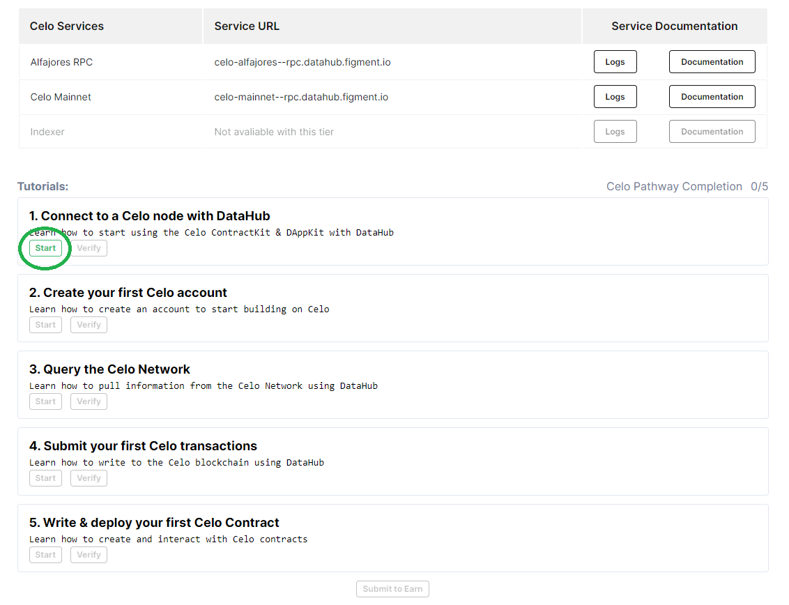
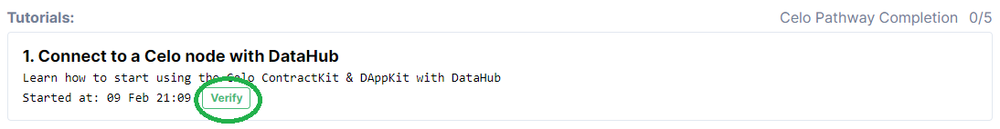

# 🗺 Celo Pathway

##  Welcome to the Celo Pathway

Celo’s aim is to empower anyone with a smartphone anywhere in the world to have access to financial services, send money to phone numbers, and pay merchants -- on a decentralized platform that is operated by a community of users.   
  
To achieve this, Celo offers a complete stack of new blockchain software, core libraries that run on that blockchain, and end-user applications including a Wallet app that communicates with that logic. Learn what makes it unique and build your first project.


There are currently no rewards for completing the intro Pathway. Advanced Pathways will be released shortly and provide new opportunities to earn.


## **🏁** Get started by signing up for DataHub 

Once you are ready, get started by [**setting up an account on DataHub**](https://datahub.figment.io/sign_up?service=celo) to put your skills to the test and follow-along the tutorials to start building on Celo. Make sure to click on "Start" on the first tutorial before starting to code!  

Verify each tutorial as you complete them and make sure to click on "Submit to earn" when you are done with the five tutorials to access the completion form. 

[**Learn more about DataHub**](https://learn.figment.io/guides/datahub-products)**.** 

\*\*\*\*[**Make sure to read our Terms of Use before starting**](https://learn.datahub.figment.io/terms-of-use)**.** 

## \*\*\*\* **Celo** Pathway Tutorials

###  [Get started by signing up to DataHub!](https://datahub.figment.io/sign_up?service=celo) 


Make sure to use a browser that does not hide your IP address, we will deny submissions with hidden IPs.   
  
We also do not accept "Google phone numbers" or any online SMS number. 


### 💡 1. Connect to a Celo node using DataHub



### 💡 2. Create your first Celo account 



### 💡 3. Query the Celo network



### 💡 4. Submit your first transactions



### 💡 5. Write & deploy your first Celo smart contract



##  Extra Celo Pathway Challenges


Bonus activities have been turned off for now until we launch the next Celo Pathway. 


Celo is providing Bonus Activity Rewards for additional activities following the completion of the Celo Pathway tutorials. Complete any of these challenges and earn more cUSD tokens!   
  
Bonus Activity Rewards will be given out at the discretion of the reviewer. Please provide any context you would like us to consider to maximize your Bonus Activity Reward. 

###  Twitter \($5 in cUSD each\)

1. Post a lesson learned about the Celo platform, tools, community, etc.
2. Post a screenshot of what you just built with Celo
3. Share a public link to a repository with your code
4. Start a debate about the pros / cons of Celo
5. Launch a meme war with Celo prominently featured

Make sure to refer to Figment Learn in your tweet! 

###  Medium \($20 in cUSD each, `1500-2000` words each\)

1. Recount your Celo learning experience
2. Share your ideas for improving the Celo developer experience
3. Describe the business case for a DApp that should be built on Celo
4. Write a list of the key features you discovered about Celo
5. Compare Celo with another technology, blockchain or otherwise

Make sure to refer to Figment Learn in your post! 

###  Github \(`$50` in cUSD each up to `1` max of `meaningful` piece of software\)

1. Build a demo of an interesting Celo feature
2. Integrate Celo with a popular framework
3. Adapt a popular, existing system to use Celo
4. Extend an existing Celo sample into something better 
5. Contribute to the Celo codebase

#### [Join our community today](https://discord.gg/PtkKz5) if you want to interact with other Celo builders and become a part of this growing ecosystem! 

