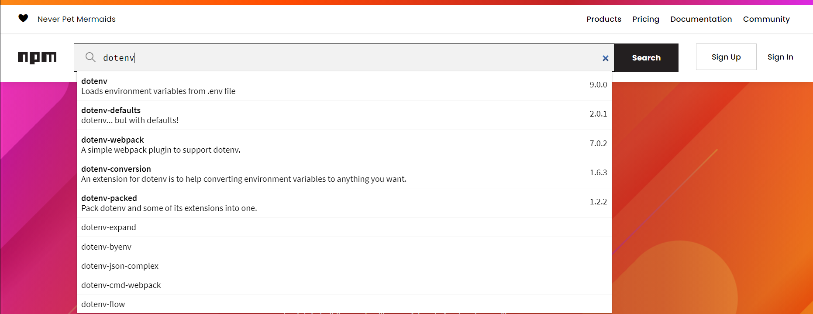

# Getting started with dotenv and .env files



## What are dotenv and .env?

`.env` is a [dotfile](https://medium.com/@webprolific/getting-started-with-dotfiles-43c3602fd789) which developers can use to store [environment variables](https://medium.com/chingu/an-introduction-to-environment-variables-and-how-to-use-them-f602f66d15fa) for use in various code projects. It is beneficial to learn more about the specifics of and the format of a `.env` file, as environment variables are rather common in software development. The basic syntax for environment variables within a `.env` file is simply `KEY=value` .  
Check the [parser rules](dotenv-and-.env.md#dotenv-parser-rules) below for a more detailed explanation.

`dotenv` is an npm package that simplifies usage of `.env` files. 



## How to use dotenv

### Installing it as a dependency



```
npm install --save dotenv
```



```text
yarn add dotenv
```



### Including it in a JavaScript source file



```javascript
require("dotenv").config();
```



```javascript
require("dotenv").config({path: './.env'});
```



### Referencing environment variables

```javascript
// When .env contains : ENV_NAME=Figment

const name = process.env.ENV_NAME;
console.log(`The ${name} community rocks!`); // The Figment community rocks!
```

### dotenv parser rules

* Empty lines are skipped
* Lines beginning with `#` \(comments\) are ignored by the parser
* `BASIC=basic` becomes `{BASIC: 'basic'}`
*  Empty values become empty strings - `EMPTY=` becomes `{EMPTY: ''}`
*  Inner quotes are maintained - `JSON={"foo": "bar"}` becomes `{JSON:"{\"foo\": \"bar\"}"`
*  Surrounding whitespace is removed from unquoted values \(`FOO= some_value` becomes `{FOO: 'some_value'}` \)
* Single and double quoted values maintain surrounding whitespace - `FOO=" some_value "` becomes `{FOO: ' some_value '}`
*  Double quoted values expand escaped newlines - `MULTILINE="new\nline"` becomes

```text
{MULTILINE: 'new
line'}
```

## .gitignore the .env

Read more about [ignoring files in git](https://docs.github.com/en/github/getting-started-with-github/ignoring-files) on the GitHub documentation. 


Ignore files are used in many different Open Source repositories. Since we are working with blockchains and cryptocurrency, it is imperative to point out the security implications of this method. This prevents _git_ from checking in the .env file to a public repository.  
If you are using a different code versioning system, there will be different requirements.


Create a file named `.gitignore` in the same directory as the project `package.json` and explicitly name the `.env` file on a line by itself within that `.gitignore` file. 



```text
.env
```



This is an important step to safeguarding any API keys, seed phrases or other sensitive information placed inside a `.env` file from being inadvertently sent to a public code repository on the internet, where they would immediately become vulnerable with a high likelihood of being scraped by bots.

