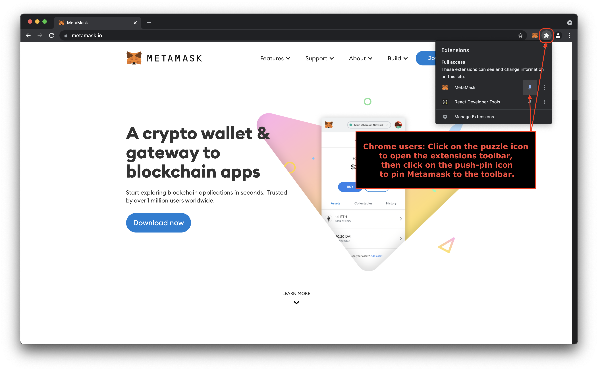
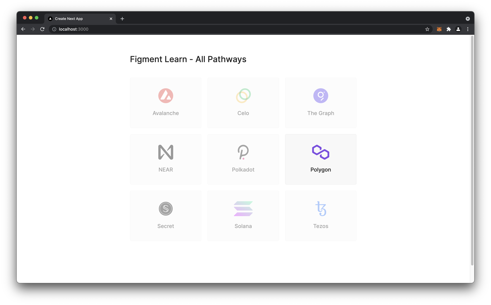
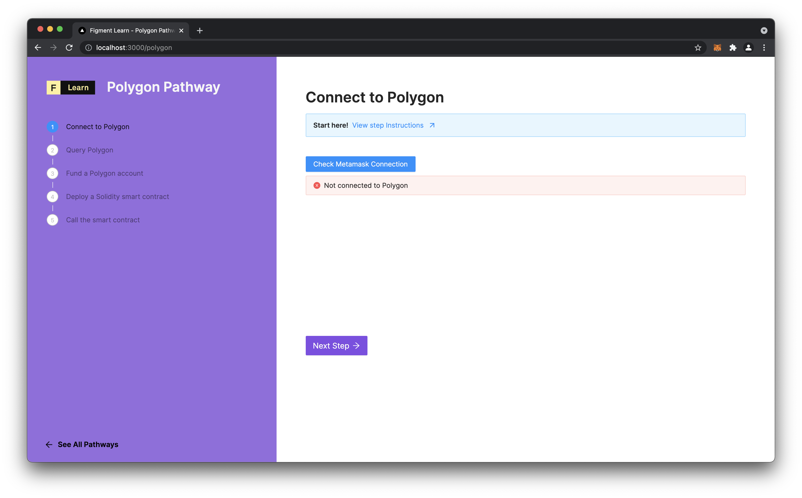

# 🗺 Polygon \(Matic\) Pathway

## What is Polygon?

"_Polygon is a protocol and a framework for building and connecting Ethereum compatible blockchain networks. Aggregating scalable solutions on Ethereum, supporting a multi-chain Ethereum ecosystem._"

Polygon is designed to interoperate with and solve some of Ethereum's limitations: Scaling, the speed of transaction throughput - and poor user experience such as the high cost of transactions. Polygon's testnets can currently reach over 7000 transactions per second and the low cost of the MATIC token means cheap transaction fees!  
  
Matic, the predecessor of Polygon, utilized a single scaling solution known as [Plasma](https://education.district0x.io/general-topics/understanding-ethereum/understanding-plasma/) which allows for 'child' blockchains to move transaction bloat off of the main Ethereum network. A Plasma chain can have different conditions to the main network, and can be specifically tuned to satisfy certain needs. Sidechains based on Plasma offer cheap and rapid transactions that are ultimately settled in batches on the main chain, so they benefit from the security of the main chain without compromising performance.

Today, Polygon operates a Proof-of-Stake \(PoS\) sidechain. Polygon will grow to include other scaling solutions like [zero knowledge proofs](https://consensys.net/blog/blockchain-explained/zero-knowledge-proofs-starks-vs-snarks/) and [optimistic rollups](https://blog.polygon.technology/polygon-research-ethereum-scaling-with-rollups-8a2c221bf644) in the future, and allow developers to choose how best to scale their dApps. Currently, connecting to Polygon purely from a user perspective means using a compatible wallet such as Metamask, and being aware of the difference between Polygon and Ethereum.

[MATIC](https://coinmarketcap.com/currencies/polygon/) is the native token of Polygon, as [ETH](https://coinmarketcap.com/currencies/ethereum/) is the native token of Ethereum. MATIC is used to pay transaction \(gas\) fees on Polygon. It is also used to secure the network via staking and to pay out staking rewards. Holding MATIC allows users to take part in the decentralized governance of the protocol by voting on [Polygon Improvement Proposals](https://forum.matic.network/t/polygon-improvement-proposals/630).

Check out [Awesome Polygon](https://awesomepolygon.com/dapps/) for many examples of what is being built on Polygon! [This article](https://finematics.com/polygon-commit-chain-explained/) on Finematics is also worth a look.

There are a few important sites that will be of interest to users of Polygon \(Matic\) 

* [https://wallet.matic.network](https://wallet.matic.network) for bridging assets between Polygon and Ethereum.
* [https://docs.matic.network](https://docs.matic.network/) for knowledge!
* [https://faucet.matic.network](https://faucet.matic.network/) for free testnet assets.

### Heimdall & Bor

For Polygon, the node is designed with a two layer implementation with Heimdall \(the Validator layer\) & Bor \(the Block Producer layer\) :

* **Heimdall** uses Proof-of-Stake verification and is responsible for checkpoint blocks on Ethereum mainnet. It also handles the Validators and rewards management. The role of Validators is to run a full node, produce blocks, validate and participate in consensus and commit checkpoints on the Ethereum Mainnet. Heimdall ensures synchronization with Ethereum.
  * On DataHub, the RPC endpoint is used to access Heimdall. 
* **Bor** is compatible with the Ethereum Virtual Machine \(EVM\), it is a fork of the [Geth client](https://geth.ethereum.org/docs/) with customized consensus algorithms. User interaction on Polygon takes place on this chain, it also makes available the functionality and compatibility of Ethereum developer tooling and applications.  Read more about the [core concepts](https://docs.matic.network/docs/contribute/bor/core_concepts) of Bor.
  * On DataHub, the JSON-RPC endpoint is used to access Bor.

### Bridging Polygon & Ethereum

Polygon's Validators continuously monitor a contract on Ethereum's mainnet called _**StateSender**_. Each time a registered contract on Ethereum calls this contract, it emits an event. Using this event, Polygon validators relay the data to another contract on the Polygon chain. This _**StateSync**_ mechanism is used to send data from Ethereum to Polygon.

Validators also periodically submit a hash of all transactions on the Polygon chain to the Ethereum chain. This is the mechanism which enables two way data \(state\) transfer between Polygon and Ethereum. The [_**Checkpoint**_](https://docs.matic.network/docs/contribute/heimdall/checkpoint) can be used to verify any transaction that happened on Polygon. Once a transaction is verified to have happened on Polygon chain, action can be taken accordingly on Ethereum. 

It is possible to process many transactions on Polygon and use relatively little MATIC for gas fees. This helps reduce friction for onboarding new users, because there is a much lower barrier to entry in terms of raw cost as compared to settling the same number of transactions on Ethereum.

In summary, Polygon is an attractive solution for developers who wish to keep much of the tooling and community of Ethereum, while leveraging the best scaling for their decentralized applications.

## Requirements

* [Node.js](https://nodejs.org) v14+ installed \(we recommend using [nvm](https://github.com/nvm-sh/nvm) or [fnm](https://github.com/Schniz/fnm)\)
* [yarn](https://yarnpkg.com/) installed
* [git](https://git-scm.com/book/en/v2/Getting-Started-Installing-Git) installed
* [Metamask](https://metamask.io/) browser extension installed. Chrome users may want to pin the extension to the Extensions toolbar for easy access. Firefox does this by default.




If you **ALREADY** have Metamask installed and are using it for a hot wallet, we _**strongly recommend**_ creating an entirely new wallet in Metamask for the purposes of these tutorials. Figment Learn wants nothing to do with your personal keys. We do not want any accidents involving anybody's cryptocurrency! Again, you _must not_ _continue_ until you take care of this.  
  
If you **DO NOT** already have Metamask installed, welcome to the wonderful world of web3!   
The first piece of advice we will give you is to make _absolutely sure that you write down the_ [_Secret Recovery Phrase_](https://community.metamask.io/t/what-is-a-secret-recovery-phrase-and-how-to-keep-your-crypto-wallet-secure/3440) that is generated during Metamask's initial setup. Do not store it in a digital format. Do not share it with anybody. Please do keep it accessible to yourself, because we will be using it during the pathway. 


## Prerequisites

* Readers are assumed to have a working knowledge of JavaScript/TypeScript.
  * [Eloquent Javascript](https://eloquentjavascript.net) is a very good starting point to learn the JavaScript language.
  * The [TypeScript Handbook](https://www.typescriptlang.org/docs/handbook/intro.html) has a great [introduction](https://www.typescriptlang.org/docs/handbook/typescript-from-scratch.html) for new programmers as well.

## Project Setup

The Polygon Pathway is in the form of a Next.js app which can be run on your local machine. We will be interacting with it through the web browser, and making changes to the code to make it a basic dApp, using Polygon!

Run the following command in a terminal to clone the `learn-web3-dapp` code repository and install the dependencies with `yarn` :


If you find yourself confused by any of the terminology used in the tutorials, or are new to software development in general, please refer to this Beginners Guide to Learn.


```text
git clone https://github.com/figment-networks/learn-web3-dapp.git
cd learn-web3-dapp
yarn
```

Once the installation is complete, then start the local development server with:

```text
yarn dev
```


Also be sure to rename the file `.env.example` to `.env.local` before continuing with the Pathway. This file is where we define various endpoint URLs and related data like API keys.


## The Pathway UI

Now visit the URL [`http://localhost:3000`](http://localhost:3000) in your web browser to see the All Pathways page:





In these tutorials we will cover connecting to and interacting with Polygon using the Metamask wallet, as this is the most common use-case even for development. Moving on, we will look at querying information from the blockchain and displaying it on the UI using the ethers library. Having tokens to test with is an important consideration, and we cover how to get test tokens from a faucet website. We will also discuss Solidity, the language used to write Ethereum and Polygon smart contracts. The basic workflow of writing, testing and deploying smart contracts will be the homestretch. We can then interact with the deployed contract to demonstrate its functionality!  
  
By the end of the Pathway tutorials, you will be confidently interacting with Polygon, sending transactions which cost fractions of a cent and deploying smart contracts.

