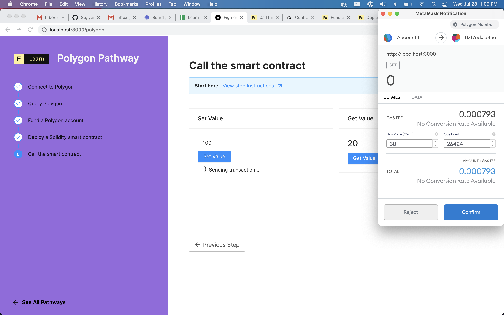

# Call the smart contract

At this point we have deployed a smart contract on the Polygon testnet and we have a client side application that's ready to interact with it. We just need to wire up that last part.

We built a simple page on the last step to help you interact with the smart contract. Since it only has two methods \(set and get\) that's all the UI will do: set a number through the smart contract and get it. As simple as it sounds, what's happening in thebackground is actually very powerful: we're using the Polygon blockchain to store information \(here a number\) and we're using a smart contract as a interface to read and write on that piece of information. And all this is happening without having to spin up a database and an API... So let's go!

## The Challenge


**Implement the `getValue` and `setValue` function**  
  
Need some help? Check out these two tips/links  
    **→**  [**Create a Contract using ethers**](https://docs.ethers.io/v5/api/contract/contract/#Contract--creating)  
****    →  You can **console.log `SimpleStorageJson`** to find the contract's `abi` and `address` \(through the property `networks`\)  
    **→**  [**How to call a contract's methods on a ethers Contract object**](https://docs.ethers.io/v5/api/contract/contract/#Contract-functionsCall)  
****    →  To read from the blockchain you don't need to spend any tokens so you can just use a provider to create a Contract ****instance. But to write you will need to create and sign a transaction through Metamask. Use a `signer` to create the Contract object!






## The solution



```text
Only click on the solution tab if you are completely stuck and want the answer.
```



```javascript
const getValue = () => {
	setFetchingGet(true)

	const provider = new ethers.providers.Web3Provider(window.ethereum)
	const contract = new ethers.Contract(
		SimpleStorageJson.networks['80001'].address,
		SimpleStorageJson.abi,
		provider
	)

	contract.get()
		.then((res: any) => {
			setContractNumber(res.toString())
		})
		.catch((err: any) => {
			console.log(err)
		})
		.finally(() => {
			setFetchingGet(false)
		})
  }

const setValue = () => {
	setFetchingSet(true)
	setTxHash(null)

	const provider = new ethers.providers.Web3Provider(window.ethereum)
	const signer = provider.getSigner()
	const contract = new ethers.Contract(
		SimpleStorageJson.networks['80001'].address,
		SimpleStorageJson.abi,
		signer
	)

	contract.set(inputNumber)
		.then((txRes: any) => {
			console.log(JSON.stringify(txRes, null, 2))
			setFetchingSet(false)
			setInputNumber(0)
			setConfirming(true)
			txRes.wait()
				.then((txReceipt: any) => {
					console.log("txReceipt", txReceipt)
					setTxHash(txReceipt.transactionHash)
				})
				.catch((txError: any) => {
					console.log("txError", txError)
				})
				.finally(() => {
					setConfirming(false)
				})
		})
		.catch((err: any) => {
			console.log(err)
			setFetchingSet(false)
		})
 }
```



What's happening in the code above?


