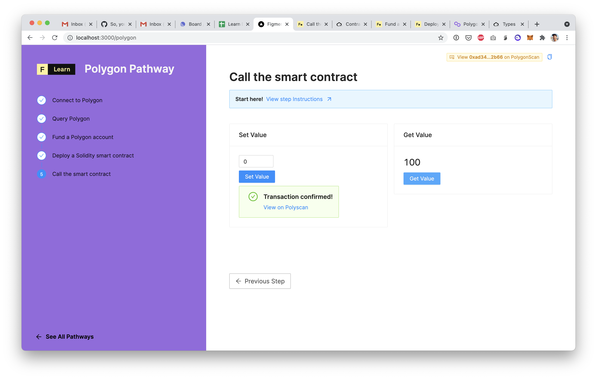

# Call the smart contract

At this point we have deployed a smart contract on the Polygon testnet and we have a client side application that's ready to interact with it. We just need to wire up that last part.

We built a simple page on the last step to help you interact with the smart contract. Since the contract has only two methods \(`set` and `get`\) that's all the UI will do: set a number through the smart contract and fetch it.

As simple as it sounds, what's happening in the background is actually very powerful: we're using the Polygon blockchain to store information \(here, a number\) and we're using a smart contract as a interface to read and write that piece of information. And what's crucial is that all this is happening without having to spin up a database and an API... So let's go!

## The Challenge


**Implement the `getValue` and `setValue` functions:**  
  
Need some help? Check out these two tips/links  
    **→**  [**Create a Contract using ethers**](https://docs.ethers.io/v5/api/contract/contract/#Contract--creating)  
****    →  You can **console.log `SimpleStorageJson`** to find the contract's `abi` and `address` \(through the property `networks`\)  
    **→**  [**How to call a contract's methods on a ethers Contract object**](https://docs.ethers.io/v5/api/contract/contract/#Contract-functionsCall)  
****    →  To read from the blockchain you don't need to spend any tokens so you can just use a provider to create a Contract ****instance. But to write you will need to create and sign a transaction through Metamask. Use a `signer` to create the Contract object!



Still not sure how to do this? [**Join us on Discord**](https://discord.gg/fszyM7K) and someone will help!


## The solution



```text
Only click on the solution tab if you are completely stuck and want the answer.
```



```javascript
const getValue = () => {
	setFetchingGet(true)

	const provider = new ethers.providers.Web3Provider(window.ethereum)
	const contract = new ethers.Contract(
		SimpleStorageJson.networks['80001'].address,
		SimpleStorageJson.abi,
		provider
	)

	contract.get()
		.then((res: any) => {
			setContractNumber(res.toString())
		})
		.catch((err: any) => {
			console.log(err)
		})
		.finally(() => {
			setFetchingGet(false)
		})
  }

const setValue = () => {
	setFetchingSet(true)
	setTxHash(null)

	const provider = new ethers.providers.Web3Provider(window.ethereum)
	const signer = provider.getSigner()
	const contract = new ethers.Contract(
		SimpleStorageJson.networks['80001'].address,
		SimpleStorageJson.abi,
		signer
	)

	contract.set(inputNumber)
		.then((txRes: any) => {
			setFetchingSet(false)
			setInputNumber(0)
			setConfirming(true)
			txRes.wait()
				.then((txReceipt: any) => {
					console.log("txReceipt", txReceipt)
					setTxHash(txReceipt.transactionHash)
				})
				.catch((txError: any) => {
					console.log("txError", txError)
				})
				.finally(() => {
					setConfirming(false)
				})
		})
		.catch((err: any) => {
			console.log(err)
			setFetchingSet(false)
		})
 }
```



What's happening in the code above?

* We create Contract objects using
  * The contract json's address
  * The contract json's abi
  * A web3 provider
* We then call the functions `get()`  and `set()` on this Contract object to operate our decentralized code. The names of the functions must match the ones we defined in our Solidity smart contract, otherwise how would we know which code to execute? 

Once you've implemented those two functions, this is what the UI should look like!



## Conclusion

Congratulations! We have gone from zero to Polygon, covering all the most fundamental concepts needed for developers to succeed in using Polygon. From connecting to the network to interacting with smart contracts, you have completed coding challenges and created a functional yet basic dApp.   
  
From here, there are many ways to increase your skills with web3 development. We recommend following some of the other Pathways on Learn, to learn about what makes the other netwrk protocols unique.

If you are an experienced developer, you are welcome to contribute tutorials for Polygon \(Matic\) and earn some MATIC tokens! Check out our tutorial [contribution guidelines](../../../other/tutorial-guidelines/) to get started.

\*\*\*\*[**Please tell us what you think about this tutorial!**](https://docs.google.com/forms/d/e/1FAIpQLSc9taxobvDSdXprMEFhCXgfcwS_oA-lu-nbQdYEW6c57Ie6qg/viewform?usp=sf_link) ****It's just a quick Google Form. We invite your feedback, which will help us to improve our educational resources.

