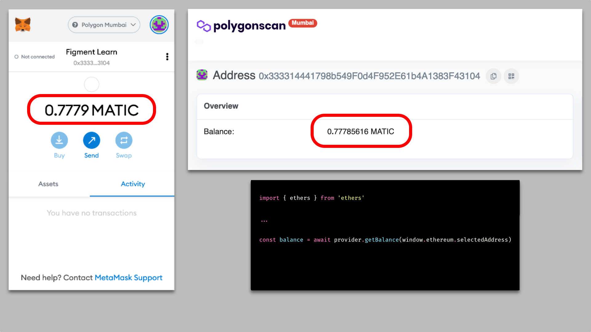
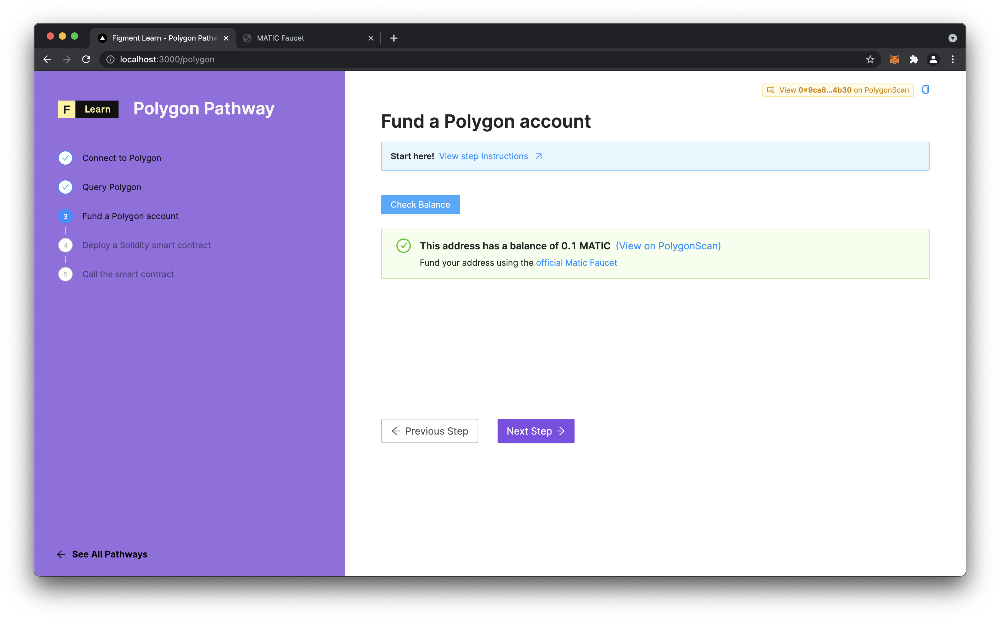

# Fund a Polygon account

## Getting MATIC

Next we will acquire some free MATIC on the testnet so we can deploy a smart contract and interact with it! Before dealing with actual value on the Polygon mainnet, it is wise to practice using the Polygon testnet \(called Mumbai\).

Click on the icon in the upper-right corner of the page to copy the hexadecimal address of the Metamask account to the clipboard :


Visit [https://faucet.matic.network/](https://faucet.matic.network/) and paste the address from your selected account in Metamask into the textinput. It is OK to leave the default options for MATIC tokens and the Mumbai network selected. Click the Submit button, then click again below to confirm the transaction. 


Sometimes the transaction response on the faucet website returns an `[Object object]` - when this happens, simply refresh the page and try again. 


Once this transaction is confirmed, you will have 0.1 MATIC on the Mumbai testnet!   
You will want to patiently repeat this process four more times, waiting about a minute between attempts to avoid being greylisted by the faucet. You will want to have about 0.5 MATIC to complete the Pathway.

## Account Balances

It is possible to view the balance of an address on Polygon in several ways. Through a wallet UI such as Metamask, on a block explorer like [polygonscan.com](https://polygonscan.com) \(this is how you view balances of contract addresses\), or via the [ethers API](https://docs.ethers.io/v5/single-page/#/v5/api/providers/provider/-%23-Provider-getBalance) :



## The challenge

Get the balance of the currently selected account in Metamask and display it on the UI.

**Imagine this scenario:** You know you have a big balance. You need to show that balance so you can brag about it to all your awesome web3 developer friends!


In `components/protocols/polygon/3_Balance.jsx`, implement the`checkBlance`function :  
  
**Need some help?** Check out these two links  
  **→ Get an** [**account balance**](https://docs.ethers.io/v5/api/providers/provider/#Provider-getBalance) **using ethers  
  → Format the balance using** [**ethers.utils.formatEther**](https://docs.ethers.io/v5/api/utils/display-logic/#unit-conversion)\*\*\*\*





```jsx
const checkBalance = async () => {
  setFetching(true)
  const provider = new ethers.providers.Web3Provider(window.ethereum);
  const selectedAddress = window.ethereum.selectedAddress;
    
  // TODO
  // Define those two variables
  const selectedAddressBalance = undefined
  const balanceToDisplay = undefined
    
  setBalance(balanceToDisplay);
  setFetching(false)
}
```




When you have completed the code, the 'Check Balance' button will function. Click it to view the balance of the connected account:




Still not sure how to do this? [**Join us on Discord**](https://discord.gg/fszyM7K) and someone will help!


## The solution



```text
Only click on the solution tab if you are completely stuck and want the answer.
```




```javascript
  const checkBalance = async () => {
    setFetching(true)
    const provider = new ethers.providers.Web3Provider(window.ethereum)
    const selectedAddress = window.ethereum.selectedAddress;
    const selectedAddressBalance = await provider.getBalance(selectedAddress)
    const balanceToDisplay = ethers.utils.formatEther(selectedAddressBalance.toString())
    setBalance(balanceToDisplay)
    setFetching(false)
  }
```




What happened in the code above? Let's take a closer look!

* For the duration of this function, `fetching` will be true so that we can conditionally render our UI. 
* We await `provider.getBalance()` because it returns a Promise. That Promise returns a BigNumber, which is a specific data type for handling numbers which fall [outside the range of safe values](https://docs.ethers.io/v5/api/utils/bignumber/#BigNumber--notes-safenumbers) in JavaScript. A BigNumber cannot be displayed in the same way as a normal number. We must therefore format the balance to transform it into a string for display, using `ethers.utils.formatEther()`.
* Before we exit the function, set `fetching` to false, which effects the conditional rendering happening in the return function of `3_Balance.tsx`.

## Next Steps

Now that we have a funded Polygon account, we can use our MATIC tokens to deploy a smart contract.  
In the next tutorial, we will cover writing, testing and deploying the Solidity code using Truffle, a smart contract development suite.

