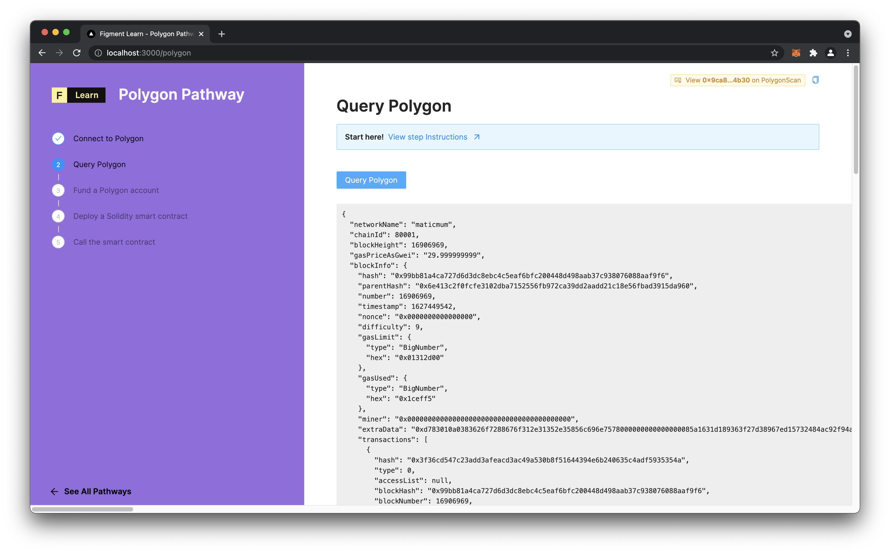

# Query Polygon

## Ethers API Queries

In order to gather information from the blockchain, we will use ethers again. For basic interaction with Polygon, the [provider](https://docs.ethers.io/v5/api/providers/provider/) methods are often most useful. 

In the file `components/protocols/polygon/steps/2_Query.tsx` we have already written the `getQuery` function which will send a network request to the node server. [By convention of Next.js routing](https://nextjs.org/docs/api-routes/introduction), a client-side request to `http://localhost:3000/api/polygon/query` will get routed to the file `query.js` in `/pages/api/polygon` and be executed by the default imported function.

## The challenge

**Imagine this scenario:** As the lead developer of a cool new dApp, you need to create a way to query information from the blockchain and then display it on the UI. You know that Next.js has some nice features for creating custom API routes, and that by using TypeScript it is easy to pass complex data types as JSON. Now you just need to wire it up to Polygon to take advantage of the impressive transaction throughput!


In **`pages/api/polygon/query.ts`**, assign values to the following variables :

`chainId` , `blockHeight` , `gasPriceAsGwei` ,`blockInfo`

**Need some help?** Check out these links  
  **→** [**Getting the network's chainId**](https://ethereum.stackexchange.com/questions/82365/how-get-network-id-with-ethers-js)  
  **→ What is a** [**block number \(or height**](https://learn.figment.io/other/glossary)**\)? And how to** [**get it from ethers**](https://docs.ethers.io/v5/api/providers/provider/#Provider-getBlockNumber)**.  
  → What is gas price and** [**gwei**](https://gwei.io/)**? And how to** [**get it from ethers**](https://docs.ethers.io/v5/api/providers/provider/#Provider-getGasPrice)**.  
  →** [**Formatting units**](https://docs.ethers.io/v5/api/utils/display-logic/#utils-formatUnits) **from BigNumber to gwei**





```typescript
 try {
    const networkName = await provider.getNetwork().then(res => { return res.name })

    // TODO
    // Define those variables below
    const chainId = undefined
    const blockHeight = undefined
    const gasPriceAsGwei = undefined
    const blockInfo = undefined

    ...
 }
```





Still not sure how to do this? [**Join us on Discord**](https://discord.gg/fszyM7K) and someone will help!


When complete, click on the button and you should see:



## The solution



```text
Only click on the solution tab if you are completely stuck and want the answer.
```




```typescript
  const chainId = provider.network.chainId
  const blockHeight = await provider.getBlockNumber()
  const gasPriceAsGwei = await provider.getGasPrice().then(res => {
    return ethers.utils.formatUnits(res, "gwei") 
  })
  const blockInfo = await provider.getBlockWithTransactions(blockHeight)
```




What happened in the code above? Let's have a closer look!

* The default export of this TypeScript file is an asynchronous function named `query`, for which we have defined the data types of the request as well as the response. `res: NextApiResponse<PolygonQueryResponse>` is providing a type definition of `PolygonQueryResponse`, which means that the response generated by this API must conform to that overall data type. Let's go over it now:
  * `networkName` must be a string
  * `chainId` must be a number
  * `blockHeight` must be a number
  * `gasPriceAsGwei` must be a string
  * `blockInfo` must be a [`BlockWithTransactions`](https://docs.ethers.io/v5/api/providers/provider/#Provider-getBlockWithTransactions) which we have already imported from ethers' abstract-provider sub-module in `types/polygon-types.ts`.
* The `networkName` awaits `provider.getNetwork()` because it returns a Promise, and then we will return the name property of the response object.
* We can get the `chainId` as a property of `provider.network`.
* `blockHeight` can be taken directly from the returned value of `getBlockNumber()` 
* `gasPriceAsGwei` gets the current gas price and then formats the value into a human-friendly number with the ethers utility function `formatUnits()`.
* `blockInfo` must be a BlockWithTransactions type, which is what the function `getBlockWithTransactions()` returns.

## Next Steps

Now that we have queried Polygon and retreived information from the blockchain, we will want to get MATIC tokens into our wallet so we can pay the fees to deploy a smart contract.  
In the next tutorial, we will cover how to fund an account with MATIC through the official faucet.

