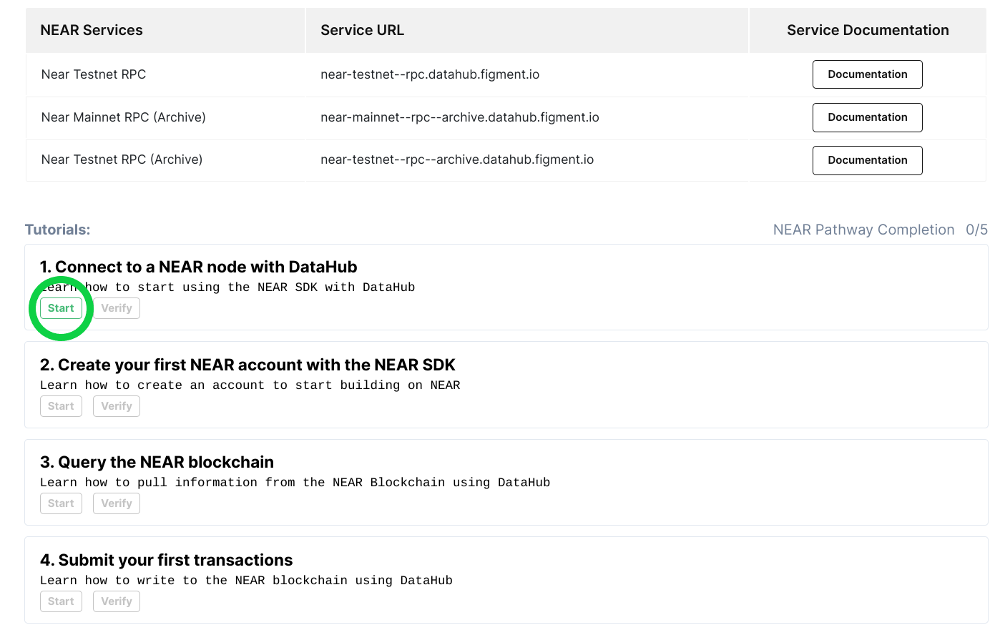
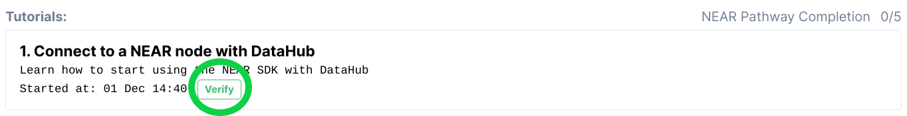

# 🗺 NEAR Pathway

##  Welcome to the NEAR Pathway

NEAR Protocol is a decentralized platform where developers can host serverless applications and smart contracts which have easy access to open finance networks and benefit from an ecosystem of open web components. 

Learn what makes it unique and build your first project to **earn $5 in NEAR tokens**. 

## 🏁 Get started by signing up for DataHub

Once you are ready, get started by [**setting up an account on DataHub** ](https://datahub.figment.io/sign_up?service=near)to put your skills to the test and follow-along the tutorials to start building on NEAR. Make sure to click on "Start" on the first tutorial before starting to code! 

Verify each tutorial as you complete them and make sure to click on "Submit to earn" when you are done with the five tutorials to access the completion form. 

\*\*\*\*[**Learn more about DataHub**](https://learn.figment.io/guides/datahub-products)**.** 

\*\*\*\*[**Make sure to read our Terms of Use before starting**](https://learn.datahub.figment.io/terms-of-use)**.** 

##  NEAR Pathway Tutorials

###  [Get started by signing up to DataHub! ](https://datahub.figment.io/sign_up?service=near)


Make sure to use a browser that does not hide your IP address, we will deny submissions with hidden IPs.   
  
We also do not accept "Google phone numbers" or any online SMS number. 


### 💡1. Connect to a NEAR node using DataHub 



### 💡2. Create your first NEAR account



### 💡3. Query the NEAR blockchain 



### 💡4. Submit your first transactions 



### 💡5. Write & deploy your first NEAR smart contract



## Extra NEAR Pathway Challenges


Bonus activities have been turned off for now until we launch the next NEAR Pathway. 


NEAR is providing Bonus Activity Rewards for additional activities following the completion of the NEAR Pathway tutorials. Complete any of these challenges and earn more NEAR tokens!   
  
Bonus Activity Rewards will be given out at the discretion of the reviewer. Please provide any context you would like us to consider to maximize your Bonus Activity Reward. 

###  Twitter \(5$ in NEAR each\)

1. Post a lesson learned about the NEAR platform, tools, community, etc.
2. Post a screenshot of what you just built with NEAR
3. Share a public link to a repository with your code
4. Start a debate about the pros / cons of NEAR
5. Launch a meme war with NEAR prominently featured

Make sure to refer to Figment Learn in your tweet! 

###  Medium \(25$ in NEAR each, `1500-2000` words each\)

1. Recount your NEAR learning experience
2. Share your ideas for improving the NEAR developer experience
3. Describe the business case for a DApp that should be built on NEAR
4. Write a list of the key features you discovered about NEAR
5. Compare NEAR with another technology, blockchain or otherwise

Make sure to refer to Figment Learn in your post! 

###  Github \(50$ in NEAR each up to `1` max of `meaningful` piece of software\)

1. Build a demo of an interesting feature of NEAR \(ie. cross-contract calls\)
2. Integrate NEAR with a popular framework \(ie. Express middleware\)
3. Adapt a popular, existing system to use NEAR \(ie. a simple JS game\)
4. Extend an existing NEAR sample into something better \(see [near.dev](http://near.dev/)\)
5. Contribute to the NEAR codebase \(see [github.com/near](http://github.com/near)\)

#### [Join our community today](https://discord.gg/PtkKz5) if you want to interact with other NEAR builders and become a part of this growing ecosystem! 

