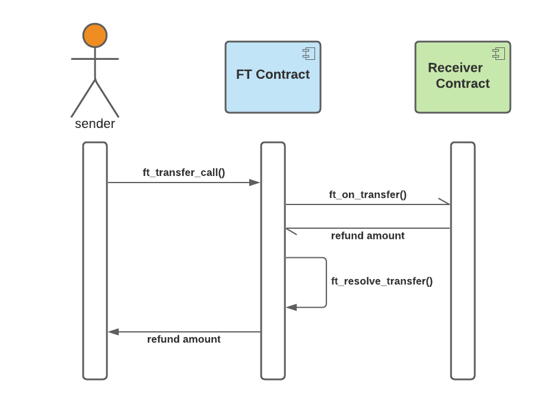

# You Can Have Your STAKE and Trade It Too

## Show Me the Money: You Can Have Your STAKE and Trade It Too
Plain old vanilla staking is a great way to earn more NEAR, but their are some trade-offs to be aware of. One of the main 
trade-offs is that the staked NEAR is locked because it is effectively put up as collateral to help secure the NEAR network. 
We can do better than that by unlocking the value. The [STAKE][1] contract unlocks the value stored in the staked NEAR by 
transforming it into a [fungible token][3]. You can now have your STAKE and trade it too.

In this tutorial we'll learn about how staking works on NEAR. We'll see how the STAKE token unlocks value. We'll then
apply what we learned from the [fungible token][3] tutorial and implement the fungible token core NEP-141 standard in my
favorite programming language, Rust. We will take it step by step and divide it up into 3 phases - design, coding, and last 
but most important is testing. Finally, we'll take the STAKE contract for a test drive and give you a chance to earn some 
NEAR. There's a lot to cover, so let's get started ...

## NEAR Staking 101


The NEAR protocol is a Proof-of-Stake (PoS) blockchain. Those who participate in staking to help secure the blockchain 
network earn staking rewards paid in NEAR tokens. There are two ways to participate:

#### As a **Validator**
Validators are responsible for running and operating the validator nodes that are actively producing blocks and must
come to a stake-weighted consensus about the valid state of the chain. On NEAR, the number of validator nodes per shard
is limited (currently 100 per shard). Anyone can submit a proposal to become a validator, but validator seats are auctioned
off to the highest bidders, i.e., those that who stake the most NEAR.
#### As a **Delegator**
Anyone can earn staking rewards by delegating their NEAR tokens to a validator through a [staking pool][2] contract.
Here's how it works:
1. Each deployed staking pool contract instance is owned by a single validator. 
2. Users deposit NEAR into the staking pool contract. Recall that validator seats are auctioned off to the highest bidder.
  Delegators pool their NEAR with validators to help them win auction bids for validator seats. Staking rewards earned
  by the validator are shared with the delegator minus validator fees. 
3. While delegated NEAR is deposited in the staking pool, it is effectively locked. While being staked, the delegated 
  NEAR is owned by the staking pool contract (which is owned by the validator). Effectively, delegators are lending
  their NEAR to validators through the staking pool contract. Delegators return on investment is their share of staking
  rewards - assuming the validator acquires a seat and does his job. 
4. When delegators choose to withdraw their NEAR they must first unstake the NEAR. The unstaked NEAR will remain locked 
  within the staking pool for 4 epoch periods (2 days) before being eligible for withdrawal from the staking pool contract.
   - **ATTENTION**: One thing users need to be aware and careful about is how the unstaking lock period functions in 
     the current version of the staking pool contract. Each time the user submits a request to unstake NEAR it
     resets the lock period to 4 epochs (2 days). For example, if a user unstaked 1000 NEAR in epoch (1), then the 1000 NEAR
     will be available for withdrawal in epoch (4). What happens if the user submits another request to unstake 1 NEAR
     on epoch (3)? When you try to withdraw the 1000 NEAR in epoch (4), it is still locked because the lock period has
     been reset and extended for all unstaked NEAR. The 1001 NEAR will then be available for withdrawal in epoch (7).

For more information on how staking works on NEAR see:
- [Economics in a Sharded Blockchain - Validators section](https://near.org/papers/economics-in-sharded-blockchain/#validators)
- [Is NEAR a delegated proof of stake network](https://docs.near.org/docs/faq/economics_faq#is-near-a-delegated-proof-of-stake-network)
- [Staking Orientation](https://docs.near.org/docs/validator/staking-overview)

# You Can Have Your STAKE and Trade It Too


When you deposit NEAR into the STAKE token contract, it will delegate the NEAR to the staking pool for you. In return you 
are issued STAKE tokens that grow in value via staking rewards issued through the staking pool contract. STAKE tokens unlock 
the value of the staked NEAR that is locked up by the staking pool contract by enabling the user to transfer the staked NEAR 
value to other accounts. The STAKE token contract adds even more value beyond letting you use staked NEAR as fungible tokens. 
However, we'll save that for future tutorials. For now, we'll stay focused on how the STAKE token implements [NEP-141][3].

## Why Rust for Smart Contracts
Rust's website sums it up in 3 words: performance, reliability, and productivity. For me it's a no-brainer. Over the past
20+ years, I have used many programming languages, and [Rust][5] is the clear winner for me. For five years running, Rust has 
also been voted by developers as the [most loved language][4] on stackoverflow for good reason. It is becoming the preferred 
language of choice for the crypto space because it is a perfect fit to build highly performant, reliable, and secure 
blockchain software. On NEAR, for any serious or more complex smart contracts, especially within the DeFi space, I 
strongly encourage and recommend Rust to you. 

For developing NEAR smart contracts, you will need to learn to use the [NEAR Rust SDK][7]. I personally link to the latest
and greatest tagged version on github because:
- it provides a few features that are not yet released via crates.io to reduce boilerplate
  - `#[private]` macro for callbacks
  - `PanicOnDefault` used to derive `Default` implementation that panics. This is a helpful macro in case the contract is 
     required to be initialized with either `#[init]` or `#[init_once]`.
  - better unit testing support
- for simulation testing support

**Cargo.toml**
```toml
[dependencies]
near-sdk = { git = "https://github.com/near/near-sdk-rs",  tag = "2.4.0" }

[dev-dependencies]
near-sdk-sim = { git = "https://github.com/near/near-sdk-rs",  tag = "2.4.0" }
```
- **NOTE**: to view the corresponding Rust docs, you will need to clone the above git projects and generate the Rust
docs locally.


## Show Me the Design
To keep the code clean we will first design the interfaces separate from the implementation. The contract API will be defined
explicitly via an interface. In Rust, interfaces are called [traits][6]. The design approach will be to leverage Rust strongly
typed system to model the domain. The [NEP-141][3] standard defined the API using the lowest common denominator to keep the
API programming language neutral as much as possible. In doing so, we lost type safety. For example, numeric amounts were
specified as `string` types. With Rust, we get type safety back. We will be working with a typed domain model that makes 
the code clear and precise.


 
- see [Rust code][8] on github

**StakeTokeContract** implements the **FungibaleToken** and **ResolveTransferCall** traits. It depends on the 
**TransferReceiver** interface for cross-contract calls. 

**FungibleToken** trait
- specifies the core fungible token API
- instead of using native String types, I use specific domain type wrappers for `TokenAmount`, `Memo`, and `TransferCallMessage`
  - this leaves absolutely zero ambiguity in the code and enables the domain model to be encoded into the type system. You
    may think this is overkill for something so simple, but my advice is to never take shortcuts. If you are going to do
    something, then do it right in the first place. In addition, the beauty of Rust's zero cost abstractions, is that we 
    can leverage the type system for zero runtime costs (if done right).
  
**TransferReceiver** trait
- represents the contract API required by the transfer receiver contract

**ResolveTransferCall** trait
- specifies the **private** callback interface used as part of the transfer call workflow
- the key word here to notice is **private** - it means that even though the function is exposed on the contract, only 
  the contract itself is allowed to call the function. If any other account tries to call the private function, then it should fail. 
- **NOTE**: the callback function signature is not explicitly defined by the FT standard (NEP-141). I am presenting to you
  my implementation, but you may choose to name your callback whatever you want

## Show Me the Code
You can refer to the full source code on github. I will be reviewing the most important parts of the code below.

We start by implementing the core fungible token interface on the contract:
```rust
#[near_bindgen]
impl FungibleToken for StakeTokenContract {
  // TODO
}
```
- [near_bindgen][9] generates the smart contract compatible with the NEAR blockchain at the WASM level
- the above reads as `StakeTokenContract` implements the `FungibleToken`  interface

Now we'll walk through each of the core contract API functions. For those of you who are Rust gurus or seasoned developers, 
please bear with me ... I will be pointing out Rust idioms and coding best practices that may seem obvious. Because I am 
showing actual Rust code for the first time, I will describe these Rust idioms and coding practices in more detail so 
that you can become familiar with my coding style. In future tutorials, I will assume this knowledge.

```rust
#[payable]
fn ft_transfer(
    &mut self,
    receiver_id: ValidAccountId,
    amount: TokenAmount,
    _memo: Option<Memo>,
) {
    assert_yocto_near_attached();
    assert_token_amount_not_zero(&amount);

    let stake_amount: YoctoStake = amount.value().into();

    let mut sender = self.predecessor_registered_account();
    self.claim_receipt_funds(&mut sender);
    sender.apply_stake_debit(stake_amount);
    // apply the 1 yoctoNEAR that was attached to the sender account's NEAR balance
    sender.apply_near_credit(1.into());

    let mut receiver = self.registered_account(receiver_id.as_ref());
    receiver.apply_stake_credit(stake_amount);

    self.save_registered_account(&sender);
    self.save_registered_account(&receiver);
}
```
- `#[payable]` marks the function to allow callers to attach NEAR to the function call. Recall that according to the 
   specification, callers must attach exactly 1 yoctoNEAR to the function call as a security measure
- `&mut self` tells the rust compiler that the function will modify contract state
- [ValidAccountId][10] comes from NEAR rust SDK. It eliminates boilerplate code to validate the NEAR account ID. If the account
  ID is not a valid NEAR account ID, then the function call will fail fast
- `_memo` - the STAKE contract has no use for memo, and thus tells the rust compiler that it will not be used by using a naming
  convention, i.e., by prefixing the name with an `_`. The rust compiler is very strict and disciplined. By default, it 
  will emit warnings for any sign of something possibly wrong with the code. 
- the first thing the code does is perform some checks:
  - it checks to make sure exactly 1 yoctoNEAR is attached
  - it checks that the transfer amount is not zero
  - by this point in the code the `receiver_id` has already been validated by NEAR SDK
- I like to keep the contract function code as clean and readable as possible. The goal is to be able to read the code 
  and easily understand the business logic. Implementation details or boilerplate should be separated out into other functions.
  If you come back to the code in 6 months and can't understand it or is hard to follow, then it's time to refactor and clean it up. 
- converting the token amount to `YoctoStake` is specific to the STAKE token business logic. The code is expecting the 
  transfer amount to be specified in yocto scale - yoctoSTAKE is the smallest unit for the STAKE token, just like yoctoNEAR
  is the smallest unit for NEAR. That's a bit off topic ... we'll revist this in future tutorials
- NEP-141 requires that the accounts involved in the transfer must both be registered. The `predecessor_registered_account()`
  and `registered_account()` helper functions will lookup the accounts and panic if the account is not registeredd
- `claim_receipt_funds()` is specific to STAKE business logic and we'll skip this for now
- `sender.apply_near_credit(1.into())` - remember the sender was required to attach 1 yoctoNEAR to the function call. How
  the attached deposit is handled is not defined in the standard. In the STAKE contract, every registered account has a NEAR
  balance. Thus, the contract will credit the yoctoNEAR to the sender account (because 1 yoctoNEAR is not zero).
- the transfer amount is debited from the sender and then credited to the receiver
- in order to commit the transfer to the blockchain, we must remember to persist the state change to storage. Both the sender
  and receiver accounts are saved to storage.
  
> #### Best Practices
> 1. You should always use [ValidAccountId][10] as the contract function argument type
> 2. Contract API function should be easy to read to understand the business logic
> 3. Remember to commit contract state changes to storage

```rust
 #[payable]
fn ft_transfer_call(
    &mut self,
    receiver_id: ValidAccountId,
    amount: TokenAmount,
    msg: TransferCallMessage,
    _memo: Option<Memo>,
) -> Promise {
    self.ft_transfer(receiver_id.clone(), amount.clone(), _memo);

    ext_transfer_receiver::ft_on_transfer(
        env::predecessor_account_id(),
        amount.clone(),
        msg,
        receiver_id.as_ref(),
        NO_DEPOSIT.value(),
        self.ft_on_transfer_gas(),
    )
    .then(ext_resolve_transfer_call::ft_resolve_transfer_call(
        env::predecessor_account_id(),
        receiver_id.as_ref().to_string(),
        amount,
        &env::current_account_id(),
        NO_DEPOSIT.value(),
        self.resolve_transfer_gas(),
    ))
}
```

Transfer call is a little more interesting because it involves cross contract calls. It showcases how NEAR differs and 
stands out from other blockchains thanks to its sharded architecture.



- transfer call workflow will first transfer the tokens - it simply delegates to `ft_transfer()` as we saw above
- then it composes the async transfer call workflow using the [Promise][11] abstraction provided by the NEAR Rust SDK
  - the Promise that is returned is not executed as part of the current block. The NEAR runtime will schedule the
    the Promise to run async and kickoff the workflow in the next block. It will be executed on the shard that hosts the 
    receiver account. Once the `ft_on_transfer` call completes on the receiver account, then the NEAR runtime will
    capture its output data and provide it as input data for the `ft_resolve_transfer_call`. The callback will be 
    scheduled in the next block to run on the shard that hosts the STAKE token contract.
  - with cross contract calls gas considerations need to be taken into account. The FT standard states that `ft_transfer_call`
    must pass along all unused gas to the receiver contract. Technically speaking that is not possible. We can approximately
    pass along the unused gas. Getting gas right in cross contract calls requires experimentation. The approach I use is to
    measure the gas consumption on the callback by temporarily relaxing the private contraint. This enables me to invoke 
    the function manually and measure the gas consumption. The STAKE contract provides an operator interface to enables
    the operator to configure the gas usage for cross contract calls.  This is beyond the scope of this tutorial, but worth
    mentioning. Checkout the `ft_on_transfer_gas()` and `resolve_transfer_gas()` methods in the source code for details.
- the code uses what's called the high level cross contract pattern provided by NEAR Rust SDK. It works as follows:

The remote function calls are declared as rust traits and annotated with the `#[ext_contract]` attribute. This attribute
will be used to generate the low level code to invoke the remote call on the external contract. For each external
contract interface that is annotated, a rust module is generated containing functions that map to the functions defined
on the trait. I explicitly specify the module name in the attribute, i.e., `ext_transfer_receiver` explicitly specifies
the module name. The name is optional, and a default name will be generated based on the trait name if not specified - 
but I prefer to be specific. 

```rust
#[ext_contract(ext_transfer_receiver)]
pub trait ExtTransferReceiver {
    fn ft_on_transfer(
        &mut self,
        sender_id: AccountId,
        amount: TokenAmount,
        msg: TransferCallMessage,
    ) -> PromiseOrValue<TokenAmount>;
}

#[ext_contract(ext_resolve_transfer_call)]
pub trait ExtResolveTransferCall {
    fn ft_resolve_transfer_call(
        &mut self,
        sender_id: AccountId,
        receiver_id: AccountId,
        amount: TokenAmount,
    ) -> PromiseOrValue<TokenAmount>;
}
```

Each module function that is generated for the external contract appends arguments required to make the remote contract
function call that is required by the NEAR protocol:
- contract account ID
- how much NEAR to attach to the function call
- how prepaid gas to supply to the function call

> #### Side Topic ... 
> Something to be aware of is that the high level cross contract approach works well for simple cross contract calls - 
> as in this case. However, you may need to reach down to use the lower level cross contract approach because you
> require more robust error handling, or your use case requires batched transactions, etc. We'll explore this topic in 
> future tutorials. 

#### How Promises work on NEAR
On NEAR, think of [promises][11] as a way to compose **actions** to run asynchronously on remote contracts. I use the 
term actions because promises support more than just calling remote functions. You can perform other actions, such as 
creating and deleting accounts, adding keys, deploying contracts, and of course transferring NEAR - see the [docs][11] for 
details. For now, we'll focus the discussion on using promises for remote function calls. 

Remote function calls are always scheduled to run async after the current function is committed to the blockchain. 
This means contract state will be persisted to blockchain storage before the remote function is executed in a future block - 
most likely in the next block. If the contract requires to handle the remote contract function call results or perform
error handling, then the contract must schedule a callback that is triggered when the remote function call completes. 
We used [Promise::then][12] to connect the two function calls and compose them into the transfer call workflow. 

>#### Remember this about NEAR Promises:
>
> 1. Promises are always run async. 
> 2. In order to handle promise results, the contract must schedule a callback.
> 3. There are no global transactions that spans across contracts. Think of each contract function call always being executed 
>   in its own separate transaction. If contract state needs to be rolled back because a downstream promise failed, then
>   the contract is responsible to rollback the contract state in the form of a compensating transaction.

Let's bring it home ...
```rust
#[near_bindgen]
impl ResolveTransferCall for StakeTokenContract {
    #[private]
    fn ft_resolve_transfer_call(
        &mut self,
        sender_id: ValidAccountId,
        receiver_id: ValidAccountId,
        amount: TokenAmount,
    ) -> PromiseOrValue<TokenAmount> {
        let unused_amount = self.transfer_call_receiver_unused_amount(amount);

        let refund_amount = if unused_amount.value() > 0 {
            log!("unused amount: {}", unused_amount);
            let mut sender = self.registered_account(sender_id.as_ref());
            let mut receiver = self.registered_account(receiver_id.as_ref());
            match receiver.stake.as_mut() {
                Some(balance) => {
                    let refund_amount = if balance.amount().value() < unused_amount.value() {
                        log!("ERROR: partial amount will be refunded because receiver STAKE balance is insufficient");
                        balance.amount()
                    } else {
                        unused_amount.value().into()
                    };
                    receiver.apply_stake_debit(refund_amount);
                    sender.apply_stake_credit(refund_amount);

                    self.save_registered_account(&receiver);
                    self.save_registered_account(&sender);
                    log!("sender refunded: {}", refund_amount.value());
                    refund_amount.value().into()
                }
                None => {
                    log!("ERROR: refund is not possible because receiver STAKE balance is zero");
                    0.into()
                }
            }
        } else {
            unused_amount
        };

        PromiseOrValue::Value(refund_amount)
    }
}

impl StakeTokenContract {
  /// the unused amount is retrieved from the `TransferReceiver::ft_on_transfer` promise result
  fn transfer_call_receiver_unused_amount(&self, transfer_amount: TokenAmount) -> TokenAmount {
    let unused_amount: TokenAmount = match self.promise_result(0) {
      PromiseResult::Successful(result) => {
        serde_json::from_slice(&result).expect("unused token amount")
      }
      _ => {
        log!(
          "ERROR: transfer call failed on receiver contract - full transfer amount will be refunded"
        );
        transfer_amount.clone()
      }
    };
  
    if unused_amount.value() > transfer_amount.value() {
      log!(
        "WARNING: unused_amount({}) > amount({}) - full transfer amount will be refunded",
        unused_amount,
        transfer_amount
      );
      transfer_amount
    } else {
      unused_amount
    }
  }
}
```
The business logic is pretty straight forward. The callback's main purpose is two-fold

1. It refunds any unused amount back from the reciever account to the sender account. 
2. If the function call failed on the receiver contract, then the callback will attempt to refund the full amount.

Certain business rules and checks are executed to gaurd against receiver contracts that violate the contract. This ties
back to our earlier discussion on promises. Before the receiver contract is invoked, the transfer has already been committed
to contract storage on the blockchain. Thus, the callback must be coded defensively to handle errors or contracts that 
violate the transfer contract.

The NEAR Rust SDK currently has no high level support for handling promise failures in cross contract calls - but it's on
the NEAR Rust SDK roadmap. The `transfer_call_receiver_unused_amount` function shows how to use the low level NEAR SDK
API to handle the promise result, which requires us to manually deserialize the result:
`serde_json::from_slice(&result).expect("unused token amount")`

## Show Me the Tests
Testing smart contracts is crucial because once contracts are deployed in a **permissionless** manner, the contract code
cannot be upgraded. Permissionless means that the contract has no access keys which would permit the code to be changed.
In other words, once the contract is deployed and stripped of all access keys, its code and interface will never change.
To be considered truly permissionless, the code requires audit to make sure there is no hidden code that would be able 
to add access keys later on or redeploy the contract - but that is a whole other topic. 

There are multiple types of tests:

1. Unit tests
2. Local simulation tests
3. Integration tests using deployed contracts on testnet

All three types of tests are crucial. However, in order to not turn this tutorial into a novel, we'll save simulation
and integration tests for future tutorials. Don't worry, we'll keep it as short as possible, but if you want to see more,
the full test suite is on github. I'll cover the most interesting parts related to unit testing cross-contract calls.

... another reason I love Rust is because it comes with batteries included with robust support for [testing][14]. 

### How I structure unit tests
I create one test module per contract function, e.g., 

```rust
#[cfg(test)]
mod test_transfer {
  // tests
}

#[cfg(test)]
mod test_transfer_call {
  // tests
}

#[cfg(test)]
mod test_resolve_transfer_call {
  // tests
}
```

Unit tests are written following the [Arrange-Act-Assert][15] test pattern, e.g., 
```rust
#[test]
pub fn transfer_ok() {
    // Arrange
    // TODO: setup the test
  
    // Act
    // TODO: execute the code to test
  
    // Assert
    // TODO: check the test results
}
```

My goal here is to cover the basics to get you started and point you in the right direction. The [STAKE][1] project has a 
ton of tests, and there's nothing better than having actual real code to reference.

### NEAR Rust SDK Unit Testing Support
These are the 3 key ingredients every contract unit test requires:

1. **VMContext** - provided by the NEAR Rust SDK - it provides the context for contract execution
2. Contract instance
3. NEAR account used to execute the contract functions

In the STAKE project there is a [test_utils][20] module that you may find useful. I'll call out what's most interesting
and relevant to our current discussion - see the source code on github for full details.

In the STAKE project, the first thing each contract unit test does is create a **TestContext** to get the 3 key ingredients:
```rust
pub struct TestContext<'a> {
    pub contract: StakeTokenContract,
    pub account_id: &'a str,
    pub context: VMContext,
}
```
- TestContext is simply a wrapper that collects what is needed to test the contract

Knowing how to work with the VMContext provided by the NEAR Rust SDK is half the battle. It will be  worth your time to 
familiarize yourself and become comfortable working with it. The basic pattern to work with the VMContext is:
1. Clone the VMContext
2. Modify the VMContext to setup the test
3. Update the testing env with the new VMContext
4. Execute contract function

For example:
```rust
#[test]
pub fn ok_with_refund_gt_transfer_amount() {
  // Arrange
  let mut test_ctx = TestContext::with_registered_account();            // initial TestContext contains VMContext
  let contract = &mut test_ctx.contract;

  let sender_id = test_ctx.account_id;
  let receiver_id = "receiver.near";

  // register receiver account
  {
    let mut context = test_ctx.context.clone();                         // clone the VMContext
    context.predecessor_account_id = receiver_id.to_string();           // modify the VMContext
    context.attached_deposit = YOCTO;
    testing_env!(context);                                              // Update the testing env with the new VMContext
    contract.register_account();                                        // Execute contract function
  }

  ...
}
```

### Unit testing cross-contract calls
The title is a little misleading because technically you can't unit test cross contract calls for technical reasons
discussed above. To test cross contract calls locally, you would use simulation tests. However, simulation tests also
has its limitations for more complex workflows. Ultimately, you will need to run integration tests on testnet to fully 
test more complex cross-contract workflows ... but I digress ...

Try to test as much as possible with unit tests because they run the fastest and give the quickest feedback. Unit tests 
allow us to verify that the expected cross-contract workflows are setup correctly.

Let's take a look at the happy case scenario for the `ft_transfer_call`:
```rust
#[test]
pub fn transfer_ok() {
  // Arrange
  let mut test_ctx = TestContext::with_registered_account();                            
  let contract = &mut test_ctx.contract;

  let sender_id = test_ctx.account_id;
  let receiver_id = "receiver.near";

  // register receiver account
  {
    let mut context = test_ctx.context.clone();
    context.predecessor_account_id = receiver_id.to_string();
    context.attached_deposit = YOCTO;
    testing_env!(context);
    contract.register_account();
  }

  assert!(contract.account_registered(to_valid_account_id(sender_id)));
  assert!(contract.account_registered(to_valid_account_id(receiver_id)));

  assert_eq!(contract.ft_total_supply(), 0.into());
  assert_eq!(
    contract.ft_balance_of(to_valid_account_id(sender_id)),
    0.into()
  );
  assert_eq!(
    contract.ft_balance_of(to_valid_account_id(receiver_id)),
    0.into()
  );

  // credit the sender with STAKE
  let mut sender = contract.registered_account(sender_id);
  let total_supply = YoctoStake(100 * YOCTO);
  sender.apply_stake_credit(total_supply);
  contract.total_stake.credit(total_supply);
  contract.save_registered_account(&sender);

  // Act - transfer with no memo
  let mut context = test_ctx.context.clone();
  context.predecessor_account_id = sender_id.to_string();
  context.attached_deposit = 1; // 1 yoctoNEAR is required to transfer
  testing_env!(context.clone());
  let transfer_amount = 10 * YOCTO;
  let msg = TransferCallMessage::from("pay");
  contract.ft_transfer_call(
    to_valid_account_id(receiver_id),
    transfer_amount.into(),
    msg.clone(),
    None,
  );

  // Assert
  
  // check that the funds were transfered
  assert_eq!(contract.ft_total_supply().value(), total_supply.value());
  assert_eq!(
    contract
            .ft_balance_of(to_valid_account_id(sender_id))
            .value(),
    total_supply.value() - transfer_amount
  );
  assert_eq!(
    contract
            .ft_balance_of(to_valid_account_id(receiver_id))
            .value(),
    transfer_amount
  );
  let sender = contract.predecessor_registered_account();
  assert_eq!(sender.near.unwrap().amount().value(), 1,
             "expected the attached 1 yoctoNEAR for the transfer to be credited to the account's NEAR balance");
  
  // check that the Promise workflow is setup correctly for the transfer call
  let receipts = deserialize_receipts();
  assert_eq!(receipts.len(), 2);
  {
    let receipt = &receipts[0];
    match &receipt.actions[0] {
      Action::FunctionCall {
        method_name,
        args,
        deposit,
        gas,
      } => {
        assert_eq!(method_name, "ft_on_transfer");
        assert_eq!(*deposit, 0);
        let args: TransferCallArgs = serde_json::from_str(args).unwrap();
        assert_eq!(args.sender_id, to_valid_account_id(sender_id));
        assert_eq!(args.amount, transfer_amount.into());
        assert_eq!(args.msg, msg);
        assert!(*gas >= context.prepaid_gas - (TGAS * 35).value())
      }
      _ => panic!("expected `ft_on_transfer` function call"),
    }
  }
  {
    let receipt = &receipts[1];
    match &receipt.actions[0] {
      Action::FunctionCall {
        method_name,
        args,
        deposit,
        gas,
      } => {
        assert_eq!(method_name, "ft_resolve_transfer_call");
        assert_eq!(*deposit, 0);
        let args: ResolveTransferCallArgs = serde_json::from_str(args).unwrap();
        assert_eq!(args.sender_id, to_valid_account_id(sender_id));
        assert_eq!(args.receiver_id, to_valid_account_id(receiver_id));
        assert_eq!(args.amount, transfer_amount.into());
        assert_eq!(
          *gas,
          contract
                  .config
                  .gas_config()
                  .callbacks()
                  .resolve_transfer_gas()
                  .value()
        )
      }
      _ => panic!("expected `ft_on_transfer` function call"),
    }
  }
}
```
The `ft_transfer_call` is expected to produce 2 function call action receipts for the cross-contract workflow. 
The unit test is able to verify the following:
- that the cross-contract workflow is setup correctly
- that the correct amounts of gas is supplied to each function call
- that the function call arguments are correct

That's pretty cool for a unit test and it was made possible because NEAR Rust SDK exposed receipts for testing - see
`deserialize_receipts()` for details on how to retrieve the receipts.

Unit testing the callback is a bit more tricky because of the data dependencies ...
```rust
#[test]
pub fn ok_zero_refund() {
    // Arrange
    let mut test_ctx = TestContext::with_registered_account();
    let contract = &mut test_ctx.contract;

    let sender_id = test_ctx.account_id;
    let receiver_id = "receiver.near";

    // register receiver account
    {
        let mut context = test_ctx.context.clone();
        context.predecessor_account_id = receiver_id.to_string();
        context.attached_deposit = YOCTO;
        testing_env!(context);
        contract.register_account();
    }

    set_env_with_promise_result(contract, promise_result_zero_refund);

    // Act
    let result = contract.ft_resolve_transfer_call(
        to_valid_account_id(sender_id),
        to_valid_account_id(receiver_id),
        YOCTO.into(),
    );

    // Assert
    match result {
        PromiseOrValue::Value(refund_amount) => assert_eq!(refund_amount.value(), 0),
        _ => panic!("expected value to be returned"),
    }
}

/// used to inject PromiseResult into NEAR testing env
pub fn set_env_with_promise_result( contract: &mut StakeTokenContract, promise_result: fn(u64) -> PromiseResult) {
  pub fn promise_results_count() -> u64 {
    1
  }

  contract.set_env(Env {
    promise_results_count_: promise_results_count,
    promise_result_: promise_result,
  });
}

// used to inject a PromiseResult that provides the function call result for `TransferReceiver::ft_on_transfer`
fn promise_result_zero_refund(_result_index: u64) -> PromiseResult {
  PromiseResult::Successful(serde_json::to_vec(&TokenAmount::from(0)).unwrap())
}
```
The key to making this work is the magic performed by `set_env_with_promise_result(contract, promise_result_zero_refund);`
To summarize how this works, I proxied the Rust `env`. Instead of the contract using `env` provided by
the NEAR Rust SDK directly, I wrapped it in order to be able to inject promise results into it - but only when the code
is compiled in test mode. I leverage Rust conditional compilation feature to select which `env` to use. If the code is compiled
in release mode, then it uses NEAR's provided `env`. Take a look at [lib.rs][16] to see exactly how I do that. If there any
questions, feel free to post them on the tutorial.

## Show Me the Demo: Earn Some NEAR
As a bonus, you can earn some NEAR by taking the STAKE token contract for a test drive on testnet and running through the 
demo below using the [NEAR CLI][18]. I have deployed the STAKE contract to `stake-demo.oysterpack.testnet` on testnet 
for the demo.

To earn NEAR rewards for exercising the demo, you will need to submit the NEAR requests through [DataHub][13] using your
DataHub access key. If you have earned NEAR on previous NEAR tutorials, then you should already be set. Otherwise, follow
the instructions in the following link on [how to obtain your DataHub access key][17].

We will use the NEAR CLI to submit the transactions. Plugin your DataHub API Key and NEAR account at the top, and then
you should be all set to go.
```shell
export DATAHUB_APIKEY=<DATAHUB_APIKEY>
export NEAR_ACCOUNT=<YOUR-NEAR-ACCOUNT.testnet>

export CONTRACT=stake-demo.oysterpack.testnet
export NEAR_NODE_URL=https://near-testnet--rpc.datahub.figment.io/apikey/$DATAHUB_APIKEY
export NEAR_ENV=testnet

# register account
near call $CONTRACT register_account --node_url $NEAR_NODE_URL --accountId $NEAR_ACCOUNT --amount 1

# deposit and stake some NEAR to get some STAKE tokens
near call $CONTRACT deposit_and_stake --node_url $NEAR_NODE_URL --accountId $NEAR_ACCOUNT --amount 1 --gas 200000000000000

# check balance
near view $CONTRACT ft_balance_of --node_url $NEAR_NODE_URL --args "{\"account_id\":\"$NEAR_ACCOUNT\"}" 

# check total supply
near view $CONTRACT ft_total_supply --node_url $NEAR_NODE_URL

# check balance for receiver contract - before transfer call
near view $CONTRACT ft_balance_of --node_url $NEAR_NODE_URL --args '{"account_id":"dev-1611907846758-1343432"}'

# transfer STAKE via a simple transfer
near call $CONTRACT ft_transfer --node_url $NEAR_NODE_URL --accountId $NEAR_ACCOUNT  --args '{"receiver_id":"dev-1611907846758-1343432", "amount":"10000000"}' --amount 0.000000000000000000000001

# check balance for transfer receiver contract - before transfer call
near view $CONTRACT ft_balance_of --node_url $NEAR_NODE_URL --args "{\"account_id\":\"dev-1611907846758-1343432\"}"

# transfer STAKE via a transfer call to another contract
near call $CONTRACT ft_transfer_call --node_url $NEAR_NODE_URL --accountId $NEAR_ACCOUNT  --args '{"receiver_id":"dev-1611907846758-1343432", "amount":"1000000", "memo":"merry christmas", "msg":"{\"Accept\":{\"refund_percent\":50}}"}' --amount 0.000000000000000000000001

# check balance for transfer receiver contract - after transfer call
near view $CONTRACT ft_balance_of --node_url $NEAR_NODE_URL --args "{\"account_id\":\"dev-1611907846758-1343432\"}"
```

## It's a wrap folks...
That was longer than expected, but time flies by when you are having fun. We learned about staking on NEAR and how you
can earn staking rewards as a delegator. I went over, at a high level, how the STAKE contract unlocks value in your staked 
NEAR by providing you with fungible tokens for your staked NEAR. We then implemented the Fungible Token Core Standard 
(NEP-141) for the STAKE contract. We did a some design, coding, and even testing in Rust. Along the way we also got a little 
taste of how cross contract calls and promises work on NEAR using NEAR Rust SDK. I also showed you some tricks I picked 
up to unit test cross contract calls and callbacks. Finally, you got a chance to earn some NEAR while learning with us.

## What's Next ...
When I first introduced the Fungible Token Core Standard (NEP-141), I mentioned that was only a piece of the puzzle.
Account registration and metadata are required for the full solution. The community has been busy working on the new
[Account Registration Standard][19] and we have entered the finalization phase. In the next tutorial, I will present to 
you the new Account Registration Standard API.

[1]: https://github.com/oysterpack/oysterpack-near-stake-token
[2]: https://github.com/near/core-contracts/tree/master/staking-pool
[3]: 2-fungible-token.md
[4]: https://insights.stackoverflow.com/survey/2020#technology-most-loved-dreaded-and-wanted-languages-loved
[5]: https://www.rust-lang.org/
[6]: https://doc.rust-lang.org/book/ch10-02-traits.html
[7]: https://crates.io/crates/near-sdk
[8]: https://github.com/oysterpack/oysterpack-near-stake-token/blob/main/contract/src/interface/fungible_token.rs
[9]: https://crates.io/crates/near-bindgen
[10]: https://docs.rs/near-sdk/2.0.1/near_sdk/json_types/struct.ValidAccountId.html
[11]: https://docs.rs/near-sdk/2.0.1/near_sdk/struct.Promise.html
[12]: https://docs.rs/near-sdk/2.0.1/near_sdk/struct.Promise.html#method.then
[13]: https://datahub.figment.io/
[14]: https://doc.rust-lang.org/book/ch11-00-testing.html
[15]: https://automationpanda.com/2020/07/07/arrange-act-assert-a-pattern-for-writing-good-tests/
[16]: https://github.com/oysterpack/oysterpack-near-stake-token/blob/main/contract/src/lib.rs
[17]: https://learn.figment.io/network-documentation/near/tutorials/intro-pathway-write-and-deploy-your-first-near-smart-contract/1.-connecting-to-a-near-node-using-datahub#configure-environment
[18]: https://github.com/near/near-cli
[19]: https://github.com/near/NEPs/discussions/145#discussioncomment-297583
[20]: https://github.com/oysterpack/oysterpack-near-stake-token/blob/main/contract/src/test_utils.rs