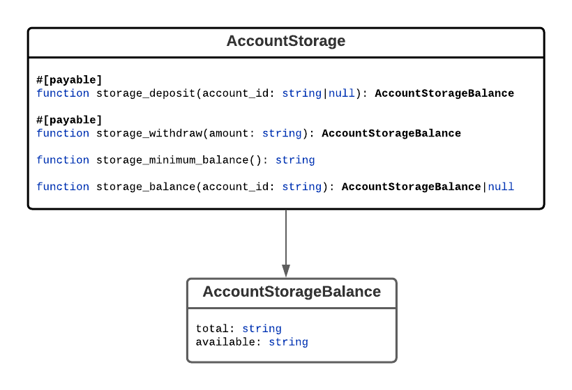

# Account Storage Standard (NEP-145)

[Storage staking][1] is an issue that needs to be addressed by any multi-user contract that allocates storage for the
user on the blockchain. This issue first arose while designing the [Fungible Token Core Standard - NEP-141][3]. Once
NEP-141 was finalized, the NEAR community went back to work on this problem. The [online discussion][4] has been lengthy,
and here I will present to you the fruits of our labor.

## Motivation: There Is No Free Storage

You can't get something for nothing. Long term contract state storage on the blockchain must be paid for. On the NEAR
platform long term storage is paid for using a process called [Storage staking][1]. The contract is responsible to stake NEAR
to pay for the contract's storage usage. The NEAR amount that is used for storage staking is effectively locked and cannot
be transferred or used to pay for gas. Storage staking costs are the most expensive costs to consider for the contract on 
NEAR. If storage costs are not managed properly, then they can [break the bank][2] for the contract.


### Side Note about "Account Storage Standard (formerly Account Registration)"
If you happened to follow the [online discussion][4], the discussion started with "Account Registration". However,
the discussion evolved into "Account Storage". The two are related, but with a different focus. The discussion was shifted
towards account storage to focus the discussion on the core problem we were trying to solve with [storage staking][1].
Account registration is related but separate concern and is to be continued in future discussions ...


# Account Storage API

On NEAR, the contract is responsible to pay for its long term persistent storage. Thus, multi-user contracts should be
designed to pass on storage costs to its user accounts. The account storage API provides the following:
1. Accounts can lookup the minimum required account storage balance for the initial deposit in order to be able to use the contract.
2. Accounts can deposit NEAR funds into the contract to pay for storage for either itself or on behalf of another account. 
The initial deposit for the account must be at least the minimum amount required by the contract.
3. Account storage balances can be looked up. The amount required to pay for the account's storage usage will be locked 
up in the contract. Any storage balance above storage staking costs is available for withdrawal.
4. Accounts can withdraw NEAR from the account's storage available balance.

### Out of Scope
- How to close the account and be able to withdraw all funds has been intentionally excluded from this standard.
- How the contract should account for changes in price for storage on the NEAR blockchain over time is out of scope.

## Quick API Overview 


**NOTES**
- API functions are specified using the lowest common denominator with the goal of being programming language neutral \(as much as possible\)
- String type is used as the de facto platform neutral type - but we will be leveraging Rust's type system when building the smart contract implementation
   - When interacting with the contract, all amounts and balances MUST be unsigned integers in yoctoNEAR.
- all account storage API functions are namespaced using a prefix naming convention (`account_`)
- `#[payable]` implies that the function supports NEAR to be attached to the function call
- API functions are tagged as either _**change methods**_ or _**view methods**_. This is from the [NEAR JSON RPC API](https://docs.near.org/docs/roles/developer/contracts/api) perspective.
   - Cross contract calls always require gas regardless of whether the function call being invoked is a _**view method**_ or _**change method**_
   
---

#### Domain Model

```javascript
class AccountStorageBalance {
    total: string;
    available: string;
}
```
- `total` represents the account's total storage balance in yoctoNEAR
- `available` represents the portion of the account's total storage balance that is available for withdrawal

--- 

#### Function

```javascript
#[payable]
function storage_deposit(account_id: string|null): AccountStorageBalance;
```

_change method_

Used by accounts to deposit funds to pay for account storage staking fees. This function supports 2 deposit modes:
1. **self deposit** (`account_id` is not specified): predecessor account is used as the account
2. **third party deposit** (`account_id` is valid NEAR account ID):  the function caller is depositing NEAR funds for the specified `account_id`
   
If this is the initial deposit for the account, then the deposit must be enough to cover the minimum required balance.

##### Arguments
- `account_id` - optional NEAR account ID. If not specified, then predecessor account ID will be used.

##### Returns
The account's updated storage balance.

##### Panics
- If the attached deposit is less than the minimum required account storage fee on the initial deposit.
- If `account_id` is not a valid NEAR account ID

---

#### Function

```javascript
#[payable]
function storage_withdraw(amount: string): AccountStorageBalance;
```

_change method_

Used to withdraw NEAR from the predecessor account's storage available balance. The attached yoctoNEAR will be refunded with the withdrawal transfer.

The account is required to attach exactly 1 yoctoNEAR to the function call to prevent restricted function-call access-key call.

##### Arguments
- `amount` - the amount to withdraw from the account's storage available balance expressed in yoctoNEAR

##### Returns
The account's updated storage balance.

##### Panics
- If the attached deposit does not equal 1 yoctoNEAR
- If the specified withdrawal amount is greater than the account's available storage balance

##### Notes
How an account will be able to withdraw funds is out of scope for this standard. For example, the contract could provide
a function to close the account, which would refund the account storage balance.

--- 

#### Function

```javascript
function storage_minimum_balance(): string;
```

_view method_

Used to look up the minimum balance required for the initial deposit.


#### Returns 
Amount in yoctoNEAR

--- 

#### Function

```javascript
function storage_balance(account_id: string): AccountStorageBalance|null;
```

_view method_

Used to lookup the account storage balance for the specified account.

##### Returns 
If the account is unknown to the contract, then null is returned. Otherwise `AccountStorageBalance` is returned.

##### Panics
- If `account_id` is not a valid NEAR account ID

---

### It's a wrap folks
Overall, the Account Storage API itself is pretty straight forward. The key is to know its purpose and what problem it is trying to solve. Let's recap:

- We discussed why contract storage costs must be carefully managed and accounted for by the contract.
- We learned about how [storage staking][1] works on NEAR and how it impacts multi-user contracts.
- We reviewed the new standard Account Storage API (NEP-145) in detail.

### What's Next
Enough theoretical discussion for now ... in the next tutorial we will get back to coding where we will implement the Account Storage API for the [STAKE][5] token contract. Until next time, I leave you with these final words ...

The Internet is the greatest revolution in humanity's history. It provides the people of the world with an opportunity to connect and unite to build a global community that knows no borders. I invite you to join the Figment and NEAR communities and embark on our common mission to defend and take back the Internet together.


[1]: https://docs.near.org/docs/concepts/storage-staking
[2]: https://docs.near.org/docs/concepts/storage-staking#the-million-cheap-data-additions-attack
[3]: https://learn.figment.io/network-documentation/near/tutorials/1-project_overview/2-fungible-token#what-does-account-registration-have-to-do-with-fungible-tokens
[4]: https://github.com/near/NEPs/discussions/145
[5]: https://github.com/oysterpack/oysterpack-near-stake-token