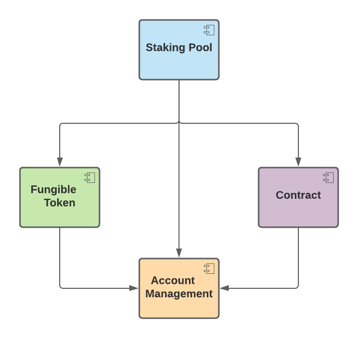

# OysterPack SMART STAKE Pool Guide for Validators

This tutorial is meant to serve as a guide for validators for managing and operating the **next generation** [OysterPack SMART
STAKE Pool][1] contract. If you wonder why I call it the "**next generation**" staking pool, then I refer you back to my previous
tutorial. In the last tutorial I showed you how easy it was to deploy the STAKE pool contract using the STAKE Pool Factory
contract and how to get started. As a validator, it is fundamental to know your staking pool contract in depth because
it is core to your validator business because it impacts your bottom line.

> Even though the main target audience are validators, contract developers will also benefit. You will learn about OysterPack
> SMART components and interfaces that you may leverage for your next contract to help you build smarter, faster, and better
> on the NEAR platform. You will also benefit from my experience and gain insight into my thought process for contract design.

# The Big Picture


The contract is composed of 4 OysterPack SMART components:

1. Account Management
2. Contract
3. Fungible Token
4. Staking Pool

Each component in turn provides 1 or more contract API interfaces. We will be using a divide and conquer approach and 
step through each component and API interface. The contract is implemented in Rust. Thus, I will review the contract API
in Rust, and I will also show how to invoke the contract APIs using the [NEAR CLI][2]. All the contract [source code][3] 
is available on GitHub. I expect the validators to be more technical savvy

## Component Dependency Graph



Notice how everything depends on **Account Management**. That makes sense because ultimately all STAKE Pool contract 
functionality derives from accounts staking funds into the pool. This is where we will get started. 

## Account Management Component

### Storage Management API

The storage management API implements the NEAR standard NEP-145, which I have covered in depth my prior [Account Storage Standard][4]
tutorial. Proper storage management is crucial to safegaurd any multi-user contract from what I call a "Denial of Storage"
attack. Storage management closes a big security vulnerability in the first generation staking pool contracts
that are currently in use. The attack is very simple based on the facts:

1. storage is orders of magnitude more expensive than transaction gas cost
2. the contract is ultimately responsible for paying for storage usage on the blockchain

Thus, in order to prevent malicious behavior, contract should pass along the storage costs to the accounts. Otherwise,
malicious actors can easily attack a contract by allocating expensive account storage on the contract using cheap transaction
gas cost. This reason should motivate current validators to migrate off the current first generation staking pool as soon 
as possible because it is not a question of will it happen, it's only a question of when. History has taught us that vulnerabilities
will always eventually be attacked and exploited because the reality is we live in a "dog eat dog" world. 

#### Key Points

1. Accounts must register with the contract before they can stake using the contract.
2. The account storage balance can be used to collect deposits and stake them as a batch later on. When an account stakes,
   any account storage available balance will be staked.
3. When accounts unregister from the STAKE pool contract, unregistration will fail if the account has STAKE tokens.
   The account must first unstake and withdraw the unstaked funds, before they are allowed to unregister. That being said,
   if an account chooses, they can force unregistration, and any STAKE tokens will get burned, which effectively distributes
   the staked NEAR to current STAKERS.


```shell
DATAHUB_APIKEY=<DATAHUB_APIKEY>
NEAR_NODE_URL=https://near-testnet--rpc.datahub.figment.io/apikey/$DATAHUB_APIKEY

NEAR_ACCOUNT=<YOUR-NEAR-ACCOUNT.testnet>
NEAR_ENV=testnet
STAKE_FACTORY=<STAKE-FACTORY-ACCOUNT.testnet>
STAKE=<STAKE-FT-SYMBOL>
CONTRACT=$STAKE.$STAKE_FACTORY

# VIEW METHODS
near --node_url $NEAR_NODE_URL view $CONTRACT storage_balance_bounds 
near --node_url $NEAR_NODE_URL view $CONTRACT storage_balance_of --args '{"account_id":"oysterpack.testnet"}'

# deposits NEAR for predecessor account
near --node_url $NEAR_NODE_URL call $CONTRACT storage_deposit --accountId $NEAR_ACCOUNT --amount 1
# deposits funds into specified "account_id" for account registration purposes only
near --node_url $NEAR_NODE_URL call $CONTRACT storage_deposit --accountId $NEAR_ACCOUNT --amount 0.00393 --args '{"account_id":"oysterpack.testnet", "registration_only":true}' 
# deposits funds for account self registration, i.e, for the predecessor account
near --node_url $NEAR_NODE_URL call $CONTRACT storage_deposit --accountId $NEAR_ACCOUNT --amount 1 --args '{"registration_only":true}'

# withdraw total account storage available balance
near --node_url $NEAR_NODE_URL call $CONTRACT storage_withdraw --accountId $NEAR_ACCOUNT --amount 0.000000000000000000000001
# withdraw the specified amount from the account storage available balance
near --node_url $NEAR_NODE_URL call $CONTRACT storage_withdraw --accountId $NEAR_ACCOUNT --amount 0.000000000000000000000001 -args '{"amount":"1000000"}'

near call $CONTRACT_NAME storage_unregister --accountId oysterpack-2.testnet --amount 0.000000000000000000000001
near call $CONTRACT_NAME storage_unregister --args '{"force":true}' --accountId oysterpack-2.testnet --amount 0.000000000000000000000001
```

### Account Storage Usage API

As stated above, managing account storage usage properly is crucial The storage management NEP-145 standard looks at it 
from the perspective of cost, i.e., storage balance. Storage costs change overtime. Fundamentally, it boils down to storage
usage, which is why the contract provides API's to inspect account storage usage. The storage management API provides
a storage balance bounds, i.e., which is used by accounts to lookup how much it costs to register with the contract. The
account management component is designed to dynamically compute account storage usage bounds when the contract is deployed.
Then, storage balance bounds are derived from the storage usage bounds.  


```shell
near --node_url $NEAR_NODE_URL view $CONTRACT ops_storage_usage_bounds 
near --node_url $NEAR_NODE_URL view $CONTRACT ops_storage_usage --args '{"account_id":"oysterpack.testnet"}'
```

### Permissions Management API

Access control and permissions management is a common use case. For example operator functions on the STAKE pool contract 
must be guarded to protect from allowing anyone to take the STAKE pool offline. The permission management implementation
supports a basic permissioning scheme using permission bitmasks. Up to 64 permissions (0-63) are supported, which should 
be sufficient to cover the majority of use cases. Two special permissions are pre-defined and reserved for the admin and 
operator. Permission bit 63 is reserved for the admin and permission bit 62 is reserved for the operator. 

By default, the contract owner is automatically assigned the admin permission when the contract is deployed. Only accounts
with the admin permission are permitted to manage permissions on other accounts. 

The STAKE Pool contract defines one additional contract specific permission: **treasurer**. Thus, the STAKE pool contract
supports 3 permissions or roles:

1. admin
2. operator
3. treasurer

Any other permission bits granted to an account will be ignored. 


```shell
near --node_url $NEAR_NODE_URL view $CONTRACT ops_permissions_is_admin --args '{"account_id":"oysterpack.testnet"}'
near --node_url $NEAR_NODE_URL view $CONTRACT ops_permissions_is_operator --args '{"account_id":"oysterpack.testnet"}'
near --node_url $NEAR_NODE_URL view $CONTRACT ops_permissions --args '{"account_id":"oysterpack.testnet"}'
near --node_url $NEAR_NODE_URL view $CONTRACT ops_permissions_granted --args '{"account_id":"oysterpack.testnet"}'

near --node_url $NEAR_NODE_URL call $CONTRACT ops_permissions_grant_admin --args '{"account_id":"oysterpack-2.testnet"}' --accountId $NEAR_ACCOUNT
near --node_url $NEAR_NODE_URL call $CONTRACT ops_permissions_grant_operator --args '{"account_id":"oysterpack-2.testnet"}' --accountId $NEAR_ACCOUNT

# used to grant permissions using a bitmask, e.g, 9 sets permission bits #0  and # 4:
# 00000000 00000000 00000000 00000000 00000000 00000000 00000000 00001001
near --node_url $NEAR_NODE_URL call $CONTRACT ops_permissions_grant --args '{"account_id":"oysterpack-2.testnet", "permissions": 9}' --accountId $NEAR_ACCOUNT
# used to specify permission bits separately as an array, e.g., [0,4] does the same as above, but may be easier to use
# when the API is invoked manually
near --node_url $NEAR_NODE_URL call $CONTRACT ops_permissions_grant_permissions --args '{"account_id":"oysterpack-2.testnet", "permissions": [0,4]}' --accountId $NEAR_ACCOUNT

near --node_url $NEAR_NODE_URL call $CONTRACT ops_permissions_revoke_admin --args '{"account_id":"oysterpack-2.testnet"}' --accountId $NEAR_ACCOUNT
near --node_url $NEAR_NODE_URL call $CONTRACT ops_permissions_revoke_operator --args '{"account_id":"oysterpack-2.testnet"}' --accountId $NEAR_ACCOUNT

near --node_url $NEAR_NODE_URL call $CONTRACT ops_permissions_revoke_all --args '{"account_id":"oysterpack-2.testnet"}' --accountId $NEAR_ACCOUNT
near --node_url $NEAR_NODE_URL call $CONTRACT ops_permissions_revoke --args '{"account_id":"oysterpack-2.testnet", "permissions": 9}' --accountId $NEAR_ACCOUNT
near --node_url $NEAR_NODE_URL call $CONTRACT ops_permissions_revoke_permissions --args '{"account_id":"oysterpack-2.testnet", "permissions": [0]}' --accountId $NEAR_ACCOUNT

# returns the custom permissions outside of admin and operator that the contract supports
# for the STAKE pool contract, the only special permission is treasurer
near --node_url $NEAR_NODE_URL view $CONTRACT ops_permissions_contract_permissions
```

To make it easier to manage **treasurer** permissions, the STAKE pool contract provides the following functions for convenience:

```shell
near --node_url $NEAR_NODE_URL call $CONTRACT ops_stake_grant_treasurer --args '{"account_id":"oysterpack-2.testnet"}' --accountId $NEAR_ACCOUNT
near --node_url $NEAR_NODE_URL call $CONTRACT ops_stake_revoke_treasurer --args '{"account_id":"oysterpack-2.testnet"}' --accountId $NEAR_ACCOUNT

near --node_url $NEAR_NODE_URL view $CONTRACT ops_stake_is_treasurer --args '{"account_id":"oysterpack-2.testnet"}'
```

If the admin permission is revoked from
the contract owner, then the contract owner has the ability to grant himself admin permission through the **Contract Operator**
API interface using the following method:

```shell
# can only be invoked by the contract owner
near --node_url $NEAR_NODE_URL call $CONTRACT ops_owner_grant_admin --accountId $NEAR_ACCOUNT
```

## Contract Component

The **Contract Component** provides APIs for common contract management activities. 

### Contract Ownership API

The API supports the following use cases:

1. Contract ownership can be transferred to another prospective account using the following workflow:


2. The contract owner can withdraw funds that the contract owner is entitled too.
   
The contract owner available balance will always be zero for the STAKE pool contract because all contract transaction earnings
go towards STAKE earnings. However, the STAKE Pool contract does contain a treasury account which is effectively owned
by the contract owner. 

#### Notes
- When the transfer is finalized, any owner balance is transferred to the new owner. The owner can withdraw from its available balance before the transfer is finalized.


```shell
near --node_url $NEAR_NODE_URL view $CONTRACT ops_owner
near --node_url $NEAR_NODE_URL view $CONTRACT ops_owner_balance

# Returns the prospective owner that the transfer is waiting on for finalization.
near --node_url $NEAR_NODE_URL view $CONTRACT  ops_owner_prospective

# NOTE: 1 yoctoNEAR deposit is required for transfer calls to force the owner to verify and confirm the transactions via the NEAR wallet
near -node_url $NEAR_NODE_URL call $CONTRACT ops_owner_transfer --args '{"new_owner":"oysterpack-2.testnet"}' --accountId $NEAR_ACCOUNT --amount 0.000000000000000000000001
near -node_url $NEAR_NODE_URL call $CONTRACT ops_owner_cancel_transfer --accountId $NEAR_ACCOUNT --amount 0.000000000000000000000001
near -node_url $NEAR_NODE_URL call $CONTRACT ops_owner_finalize_transfer --accountId $NEAR_ACCOUNT  --amount 0.000000000000000000000001

# NOTE: 1 yoctoNEAR deposit is required to force the owner to verify and confirm the transaction via the NEAR wallet
near -node_url $NEAR_NODE_URL call $CONTRACT ops_owner_withdraw_balance --accountId $NEAR_ACCOUNT --amount 0.000000000000000000000001
```

### Contract Operator API

The operator API enables storage balance to be locked based on expected contract storage usage. When the STAKE pool contract
is deployed, it will automatically lock funds to pay for 10K of contract storage, which is a conservative amount. The STAKE
pool contract should not require more than 10K storage. Locking the funds ensures that there is always enough balance available
on the contract to pay for storage for the contract to be operational.


```shell
# storage usage is specified in bytes
near -node_url $NEAR_NODE_URL call $CONTRACT ops_operator_lock_storage_balance --args '{"storage_usage":10000}' --accountId $NEAR_ACCOUNT 

# can only be invoked by the contract owner
near --node_url $NEAR_NODE_URL call $CONTRACT ops_owner_grant_admin --accountId $NEAR_ACCOUNT
```

### Contract Metrics API

This API enables key metrics to be monitored. Metrics track the following

1. total registered accounts
2. account storage usage
3. account NEAR balances - from account storage balances
4. contract NEAR balances - these are funds managed at the contract level - we'll take a closer look at these below


```shell
near --node_url $NEAR_NODE_URL view $CONTRACT ops_metrics_total_registered_accounts

# returns total contract storage usage and total storage usage across all accounts 
near --node_url $NEAR_NODE_URL view $CONTRACT ops_metrics_contract_storage_usage

# returns storage usage costs based on current storage byte cost and breaks down who is paying the storage bill
near --node_url $NEAR_NODE_URL view $CONTRACT ops_metrics_storage_usage_costs

# returns a breakdown of all NEAR balances
near --node_url $NEAR_NODE_URL view $CONTRACT ops_metrics_near_balances

# returns metrics for account storage and NEAR balances
near --node_url $NEAR_NODE_URL view $CONTRACT ops_metrics_accounts

# returns an aggregate metric view for all of the above metrics
near --node_url $NEAR_NODE_URL view $CONTRACT ops_metrics
```

#### STAKE Pool Contract Balances

This is fundamental to understand because it's how all the "money" is managed. The diagram below shows all of the contract
managed balances and how they fit into the overall big picture.

> PAY ATTENTION HERE - This is the most critical diagram to understand how money is flowing within the contract.


1. **Account Locked Balance**
   - is the portion of the total contract account balance that is currently locked by the NEAR protocol
   - this will correspond to the total staked balance and unstaked balance that is locked
2. **TOTAL_STAKED_BALANCE** 
    - is used by the contract to track the total amount of NEAR that has been staked
    - NOTE: this balance is related to the account locked balance. When the pool is online the account locked balance should
      always be greater than or equal to the total staked balance.
3. **TOTAL_USTAKED_BALANCE** and **UNSTAKED_LIQUIDITY_POOL**
    - are used by the contract to track the total amount of NEAR that has been unstaked.
    - the sum of the two balances is equal to the total unstaked balance
    - liquidity is automatically added when stakers stake new funds while TOTAL_USTAKED_BALANCE > 0. When liquidity is added,
      the funds are moved from the TOTAL_USTAKED_BALANCE into UNSTAKED_LIQUIDITY_POOL
    - funds from the UNSTAKED_LIQUIDITY_POOL are avaialble for withdrawal on a first come first serve basis
4. **Storage Balance** - this refers to the account storage balance
5. **Transaction Gas Fees** and **Staking Rewards** flow into the contract's total staked balance, which links to the account locked balance
6. **Contract Storage** and **CONTRACT_LOCKED_STORAGE_BALANCE**
    - are balances that the contract owner is resposible for to pay for contract operational storage
7. **Treasury**
    - is a STAKE account balance owned by the STAKE contract itself
    - the treasury is used to pay out dividends by burning STAKE for treasury earnings
    - the treasury balance correlates to the dividend payout - the more funds that the contract owner moves into the treasury,
      the higher the dividend
    
Internally contract balances are stored using a numeric ID, which are listed in the `balances` section:

```text
near --node_url $NEAR_NODE_URL view $CONTRACT ops_metrics_near_balances

{
  total: '74007102668152498690300000000',
  accounts: '7860000000000000000001',
  balances: {
    '1955299460766524333040021403508226880': '100000000000000000000000',        // CONTRACT_LOCKED_STORAGE_BALANCE
    '1955705469859818043123742456310621056': '74002187045471879361699999999'    // TOTAL_UNSTAKED_BALANCE
  },
  owner: '4807762680619328600000000',
  locked: '0'
}
```
In the above sample output, we can see that all funds have been unstaked in the pool.

The corresponding contract balance IDs are defined as:
```rust
pub const CONTRACT_LOCKED_STORAGE_BALANCE: BalanceId = BalanceId(1955299460766524333040021403508226880);
pub const TOTAL_STAKED_BALANCE: BalanceId = BalanceId(1956973021105502521442959170292258855);
pub const TOTAL_UNSTAKED_BALANCE: BalanceId = BalanceId(1955705469859818043123742456310621056);
pub const UNSTAKED_LIQUIDITY_POOL: BalanceId = BalanceId(1955784487678443851622222785149485288);
```

## Fungible Token Component

Provides the API's that provide the STAKE token. These APIs are well documented, and I will defer to:
- [The New and Improved Fungible Token Standard (NEP-141) Has Arrived][5]
- [NEAR Fungible Token Standard][6]

[1]: https://learn.figment.io/network-documentation/near/tutorials/1-project_overview/8-stake-pool-contract#how-to-operate-the-stake-pool-contract
[2]: https://docs.near.org/docs/tools/near-cli
[3]: https://github.com/oysterpack/oysterpack-smart
[4]: https://learn.figment.io/network-documentation/near/tutorials/1-project_overview/5-account-storage
[5]: https://learn.figment.io/network-documentation/near/tutorials/1-project_overview/2-fungible-token
[6]: https://nomicon.io/Standards/FungibleToken/README.html