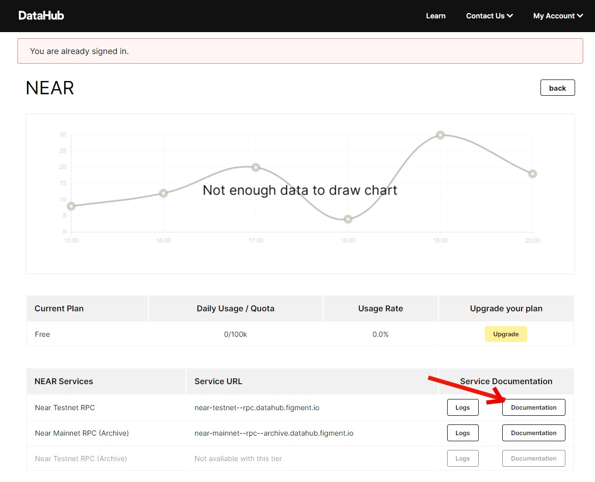
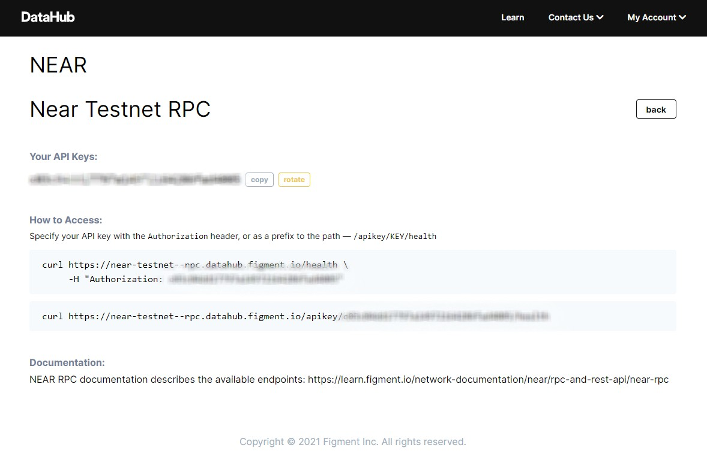

# 1. Connect to a NEAR node using DataHub

## Introduction

In order to benefit from the full potential of the NEAR blockchain, you will first need to connect to a NEAR node. In this tutorial, we are going to use the official NEAR Javascript API to connect to a NEAR node hosted by [**DataHub**](https://datahub.figment.io/sign_up?service=near). We will be building a simple Nodejs application, which we will develop further during the NEAR Pathway.

More details about NEAR JavaScript API ****can be found [**here**](https://github.com/near/near-api-js).



## Creating the NodeJS application

Before we can jump in and start using the NEAR JavaScript API, we need to set up our project and all required dependencies.


Please make sure that you have Node.js 12 installed on your machine.


First, make sure you have the right version of Node.js installed on your development machine. All tutorials in the NEAR Learn pathway require at least version 12.x, however there might be compatibility issues if you're using the most recent release like 15.x. 

We encourage developers to use a version manager  to easily switch between different Node.js engine versions without having to worry about breaking any of existing projects and development setups. Popular options include [NVM](https://github.com/nvm-sh/nvm) and [Asdf-Nodejs](https://github.com/asdf-vm/asdf-nodejs). Check your current version with:

```text
node -v
```

When a correct Node.js version is being set you should see a similar output:

```text
v12.19.1
```

The next step is to create a directory for your project where you will initialize the new Node.js project. You can do this using the following command:

```javascript
npm init -y
```

As a result you will see a new file `package.json` created in the current directory. We're going to just leave the file as is for now:

```javascript
{
  "name": "near",
  "version": "1.0.0",
  "description": "",
  "main": "index.js",
  "scripts": {
    "test": "echo \"Error: no test specified\" && exit 1"
  },
  "author": "",
  "license": "ISC",
  "dependencies": {
   }
}
```

## Installing packages

Now that we have our Node.js application set up we can install the required packages:

* `near-api-js` - for the NEAR JavaScript API \(you will need version `0.36.3`\)
* `dotenv` - for working with environment variables
* `js-sha256` - for SHA256 hashing implementation

Install the packages:

```javascript
npm install --save near-api-js@0.36.3 dotenv js-sha256
```

After the successful installation you will also see the packages added to your `package.json` file:

```text
"dependencies": {
  "dotenv": "^8.2.0",
  "js-sha256": "^0.9.0",
  "near-api-js": "^0.36.3"
}
```

## Configure environment

When we have that out of our way, we can continue by creating an `.env` file which will hold all our sensitive data.

You should never commit this file to a git repository so make sure to create a `.gitignore` file with the following content:

```javascript
.env
```

Now, open `.env` file and add a few environment variables that we're going to use in all tutorials moving forward:

* `NEAR_NODE_URL` - URL for NEAR DataHub node.
* `NEAR_NETWORK` - Name of the NEAR network, should be `testnet` by default.
* `NEAR_ACCOUNT` - Name of your NEAR account, create a new unique name and end in `.testnet` suffix

Your `.env` file should look similar to:

```javascript
NEAR_NODE_URL=https://near-testnet--rpc.datahub.figment.io/apikey/<YOUR API KEY>
NEAR_NETWORK=testnet
NEAR_ACCOUNT=your-unique-account-name.testnet
```

Make sure you have replaced `YOUR API KEY` with the valid DataHub access key. To obtain an API key you need to go to the [DataHub dashboard](https://datahub.figment.io/) \(assuming you have created an account\), then click on "NEAR" in the list of available services, after clicking on NEAR you'll see a new page \[image A\], where you have to click on Documentation \(mentioned under service documentation column\) and then you will see a new page from where you have to copy the API hostname and key \[image B\]. Your DataHub configuration page might look like the screenshot below.






Keep the `.env` file safe as it contains your DataHub API access key.


## Interacting with NEAR node

Now that we have completed all the necessary configuration steps, we can finally start building our application. We will start by configuring the NEAR javascript package and then check if everything works by fetching the node status.

Create the `connect.js` file with the following content:

```javascript
// Load environment variables
require("dotenv").config();

// Load NEAR Javascript API components
const near = require("near-api-js");

// Setup default client options
const options = {
  networkId:   process.env.NEAR_NETWORK,
  nodeUrl:     process.env.NEAR_NODE_URL,
  walletUrl:   `https://wallet.${process.env.NEAR_NETWORK}.near.org`,
  helperUrl:   `https://helper.${process.env.NEAR_NETWORK}.near.org`,
  explorerUrl: `https://explorer.${process.env.NEAR_NETWORK}.near.org`,
  keyStore:    {} // we will configure this later
}

async function main() {
  // Configure the client with options
  const client = await near.connect(options);
  const provider = client.connection.provider;
  console.log("Client config:", client.config);

  // Get current node status
  const status = await provider.status();
  console.log("Status:", status);
}

main();
```

There are a few things happening in the code, let's break it down a bit.

First, we load the NEAR node client configuration from environment variables \(`.env` file\) created in the previous step. Environment variables are convenient to use instead of hardcoding values in the code and only need to change in one place.

Using the NEAR JavaScript API is super simple, all we have to do is require the package and we should be good to go!

```javascript
const near = require("near-api-js");
```

Next, there are a few values assigned to the `options` variables. We currently only need `nodeUrl` but we'll use the rest in the following tutorials.

Finally, in the `main` function we configure the client and get the network status:

```javascript
const client = await near.connect(options);
const provider = client.connection.provider;
const status = await provider.status();
```

Let's run the code:

```javascript
node connect.js
```

If everything configured right you should see a similar output:

```javascript
Client config: { networkId: 'testnet',
  nodeUrl: 'https://rpc.testnet.near.org',
  walletUrl: 'https://wallet.testnet.near.org',
  helperUrl: 'https://helper.testnet.near.org',
  explorerUrl: 'https://explorer.testnet.near.org',
  keyStore: {} }

Status: { version: { version: '1.16.0-rc.2', build: 'e3b3e835' },
  chain_id: 'testnet',
  protocol_version: 39,
  latest_protocol_version: 39,
  rpc_addr: '0.0.0.0:3030',
  validators:
   [ { account_id: 'node2', is_slashed: false },
     { account_id: 'mmm.pool.f863973.m0', is_slashed: false },
     { account_id: 'fresh_lockup.pool.f863973.m0',
       is_slashed: false },
     { account_id: 'blazenet.pool.f863973.m0', is_slashed: false },
     { account_id: 'node3', is_slashed: false }],
  sync_info:
   { latest_block_hash: 'H4zYVT2yAGVZETRrkzMFkWAwcdxckMA5AFy1XB6zaEcK',
     latest_block_height: 23147504,
     latest_state_root: '89PTGup1pKy9mMiCKfNBjNVnnaJGKxsGCKyHtWg2n2jy',
     latest_block_time: '2020-11-06T19:46:38.859966308Z',
     syncing: false },
  validator_account_id: 'nearup-node9' }
```

Congratulations, you have successfully connected to the node!

## Conclusion

Now that we have successfully connected to a NEAR node using DataHub, we are ready to move on to the next tutorial.

The complete code for this tutorial can be found on [**Github**](https://github.com/figment-networks/tutorials/blob/main/near/1_connect_to_node/main.js).

### Next Steps

In the next tutorial, we will be creating our first NEAR account on the NEAR testnet and funding it with test tokens.

If you had any difficulties following this tutorial or simply want to discuss NEAR tech with us you can join [**our community**](https://discord.gg/fszyM7K) today!

