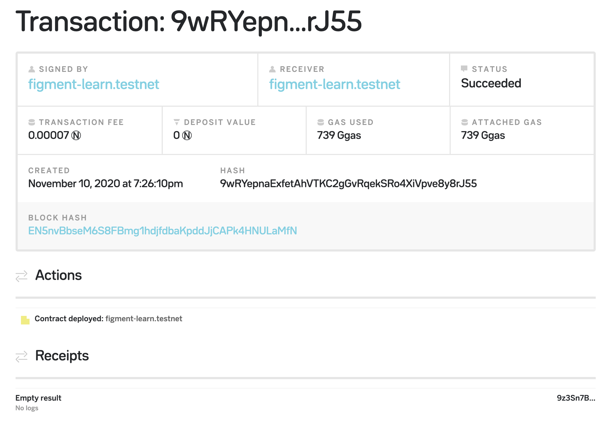

# 5. Write and deploy your first NEAR smart contract

## Introduction

At some point, while building on the NEAR blockchain, you will want to create smart contracts in order to unlock the full power of NEAR.

In this tutorial, we will learn how to create a simple contract using the NEAR SDK for AssemblyScript Contracts, compile it to WASM binary and deploy to NEAR Testnet using a [DataHub](https://datahub.figment.io/sign_up?service=near) node.

### Prerequisites

Please make sure that you have completed the tutorials:

1. [Connecting to a NEAR node with DataHub](https://learn.figment.io/network-documentation/near/tutorials/1.-connecting-to-a-near-node-using-datahub)
2. [Creating your first NEAR account](https://learn.figment.io/network-documentation/near/tutorials/2.-creating-your-first-near-account-using-the-sdk)
3. [Querying the NEAR blockchain](https://learn.figment.io/network-documentation/near/tutorials/3.-querying-the-near-blockchain)
4. [Submitting your first transaction](https://learn.figment.io/network-documentation/near/tutorials/4.-submitting-your-first-transactions)

We will be building on top of the Node.js application created in these tutorials.



## Creating a Smart Contract

Before we start working on the contract code itself, we need to install the necessary tooling to support compilation of AssemblyScript codebase into WASM. Compilation is handled by the NEAR SDK for AssemblyScript Contracts and can be found on [**Github**](https://www.assemblyscript.org/).

In the terminal run the following command:

```javascript
npm install --save near-sdk-as
```

That should do it! Now we can move on to the development part. The purpose of this tutorial is to keep things simple and straightforward, so we will be implementing a contract with only two functions that write and read data from the blockchain store.


Run `yarn add -D near-sdk-as` instead if you are using the latest Node.js version \(15.x\)


We're going to follow the suggested pattern for contract development directory structure and first create a new directory `assembly` where all out test contract files are going to live moving forward.

Next, create a new file `assembly/index.ts` with our simple contract code:

```javascript
import { context, storage, logging } from "near-sdk-as";

export function getValue(): string | null {
  return storage.getString("state");
}

export function setValue(value: string): void {
  logging.log("Setting value to " + value);
  storage.setString("state", value);
}
```

As you can see, we have two functions: `setValue` for writing data into storage, and `getValue` for reading previously stored data. The contract code must be written in [AssemblyScript](https://www.assemblyscript.org/), a variant of [TypeScript](https://www.typescriptlang.org/), and should already be familiar to developers with TypeScript experience. If that's not the case - don't worry, the example contract we're covering in this tutorial is not going to get any more complex.

Each function that is going to be exposed in the contract and later called via NEAR RPC should be prefixed with an `export` keyword. Any other functions that are intended for internal use cases don't have to be exported.

Now, let's talk about the `storage` component: storage is a helper class that allows contracts to modify the persistent state and read from it. `setString` allows you to persistently store a string value for a given string key. We will store the message provided by the last caller of this contract.

## Compiling to WebAssembly

Now that we have the contract code ready, we can focus on the compilation step. Before we can deploy the contract onto the NEAR network it needs to be converted from the AssemblyScript into a WASM binary file. Luckily it is extremely easy to do with the NEAR SDK.

First, create a new file in the current project directory, named `asconfig.json` with the content below. The config file is necessary for the correct compilation of the contract code.

```javascript
{
  "extends": "near-sdk-as/asconfig.json",
  "options": {
    "measure": true,
    "binaryFile": "./contract.wasm"
  }
}
```

Next you use`asb`, a tool to compile AssemblyScript files -&gt; WASM binary blobs. You can run `npx asb --help` or `./node_modules/.bin/asb --help` to see the list of all available options if you're interested.

With all the bits in place, we are ready to compile our contract. Run the following command:

```javascript
npx asb
```

This builds the release target and the output might look something like:

```javascript
I/O Read   :     5.802 ms  n=350
I/O Write  :     0.531 ms  n=1
Parse      :   354.087 ms  n=140
Initialize :    19.657 ms  n=1
Compile    :   183.053 ms  n=1
Emit       :    38.003 ms  n=1
Validate   :    43.159 ms  n=1
Optimize   :  3132.795 ms  n=1
Transform  :          n/a  n=4
```

You should be able to find a newly created file `contract.wasm` in the current directory.

Great job! We have successfully compiled our first smart contract into a WebAssembly binary and ready to deploy it to the NEAR network using DataHub.


To compile a non-optimized binary with debug info run`npx asb --target debug`.


## Deploying the Contract

Contract deployment on the network typically means that a compiled contract code, a WASM binary, gets broadcasted to the network as part of a transaction with a special action. We have previously covered the creation of a simple transaction, like token transfer, so creating a contract deployment is not much different. There are multiple ways to deploy a contract, however, we will cover only the most convenient one: using the NEAR CLI.

So far we have relied solely on NEAR Javascript API to perform various calls to the RPC, so now it's a good time to introduce a new tool to your arsenal, a NEAR CLI, that you might find extremely useful for day-to-day operations on NEAR blockchain in the future.

If you have not installed the CLI yet, run the following command:

```javascript
npm install -g near-cli
```

Once you run `near --help` you should see the general usage and list of available commands.

Now, make sure to check a few things before we continue:

* You should already have a `./credentials/testnet/ACCOUNT_ID.json` file with your account key pair, created as part of our previous tutorials.
* You have located the `contract.wasm` file created in the previous section of this tutorial.

To deploy your smart contract using the CLI run the command:

```text
near deploy \
  --contractName=figment-learn.testnet \
  --keyPath=./credentials/testnet/figment-learn.testnet.json \
  --wasmFile=./contract.wasm
```

Where:

* `--contractName` is the name of your contract, for demo purposes we use the same name as our account name, but you can pick any name you'd like \(the contract must exist though\).
* `--keyPath` is a location of the key pair file
* `--wasmFile` is a location of the compiled contract file


For demo purposes, we are using `figment-learn.testnet` contract throughout the tutorial. Please don't forget to change the name of your contract!


The output of the command might look similar to:

```javascript
Starting deployment. Account id: figment-learn.testnet, node: https://rpc.testnet.near.org, helper: https://helper.testnet.near.org, file: ./contract.wasm
----------------
Loaded master account figment-learn.testnet key from ./credentials/testnet/figment-learn.testnet.json with public key = ed25519:2EkrpVXEbFmg8T6UZkCv8JBfjJyGMUgsfdh7mcuShwxf
----------------
Transaction Id 9wRYepnaExfetAhVTKC2gGvRqekSRo4XiVpve8y8rJ55
----------------
To see the transaction in the transaction explorer, please open this url in your browser
https://explorer.testnet.near.org/transactions/9wRYepnaExfetAhVTKC2gGvRqekSRo4XiVpve8y8rJ55
----------------
Done deploying to figment-learn.testnet
```

Looks good, you can see the transaction status and outcome in the NEAR explorer. Here's an example:



That's it, the contract code is live and has been successfully deployed. Next, we will cover the interactions with the contract.

## Calling the Contract Methods

Our contract has been deployed and we should be ready to interact with its methods. First, we will call the `setValue` function and give it some text input, then verify the last given value by calling the `getValue` function that should return the original input value. Pretty simple.

Create a new file `execute.js` with the following content:

```javascript
// Load environment variables
require("dotenv").config();

// Load NEAR Javascript API components
const near = require("near-api-js");

// Directory where NEAR credentials are going to be stored
const credentialsPath = "./credentials";

// Configure the keyStore to be used with the NEAR Javascript API
const UnencryptedFileSystemKeyStore = near.keyStores.UnencryptedFileSystemKeyStore;
const keyStore = new UnencryptedFileSystemKeyStore(credentialsPath)

// Setup default client options
const options = {
  networkId:   process.env.NEAR_NETWORK,
  nodeUrl:     process.env.NEAR_NODE_URL,
  walletUrl:   `https://wallet.${process.env.NEAR_NETWORK}.near.org`,
  helperUrl:   `https://helper.${process.env.NEAR_NETWORK}.near.org`,
  explorerUrl: `https://explorer.${process.env.NEAR_NETWORK}.near.org`,
  accountId:   process.env.NEAR_ACCOUNT,
  deps: {
    keyStore: keyStore
  }
}

async function main() {
  // Configure the client with options and our local key store
  const client = await near.connect(options);
  const account = await client.account(options.accountId);

  // We'are using the same contract name, feel free to create a different one.
  const contractName = options.accountId;

  // Construct a new contract object, we'll be using it to perform calls
  const contract = new near.Contract(account, contractName, {
    viewMethods: ["getValue"],   // our read function
    changeMethods: ["setValue"], // our write function
    sender: options.accountId,   // account used to sign contract call transactions
  });

  // We will send the current date when calling `setValue`
  const value = (new Date()).toString();

  console.log(`Calling contract call 'setValue' with '${value}'`);
  await contract.setValue({ value: value });

  // Get the value we assigned
  console.log("Getting current value");
  result = await contract.getValue();
  console.log("Result:", result);

  // Alternative way of calling a function
  result = await account.functionCall(
    contractName,
    "getValue",
    {}
  );
  console.log(result);
};

main();
```

The majority of the code should be pretty familiar by now, so we'll cover just the important stuff. There are multiple ways to interact with contracts, like using direct RPC calls, though the NEAR Javascript API provides a more convenient option. We start by instantiating a new `near.Contract` object with a list of functions we're going to use \(or all available ones\):

```javascript
const contract = new near.Contract(account, contractName, {
  viewMethods: ["getValue"],
  changeMethods: ["setValue"],
  sender: options.accountId,
});
```

Contract object gives us the ability to call the methods naturally like:

```javascript
await contract.setValue({ value: "some text"});
await contract.getValue();
```

Now, run the code to see everything in action:

```javascript
node execute.js
```

On a successful run you should be able to see an output like:

```javascript
Calling contract call 'setValue' with 'Tue Nov 10 2020 19:47:56 GMT-0600 (Central Standard Time)'
Receipt: 93bMFayAbJNwkk2BXo4TFmFQ4AzJ3N2V3ooFTxg22Pb9
    Log [figment-learn.testnet]: Setting value to Tue Nov 10 2020 19:47:56 GMT-0600 (Central Standard Time)
-----
Getting current value
Result: Tue Nov 10 2020 19:47:56 GMT-0600 (Central Standard Time)
-----
{ status:
   { SuccessValue:
      'IlR1ZSBOb3YgMTAgMjAyMCAxOTo0Nzo1NiBHTVQtMDYwMCAoQ2VudHJhbCBTdGFuZGFyZCBUaW1lKSI=' },
  transaction:
   { signer_id: 'figment-learn.testnet',
     public_key: 'ed25519:2EkrpVXEbFmg8T6UZkCv8JBfjJyGMUgsfdh7mcuShwxf',
     nonce: 75,
     receiver_id: 'figment-learn.testnet',
     actions: [ [Object] ],
     signature:
      'ed25519:3n9YkL7mQLwnSfQ2v4wLTgh43SrSS5bdct7G1NQBo1admgopVxRQ8NZ6T8r4DmNwASbcXKnVxLKUMWM7hT9N5oA',
     hash: '4Nk5w8DCZMRJpVYmYbaFyNgXdjZh8jHCQpbbr2NF9bYM' },
```

Awesome, so everything worked out well. What you see in the output is:

* We called `setValue` with the current time as an input, the call was successful
* We called `getValue` and the output matched with the original input.

NEAR explorer will provide you a bit more information about each transaction, see examples below.


Detailed view:

| Set Value Tx | Get Value Tx |
| :--- | :--- |
| [](https://camo.githubusercontent.com/03483b5223707094a5f80557caa02dd3ec41549bfdebe05f63706baa106ab817/68747470733a2f2f692e696d6775722e636f6d2f4c584562566e312e706e67) | [](https://camo.githubusercontent.com/5b49e8f49eb1741deae204326982763c1738b0d585491ec059c9d659c39e7562/68747470733a2f2f692e696d6775722e636f6d2f575575497047662e706e67) |

## Conclusion

Congratulations! You have successfully created, deployed, and interacted with your smart contract on the NEAR Testnet using DataHub.

While we have only covered a very small area of contract development you are more than welcome to continue exploration and experiments on your own, feel free to check out [**NEAR Developer**](https://examples.near.org/) site for more examples and tutorials.

The complete code for this tutorial can be found on [**Github**](https://github.com/figment-networks/tutorials/tree/main/near/5_contracts).

If you had any difficulties following this tutorial or simply want to discuss NEAR and DataHub tech with us you can join [**our community**](https://discord.gg/fszyM7K) today!

