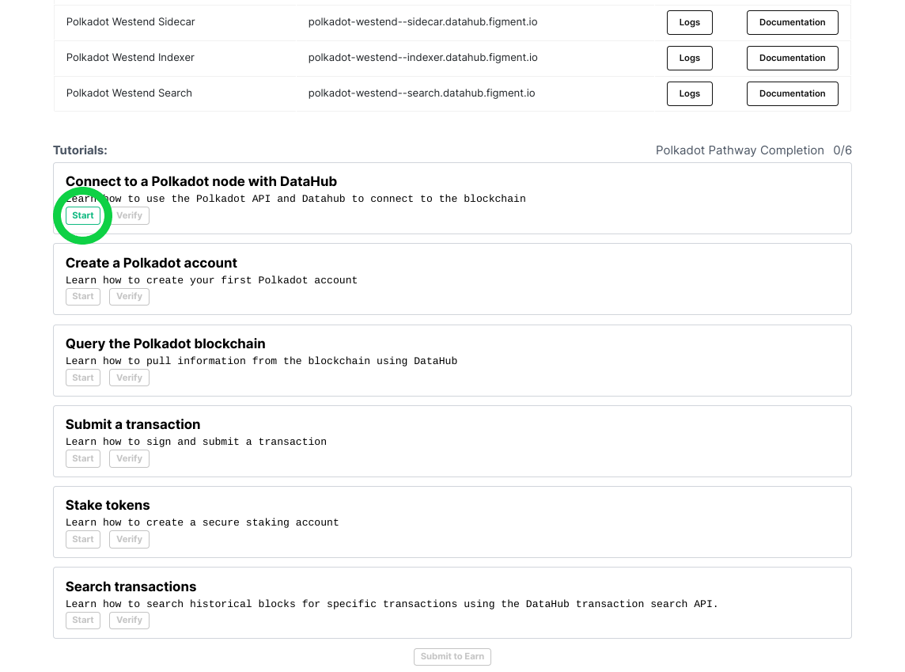
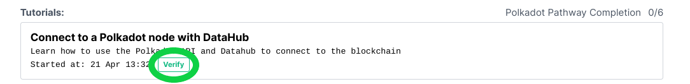

# 🗺 Polkadot Pathway

##  Welcome to the Polkadot Pathway

Polkadot enables scalability by allowing specialized blockchains to communicate with each other in a secure, trust-free environment. It is built to connect and secure unique blockchains, whether they be public, permissionless networks, private consortium chains, or oracles, and other Web3 technologies. It enables an internet where independent blockchains can exchange information under common security guarantees.

Learn what makes it unique and build your first project to **earn 1.1 DOTs**!


Disclaimer: Unfortunately, due to the recent actions of a small group of scammers, we are unable to reward DOT to developers based in Russia or Ukraine for completing the pathway. You are still more than welcome to participate in our learn community and are able to become a tutorial contributor. We will consider submissions by our active community members on a case-by-case basis.


## **🏁** Get started by signing up for DataHub 

Once you are ready, get started by [**setting up an account on DataHub**](https://datahub.figment.io/sign_up?service=polkadot) to put your skills to the test and follow along with the tutorials to start building on Polkadot. Make sure to click on "Start" on the first tutorial before starting to code!  

Verify each tutorial as you complete them and make sure to click on "Submit to earn" when you are done with the five tutorials to access the completion form. 

[**Learn more about DataHub**](https://learn.figment.io/guides/datahub-products)**.** 

\*\*\*\*[**Make sure to read our Terms of Use before starting**](https://learn.datahub.figment.io/terms-of-use)**.** 

## \*\*\*\* **Polkadot** Pathway Tutorials

###  [Get started by signing up to DataHub!](https://datahub.figment.io/sign_up?service=polkadot) 


Make sure to use a browser that does not hide your IP address, we will deny submissions with hidden IPs. VPNs and VPS are also prohibited.  
  
We also do not accept "Google phone numbers" or any online SMS number. 


### 💡 1. Connect to a Polkadot node using DataHub



### 💡 2. Create a Polkadot account



### 💡 3. Query the Polkadot blockchain



### 💡 4. Submit a transaction to Polkadot



### 💡 5. Stake tokens on Polkadot



### 💡 6. Search for Polkadot transactions 



