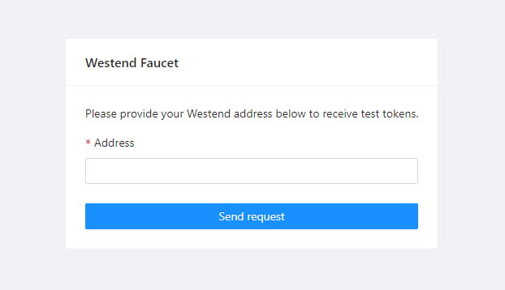
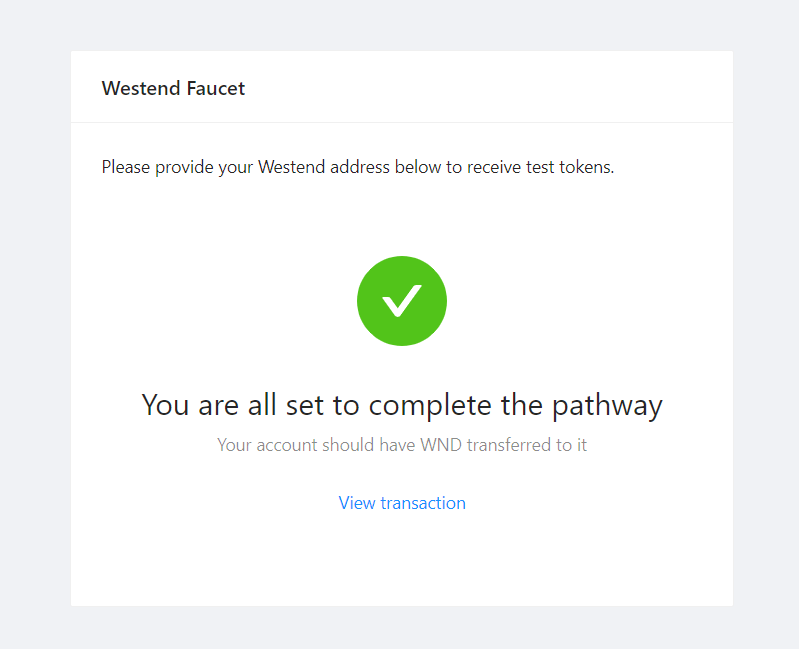

# 4. Submit a transaction

We will be building on top of the Node.js application created in the previous tutorials, so make sure to have completed :

1. [**Connect to Polkadot using a Datahub node**](https://learn.figment.io/network-documentation/polkadot/tutorials/intro-pathway-polkadot-basics/1.-connecting-to-a-polkadot-node-with-datahub)
2. [**Create a Polkadot account**](https://learn.figment.io/network-documentation/polkadot/tutorials/intro-pathway-polkadot-basics/2.-create-a-polkadot-account)
3. [**Query the blockchain**](https://learn.figment.io/network-documentation/polkadot/tutorials/intro-pathway-polkadot-basics/3.-query-the-blockchain)



## Get WND from the Figment faucet

Before we can transfer any value on Westend, we will need to acquire some WND tokens from a faucet. These tokens are free, have no monetary value & cannot be traded for any token that does have value, even unintentionally. Being able to test token transfers and interact with core functionality before going to production is a vital part of the blockchain development process. For this, we must have sufficient funding in our accounts to pay network fees and meet the existential deposit.

WND tokens can be obtained from the Figment Learn faucet or the official Polkadot faucet - however the official faucet only releases 1 WND per user, per day. Go to [https://faucet.figment.io/](https://faucet.figment.io/), sign in with a DataHub account and then copy/paste the address we generated in the step 2 into the text input \(this address should be stored in the `.env` file\) :





If you want to view your account transactions and balances with a block explorer, visit [https://westend.subscan.io/](https://westend.subscan.io).

## Make a transfer

Create a new file called `transfer.js` file and place the following code within :

```javascript
const { ApiPromise, Keyring } = require('@polkadot/api');
const { HttpProvider } = require('@polkadot/rpc-provider');
require("dotenv").config();

const main = async () => {
  const httpProvider = new HttpProvider(process.env.DATAHUB_URL);
  const api = await ApiPromise.create({ provider: httpProvider });
  const keyring = new Keyring({type: 'sr25519'});

  const AMOUNT = 100000000000; // 1/10 of a WND
  const RECIPIENT_ADDRESS = '5FjUdXXa2QRvvSsN7wpnPMevfGsehDNVkyThjt7zGzAPBZfE';

  // Initialize account from the mnemonic
  const account = keyring.addFromUri(process.env.MNEMONIC);

  // Retrieve account from the address
  const now = await api.query.timestamp.now();
  const { data: balance } = await api.query.system.account(process.env.ADDRESS);
  console.log(`${account.address} has a balance of ${balance.free} at timestamp: ${now}`);

  // Transfer tokens
  const txHash = await api.tx.balances
    .transfer(RECIPIENT_ADDRESS, AMOUNT)
    .signAndSend(account);

  // Go to https://westend.subscan.io/extrinsic/<TxHash> to check your transaction
  console.log(`Transaction hash: https://westend.subscan.io/extrinsic/${txHash}`);
};

main().catch((err) => {
  console.error(err);
}).finally(() => process.exit());
```

Beyond the `httpProvider`, `api` and `keyring` constants which we are using to initialize our connection to DataHub and manage our keyring, we will also define `AMOUNT` and `RECIPIENT_ADDRESS`.

Initializing access to our account via the mnemonic seed phrase we have stored in `.env` using `keyring.addFromUri()` and then using `api.query.system.account()` to look at the balance of an account. Once again, we use environment variables to keep important information safe and out of our code.

More information on the available extrinsic functions for Substrate compatible blockchains can be found in the [Polkadot API docs](https://polkadot.js.org/docs/substrate/extrinsics/). Now let us take a closer look at the parameters we are providing to the `.transfer()` extrinsic function :

```javascript
.transfer(RECIPIENT_ADDRESS, AMOUNT)
```

The `RECIPIENT_ADDRESS` is defined and so is the `AMOUNT`. In this case, both of these values are hardcoded earlier in the `main()` function, though it would perhaps be better to use dynamic values - we are keeping it simple for the purpose of explanation. These are the two values we must pass into `.transfer()` so that it knows where and how much to send.

Immediately following the transfer, we have :

```javascript
.signAndSend(account);
```

For this, we are simply providing our account as a signer. This is all that is required to send an amount of tokens from our address to another address.

Now that everything is in order, we will run `transfer.js` using this command :

```bash
$ node transfer.js
```

The output will be similar to the following example, although the address, timestamp and transaction hash will differ. Follow the link to view the successful transaction on the SubScan block explorer.

```bash
5FQopYEYSyZjbocqPPY4evE8uAA2DPgxsMC26LNByA19C95u has a balance of 166599849320 at timestamp: 1618522290000
Transaction hash: https://westend.subscan.io/extrinsic/0x92bcab0aefeb37238ecb70c14ffabd3e7e5d0e0eeddeaf3fb15d98f13560d42d
```

## Next steps

In the next tutorial, we will learn how to set up a Proxy Account to enable staking our tokens on Polkadot validators, which is an important function in a proof of stake blockchain because it helps to secure the network.

For the curious, the [Polkadot Wiki](https://wiki.polkadot.network/en/) has more comprehensive information on [constructing and signing transactions](https://wiki.polkadot.network/docs/en/build-transaction-construction).

If you had any difficulties following this tutorial or simply want to discuss Polkadot with us you can join our [Community Forums](https://community.figment.io) or our [Discord community](https://discord.com/invite/fszyM7K) today for up-to-date news and events!

