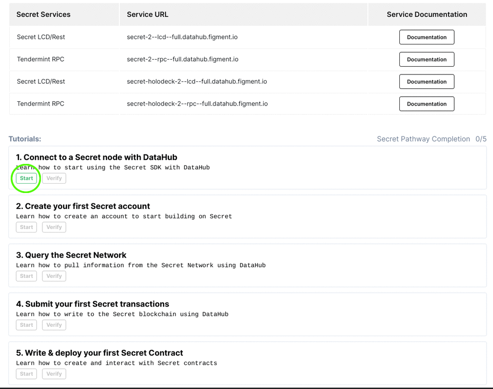
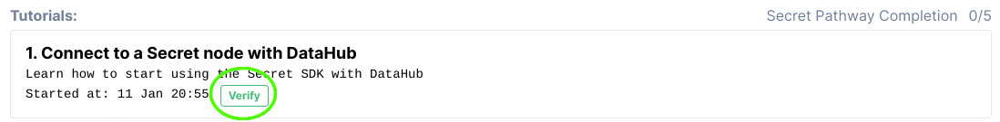

# 🗺 Secret Pathway

##  Welcome to the Secret Pathway

Secret Network is the first blockchain with privacy-preserving smart contracts. That means applications built on Secret can utilize encrypted data without revealing it to anyone, even the nodes in the network. For the first time, Secret Network allows developers to build powerful, permissionless, privacy-preserving applications - Secret Apps. Learn what makes it unique and build your first project.


There are currently no rewards for completing the intro Pathway. Advanced Pathways will be released shortly and provide new opportunities to earn.


## 🏁 Get started by signing up for DataHub

Once you are ready, get started by [**setting up an account on DataHub**](https://datahub.figment.io/sign_up?service=secret) _\*\*_to put your skills to the test and follow-along the tutorials to start building on Secret. Make sure to click on "Start" on the first tutorial before starting to code!

Verify each tutorial as you complete them and make sure to click on "Submit to earn" when you are done with the five tutorials to access the completion form.

\*\*\*\*[**Learn more about DataHub**](https://learn.figment.io/guides/datahub-products)**.**

\*\*\*\*[**Make sure to read our Terms of Use before starting**](https://learn.datahub.figment.io/terms-of-use)**.**

##  Secret Pathway Tutorials

###  [Get started by signing up to DataHub!](https://datahub.figment.io/sign_up?service=secret)


Make sure to use a browser that does not hide your IP address, we will deny submissions with hidden IPs.

We also do not accept "Google phone numbers" or any online SMS number.


### 💡1. Connect to a Secret node using DataHub



### 💡2. Create your first Secret account



### 💡3. Query the Secret Network



### 💡4. Submit your first Secret transaction



### 💡5. Write & deploy your first Secret smart contract



## Extra Secret Pathway Challenges


Bonus activities have been turned off for now until we launch the next Secret Pathway.


Secret is providing Bonus Activity Rewards for additional activities following the completion of the Secret Pathway tutorials. Complete any of these challenges and earn more SCRT tokens!

Bonus Activity Rewards will be given out at the discretion of the reviewer. Please provide any context you would like us to consider to maximize your Bonus Activity Reward.

###  Twitter \($5 in SCRT each\)

1. Post a lesson learned about the Secret platform, tools, community, etc.
2. Post a screenshot of what you just built with Secret
3. Share a public link to a repository with your code
4. Start a debate about the pros / cons of Secret
5. Launch a meme war with Secret prominently featured

Make sure to refer to Figment Learn in your tweet!

###  Medium \($20 in SCRT each, `1500-2000` words each\)

1. Recount your Secret learning experience
2. Share your ideas for improving the Secret developer experience
3. Describe the business case for a DApp that should be built on Secret
4. Write a list of the key features you discovered about Secret
5. Compare Secret with another technology, blockchain or otherwise

Make sure to refer to Figment Learn in your post!

###  Github \(`$50` Secret each up to `1` max of `meaningful` piece of software\)

1. Build a demo of an interesting feature of Secret \(ie. Secret vaults\)
2. Integrate Secret with a popular framework \(ie. Express middleware\)
3. Adapt a popular, existing system to use Secret \(ie. a simple JS game\)
4. Extend an existing Secret sample into something better 
5. Contribute to the Secret codebase \(see [https://github.com/enigmampc/SecretNetwork](https://github.com/enigmampc/SecretNetwork)\)

#### [Join our community today](https://discord.gg/PtkKz5) if you want to interact with other Secret builders and become a part of this growing ecosystem!

