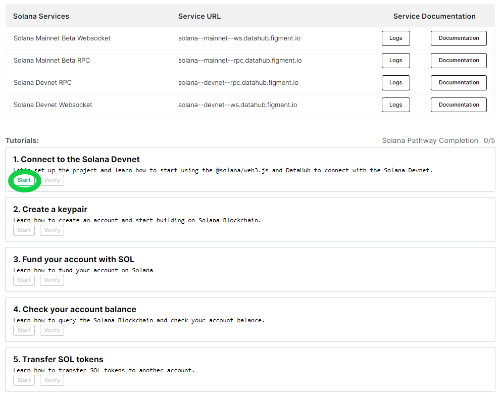
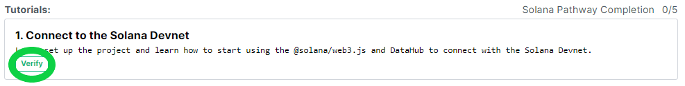

# 🗺 Solana Pathway

##  Welcome to the **Solana** Pathway

### What is Solana?

Solana is an open-source project implementing a new, high-performance, permissionless blockchain. The Solana Foundation is based in Geneva, Switzerland and maintains the open-source project. From [Messari's Solana profile](https://messari.io/asset/solana/profile), its goal is to provide a platform that enables developers to create DApps without needing to design around performance bottlenecks. Solana features a new timestamp system called Proof-of-History \(PoH\) that enables automatically ordered transactions. It also uses a Proof of Stake \(PoS\) consensus algorithm to help secure the network. Additional design goals include sub-second settlement times, low transaction costs, and support for all LLVM compatible smart contract languages.

#### Learn what makes it unique and build your first project to **earn $20 in SOL**!  



## **🏁** Get started by signing up for DataHub 

Once you are ready, get started by [**setting up an account on DataHub**](https://datahub.figment.io/sign_up?service=solana) to put your skills to the test and follow along with the tutorials to start building on Solana. Make sure to click on "Start" on the first tutorial before starting to code!

Verify each tutorial as you complete them and make sure to click on "Submit to earn" when you are done with the five tutorials to access the completion form. 

[**Learn more about DataHub**](https://learn.figment.io/guides/datahub-products)**.** 

\*\*\*\*[**Make sure to read our Terms of Use before starting**](https://learn.datahub.figment.io/terms-of-use)**.** 

##  Solana Pathway Tutorials

###   [Get started by signing up to DataHub](https://datahub.figment.io/sign_up?service=solana)!  


Make sure to use a browser that does not hide your IP address, we will deny submissions with hidden IPs. 

We also do not accept "Google phone numbers" or any online SMS number.


### 💡 Setup



### 💡 1. Connect to Solana Devnet



### 💡 2. Create a Keypair



### 💡 3. Fund the account with SOL



### 💡 4. Check the account balance



### 💡 5. Transfer SOL tokens



### 

#### [Join our community](https://discord.gg/fszyM7K) today if you want to interact with other Avalanche builders and become a part of this growing ecosystem! 

