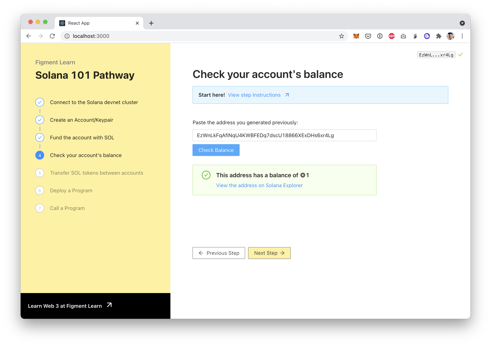

# 4. Check the account balance

## SOL Token balances

We must check the account balance to make sure we have sufficient SOL to perform a transfer. The `getBalance()` function takes a publicKey as input and will return the balance associated with that publicKey, if there is any.



## The challenge


In `src/components/Balance.jsx`, implement `getBalance` and store the balance in the state of the parent component `<App />` .

**Need some help?** Here are a few hints

    →   [Read about getBalance\(\)](https://solana-labs.github.io/solana-web3.js/classes/connection.html#getbalance)


Take a few minutes to figure this out.

You can also ****[**join us on Discord**](https://discord.gg/fszyM7K) ****if you have questions.

Still not sure how to do this? No problem! The solution is below so you don't get stuck.

## The solution




```javascript
const getBalance = () => {
  const url = getNodeRpcURL();
  const connection = new Connection(url);
  
  // Create a PublicKey from the input value
  // Call getBalance
  // Set balance using setBalance and DECIMAL_OFFSET
}
```





```javascript
const getBalance = () => {
  const url = getNodeRpcURL();
  const connection = new Connection(url);

  const publicKey = new PublicKey(value);

  connection.getBalance(publicKey)
    .then((balance) => {
      setBalance(balance / DECIMAL_OFFSET);
    })
    .catch((error) => {
      console.log(error);
      setBalance(null);
    });
}
```




**What happened in the code above?**


**Your turn to code!**

In `src/components/Balance.jsx`, implement `getBalance` and store the balance in the state of the parent component `<App />` .


* We create a `PublicKey` using the the input's value
* We call `connection.getBalance` with that `publicKey` \(address\)
* On success, we set `balance` \(using the React hook `setBalance`\) to that value, dividing by the `DECIMAL_OFFSET`to display the balance appropriately

Enter the address you just funded and click on "Check Balance". You should see:



## Next

Now that we have an account and that this account has been funded with SOL tokens, we are ready to make a transfer!

