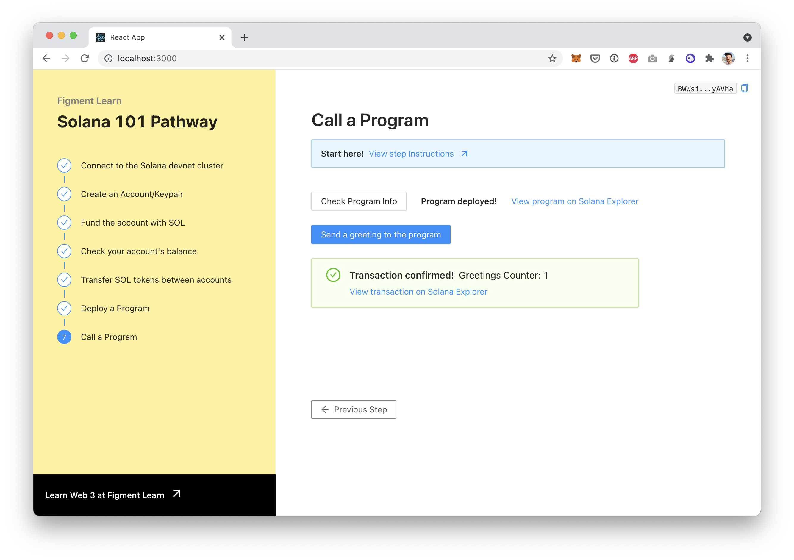
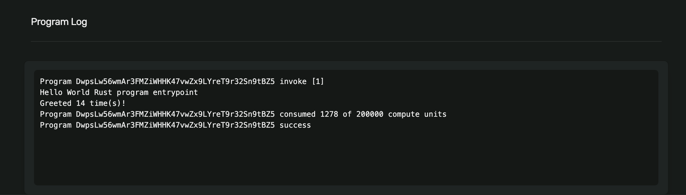

# 7. Call a program

Now that we have deployed our program it's living on the blockchain \(at an address on the devnet cluster\) and is available to interact with. We interact with a program by sending a [transaction](https://docs.solana.com/developing/programming-model/transactions) where its address is the recipient. Once a transaction is submitted to the cluster, the Solana runtime will execute a program to process each of the [instructions](https://docs.solana.com/terminology#instruction) contained in the transaction, in order, and atomically.

[Read more about Solana transactions and their anatomy](https://docs.solana.com/developing/programming-model/transactions).



## The challenge


In `src/components/Call.jsx,`finish implementing the `greet()` function.

**Need some help?** Here are a few hints

  →   [Read about extracting secret key from a bytes' array](https://solana-labs.github.io/solana-web3.js/classes/keypair.html#fromsecretkey)  
  →   [Read about building transaction instruction](https://solana-labs.github.io/solana-web3.js/classes/transactioninstruction.html)  
  →   [Read about sendAndConfirmTransaction](https://solana-labs.github.io/solana-web3.js/modules.html#sendandconfirmtransaction)


Take a few minutes to figure this out.

You can also ****[**join us on Discord**](https://discord.gg/fszyM7K) ****if you have questions.

Still not sure how to do this? No problem! The solution is below so you don't get stuck.

## The solution




```jsx
const greet = async () => {
  // Load the payer's Keypair from the Uint8Array PAYER_SECRET_KEY
  // by using Keypair.fromSecretKey
  // https://solana-labs.github.io/solana-web3.js/classes/keypair.html#fromsecretkey

  // Create the TransactionInstruction by passing keys, programId and data
  // For data you can pass Buffer.alloc(0) as all the program's instructions are the same

  // Call sendAndConfirmTransaction
  // https://solana-labs.github.io/solana-web3.js/modules.html#sendandconfirmtransaction
  // On success, call getGreetings() to fetch the greetings counter
}
```





```javascript
const greet = async () => {
  // Load the payer's Keypair from the Uint8Array PAYER_SECRET_KEY
  // by using Keypair.fromSecretKey
  // https://solana-labs.github.io/solana-web3.js/classes/keypair.html#fromsecretkey
  const payerSecretKey = new Uint8Array(PAYER_SECRET_KEY);
  const payerKeypair = Keypair.fromSecretKey(payerSecretKey);

  // Create the TransactionInstruction by passing keys, programId and data
  // For data you can pass Buffer.alloc(0) as all the program's instructions are the same
  const instruction = new TransactionInstruction({
    keys: [{pubkey: greeterPublicKey, isSigner: false, isWritable: true}],
    programId,
    data: Buffer.alloc(0), // All instructions are hellos
  });

  // Call sendAndConfirmTransaction
  // https://solana-labs.github.io/solana-web3.js/modules.html#sendandconfirmtransaction
  // On success, call getGreetings() to fetch the greetings counter
  setGreetFetching(true);
  sendAndConfirmTransaction(
    connection,
    new Transaction().add(instruction),
    [payerKeypair],
  ).then(res => {
    console.log(`SUCCESS`, res);
    setGreetTxSignature(res);
    setGreetFetching(false);
    getGreetings();
  }).catch(err => {
    console.log(`ERROR`, err);
    setGreetFetching(false);
  });
}
```




**What happened in the code above:**

* The `payerSecretKey` will be passed to the transaction to authenticate us as the owner of the program. Keypair information from the secretKey is contained in `payerKeypair` .
* The `instruction` variable contains a new instance of a `TransactionInstruction` \([docs](https://solana-labs.github.io/solana-web3.js/classes/transactioninstruction.html)\), to which we are assigning `keys` comprised of an array object with properties of `pubkey`, `isSigner` and `isWritable`.  We also pass the `programId` \(which is the address of the deployed program that we stored in the state of our React component\) and some `data` -- in the form of a zero-allocated `Buffer` , because in this case all of the instructions are the same.
* `sendAndConfirmTransaction()` takes 3 arguments: the `connection`, the `instruction` and the array of signers `[payerKeypair]` \(here we have only one signer, the payer\) `sendAndConfirmTransaction()` returns a JS Promise.
* Once the promise is fulfilled:
  * we call `setGreetTxSignature(res)` to store the transaction signature \(`res` is the signature string according to the [docs](https://solana-labs.github.io/solana-web3.js/modules.html#sendandconfirmtransaction)\)
  * we call `setGreetFetching(false)` to update the UI state: We hide the fetching spinner and show the success state \(using the signature from `res` to build the explorer URL\).
  * we call `getGreetings()` which is defined in the same component. It will fetch the `greeterPublicKey` account data, de-serialize it and store its value in a React state variable to update the UI.

Once this code is saved, click on "Check Program Info" to make sure that the program is deployed.


Then click on "Send a greeting to the program". which will trigger the `greet` function we have analyzed above. If everything goes well, it should wait for the network's confirmation and upon success update the counter! The Greetings Counter will increment by 1 every time we click the button and wait for the transaction to be confirmed.

It doesn't look like we're doing much but what we achieved is pretty cool. We have a client running in our browser interacting with a program deployed on the Solana devnet, which calls it to change \(and retrieve\) its internal state!



By following the link to view the transaction on Solana Explorer, it is possible to view the Program Log by scrolling to the bottom of the page. This log contains information from the execution of the program such as the number of times the greeting function has been called, as well as the number of [compute units](https://docs.solana.com/developing/programming-model/runtime#compute-budget) consumed by the operation of our program, and whether the execution was a success or a failure.



## Conclusion

Congratulations on completing the Solana Pathway! We hope you had a fun time and learned a lot. Here are a few things you can check out to go further:

* Keep exploring the [Solana JS API](https://solana-labs.github.io/solana-web3.js/modules.html#sendandconfirmtransaction)
* Solana's [Hello World dApp](https://github.com/solana-labs/example-helloworld)
* Read some [programs written by Solana devs](https://github.com/solana-labs/solana-program-library/tree/master/examples)
* Look at the Solana's [Token Swap program](https://github.com/solana-labs/solana-program-library/tree/master/token-swap) \(~ Uniswap clone!\)

If you had any difficulty with this tutorial or simply want to discuss Solana with other developers, [join our community](https://community.figment.io) today, or [join us on Discord](https://discord.gg/EBveT5xs9D)!

