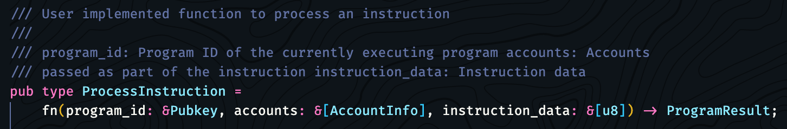
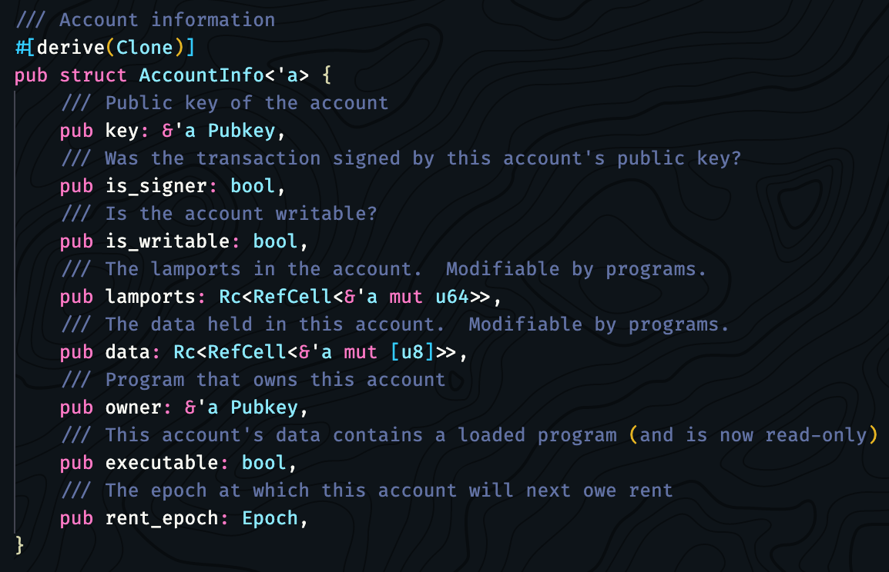
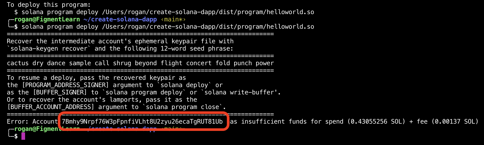
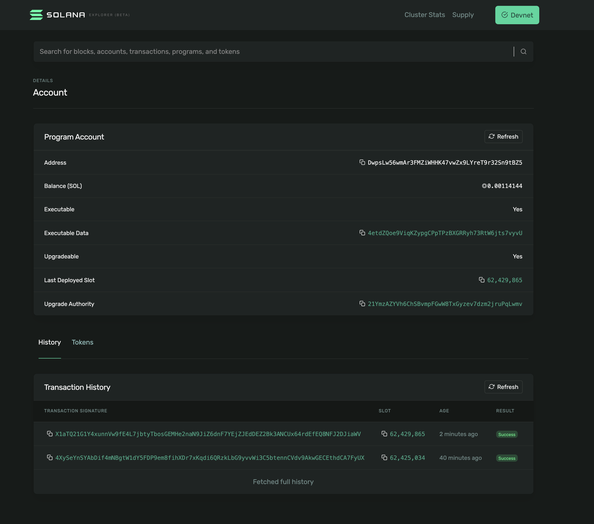

# 6. Deploy a program

A _program_ is to Solana what a _smart contract_ is to other protocols. Once a program has been deployed, any app can interact with it by sending a transaction to a Solana cluster that will pass it to the program.

Solana programs can be written in C or in Rust. You can learn more about Solana's programs [here](https://docs.solana.com/developing/on-chain-programs/overview).

So far we've been using Solana's JS API to interact with the blockchain. In this chapter we're going to deploy a Solana program using another Solana developer tool: their CLI. We'll install it and use it through our Terminal.





**There are known compatibility issues with Microsoft Windows and also Apple M1 products!**

Please STOP and read the following information carefully:

**Windows Users**: _The Rust BPF toolchain is not available for Windows._ This means the compilation step cannot be completed from a Windows commandline. You must install [Docker Desktop](https://learn.figment.io/network-documentation/extra-guides/docker-setup-for-windows) and [WSL](https://docs.microsoft.com/en-us/windows/wsl/install-win10#manual-installation-steps) - then you will need to clone the `learn-solana-dapp` repository again and install [Rust](https://rustup.rs/) and the [Solana CLI](https://docs.solana.com/cli/install-solana-cli-tools), all inside of the WSL filesystem.

To access the filesystem of your [installed Linux distribution](https://docs.microsoft.com/en-us/windows/wsl/install-win10#step-6---install-your-linux-distribution-of-choice) for WSL :  
Run the command [`wsl`](https://docs.microsoft.com/en-us/windows/wsl/reference) from a `cmd.exe` or PowerShell terminal. It is also important to make sure your PATH in the Windows Subsystem for Linux environment includes the location of the Solana release you have installed, such as :`PATH="~/.local/share/solana/install/active_release/bin:$PATH"`.  
More information on viewing and setting the PATH in Linux is [available here](https://opensource.com/article/17/6/set-path-linux).

**macOS** **Users**: If you are using any of the [Apple M1](https://en.wikipedia.org/wiki/Apple_M1#Products_that_use_the_Apple_M1) products, you may need to build from source. Refer to this GitHub PR for more information : [https://github.com/solana-labs/solana/pull/16346/](https://github.com/solana-labs/solana/pull/16346/)


## Install Rust and configure the Solana CLI

For simplicity, perform both of these installations inside the project root \(`/learn-solana-dapp/`\) :

* I[nstall the latest Rust stable](https://rustup.rs) : `curl --proto '=https' --tlsv1.2 -sSf https://sh.rustup.rs | sh`
* [Install Solana CLI](https://docs.solana.com/cli/install-solana-cli-tools) v1.6.6 or later :

  `sh -c "$(curl -sSfL https://release.solana.com/stable/install)"`

Set the CLI config URL to the devnet cluster by running this command in your Terminal:

```text
solana config set --url https://api.devnet.solana.com
```

If this is your first time using the Solana CLI, you will need to generate a new keypair. Run the following command in your Terminal :

```text
solana-keygen new
```

It will be written to `~/.config/solana/id.json` and will be used every time you use the CLI.

## Understanding the hello-world program

There is a `program` folder at the app's root. It contains the Rust program `src/lib.rs` and some configuration files to help us compile and deploy it.

**It's a simple program, all it does is increment a number every time it's called.**

Let’s dissect what each part does.

```rust
use borsh::{BorshDeserialize, BorshSerialize};
use solana_program::{
    account_info::{next_account_info, AccountInfo},
    entrypoint,
    entrypoint::ProgramResult,
    msg,
    program_error::ProgramError,
    pubkey::Pubkey,
};
```

[`use` declarations](https://doc.rust-lang.org/reference/items/use-declarations.html) are convenient shortcuts to other code. In this case, the serialize and de-serialize functions from the [borsh](https://borsh.io/) crate. borsh stands for _**B**inary **O**bject **R**epresentation **S**erializer for **H**ashing_.  
A [crate](https://learning-rust.github.io/docs/a4.cargo,crates_and_basic_project_structure.html#Crate) is a collection of source code which can be distributed and compiled together. Learn more about [Cargo, Crates and basic project structure](https://learning-rust.github.io/docs/a4.cargo,crates_and_basic_project_structure.html).

We also `use` portions of the `solana_program` crate :

* A function to return the next `AccountInfo` as well as the  struct for `AccountInfo` ;
* The `entrypoint` macro and related `entrypoint::ProgramResult` ;
* The `msg` macro, for low-impact logging on the blockchain ;
* `program_error::ProgramError` which allows on-chain programs to implement program-specific error types and see them returned by the Solana runtime. A program-specific error may be any type that is represented as or serialized to a u32 integer ;
* The `pubkey::Pubkey` struct.

Next we will use the `derive` macro to generate all the necessary boilerplate code to wrap our `GreetingAccount` struct. This happens behind the scenes during compile time [with any `#[derive()]` macros](https://doc.rust-lang.org/reference/procedural-macros.html#derive-macros). Rust macros are a rather large topic to take in, but well worth the effort to understand. For now, just know that this is a shortcut for boilerplate code that is inserted at compile time.

The struct declaration itself is simple, we are using the `pub` keyword to declare our struct publicly accessible, meaning other programs and functions can use it. The `struct` keyword is letting the compiler know that we are defining a struct named `GreetingAccount` , which has a single field : `counter` with a type of `u32` , an unsigned 32-bit integer. This means our counter cannot be larger than [`4,294,967,295`](https://en.wikipedia.org/wiki/4,294,967,295).

```rust
#[derive(BorshSerialize, BorshDeserialize, Debug)]
pub struct GreetingAccount {
    pub counter: u32,
}
```

Next, we declare an entry point - the `process_instruction` function :

```rust
entrypoint!(process_instruction);

pub fn process_instruction(
    program_id: &Pubkey, 
    accounts: &[AccountInfo],
    _instruction_data: &[u8],
```

With a quick detour out of the helloworld example and into the Solana CLI source, we can see the `ProcessInstruction` type being used behind the scenes :



`&Pubkey` is a [borrowed reference](https://doc.rust-lang.org/book/ch04-02-references-and-borrowing.html) to the public key where the contract is stored, this is our program's identifier or programId.

`&[AccountInfo]` , another borrowed reference this time to an array of accounts, however in this example there is only a single account.

Taking another quick detour out of the program code to peek at the `AccountInfo` struct, we see that `accounts.owner` is also going to be a public key :



Back to the hello-world code :

```rust
) -> ProgramResult {
    msg!("Hello World Rust program entrypoint");
    let accounts_iter = &mut accounts.iter();
    let account = next_account_info(accounts_iter)?;
```

The return value of the `process_instruction` entrypoint will be a `ProgramResult` .  
[`Result`](https://doc.rust-lang.org/std/result/enum.Result.html) comes from the `std` crate and is used to express the possibility of error.

For [debugging](https://docs.solana.com/developing/on-chain-programs/debugging), we can print messages to the Program Log [with the `msg!()` macro](https://docs.rs/solana-program/1.7.3/solana_program/macro.msg.html), rather than use `println!()` which would be prohibitive in terms of computational cost for the network.

The `let` keyword in Rust binds a value to a variable. By looping through the `accounts` using an [iterator](https://doc.rust-lang.org/book/ch13-02-iterators.html), `accounts_iter` is taking a [mutable reference](https://doc.rust-lang.org/book/ch04-02-references-and-borrowing.html#mutable-references) of each value in `accounts`. Then `next_account_info(accounts_iter)?`will return the next `AccountInfo` or a `NotEnoughAccountKeys` error. Notice the `?` at the end, this is a [shortcut expression](https://doc.rust-lang.org/std/result/#the-question-mark-operator-) in Rust for [error propagation](https://doc.rust-lang.org/book/ch09-02-recoverable-errors-with-result.html#propagating-errors).

```rust
if account.owner != program_id {
  msg!("Greeted account does not have the correct program id");
  return Err(ProgramError::IncorrectProgramId);
}
```

We will perform a security check to see if the account owner has permission. If the `account.owner` public key does not equal the `program_id` we will return an error.

```rust
let mut greeting_account = GreetingAccount::try_from_slice(&account.data.borrow())?;
greeting_account.counter += 1;
greeting_account.serialize(&mut &mut account.data.borrow_mut()[..])?;

msg!("Greeted {} time(s)!", greeting_account.counter);

Ok(())
```

Finally we get to the good stuff where we "borrow" the existing account data, increase the value of `counter` by one and write it back to storage.

* The `GreetingAccount` struct has only one field - `counter`. To be able to modify it, we need to borrow the reference to `account.data` with the `&`[borrow operator](https://doc.rust-lang.org/reference/expressions/operator-expr.html#borrow-operators). 
* The `try_from_slice()` function from `BorshDeserialize`will mutably reference and deserialize the `account.data`. 
* The `borrow()` function comes from the Rust core library, and exists to immutably borrow the wrapped value. 

Taken together, this is saying that we will borrow the account data and pass it to a function that will deserialize it and return an error if one occurs. Recall that `?` is for error propagation.

Next, incrementing the value of `counter` by `1` is simple, using the addition assignment operator : `+=` .

With the `serialize()` function from `BorshSerialize`, the new `counter` value is sent back to Solana in the correct format. The mechanism by which this occurs is the [Write trait](https://doc.rust-lang.org/std/io/trait.Write.html) from the `std::io` crate.

We can then show in the Program Log how many times the count has been incremented by using the `msg!()` macro.

To finish the program we will call `Ok(())` - which is the Result `Ok()` containing a Rust primitive called a [unit](https://doc.rust-lang.org/std/primitive.unit.html). The unit `()` type has exactly one value :`()`, and is used when there is no other meaningful value that could be returned.

### Overview

```rust
use borsh::{BorshDeserialize, BorshSerialize};
use solana_program::{
    account_info::{next_account_info, AccountInfo},
    entrypoint,
    entrypoint::ProgramResult,
    msg,
    program_error::ProgramError,
    pubkey::Pubkey,
};

// Define the type of state stored in accounts
#[derive(BorshSerialize, BorshDeserialize, Debug)]
pub struct GreetingAccount {
    // number of greetings
    pub counter: u32,
}

// Declare and export the program's entrypoint
entrypoint!(process_instruction);

// Program entrypoint's implementation
pub fn process_instruction(
    program_id: &Pubkey, // Public key of the account the program was loaded into
    accounts: &[AccountInfo], // The account to say hello to
    _instruction_data: &[u8], // Ignored, all helloworld instructions are hellos
) -> ProgramResult {
    msg!("Hello World Rust program entrypoint");

    // Iterating accounts is safer then indexing
    let accounts_iter = &mut accounts.iter();

    // Get the account to say hello to
    let account = next_account_info(accounts_iter)?;

    // The account must be owned by the program in order to modify its data
    if account.owner != program_id {
        msg!("Greeted account does not have the correct program id");
        return Err(ProgramError::IncorrectProgramId);
    }

    // Increment and store the number of times the account has been greeted
    let mut greeting_account = GreetingAccount::try_from_slice(&account.data.borrow())?;
    greeting_account.counter += 1;
    greeting_account.serialize(&mut &mut account.data.borrow_mut()[..])?;

    msg!("Greeted {} time(s)!", greeting_account.counter);

    Ok(())
}
```

## Testing the program


Apple M1 users may encounter an issue here. This step is not a requirement, but testing programs before deployment is a good practice. Refer to the comments on this Pull Request for more information : [https://github.com/solana-labs/solana/pull/16346](https://github.com/solana-labs/solana/pull/16346)


To ensure that the program code has no obvious bugs and passes any tests defined in the sourcefile, it is good to run the unit tests before building and deploying. Here is what the default unit test for this program looks like :

```rust
// Sanity tests
#[cfg(test)]
mod test {
    use super::*;
    use solana_program::clock::Epoch;
    use std::mem;

    #[test]
    fn test_sanity() {
        let program_id = Pubkey::default();
        let key = Pubkey::default();
        let mut lamports = 0;
        let mut data = vec![0; mem::size_of::<u32>()];
        let owner = Pubkey::default();
        let account = AccountInfo::new(
            &key,
            false,
            true,
            &mut lamports,
            &mut data,
            &owner,
            false,
            Epoch::default(),
        );
        let instruction_data: Vec<u8> = Vec::new();

        let accounts = vec![account];

        assert_eq!(
            GreetingAccount::try_from_slice(&accounts[0].data.borrow())
                .unwrap()
                .counter,
            0
        );
        process_instruction(&program_id, &accounts, &instruction_data).unwrap();
        assert_eq!(
            GreetingAccount::try_from_slice(&accounts[0].data.borrow())
                .unwrap()
                .counter,
            1
        );
        process_instruction(&program_id, &accounts, &instruction_data).unwrap();
        assert_eq!(
            GreetingAccount::try_from_slice(&accounts[0].data.borrow())
                .unwrap()
                .counter,
            2
        );
    }
}
```

The term "Sanity test" or "[Sanity check](https://en.wikipedia.org/wiki/Sanity_check)" in relation to computing is a basic test to quickly evaluate whether a claim or the result of a calculation can possibly be true. It is a simple check to see if the produced material is rational \(that the material's creator was thinking rationally, applying [sanity](https://en.wikipedia.org/wiki/Sanity)\). The point of a sanity test is to rule out certain classes of obviously false results, not to catch every possible error.

Simply run the command `cargo test` inside of the `learn-solana-dapp/program` subdirectory. The first time you do this, Cargo will need to compile a lot of related crates \(libc, borsh, the Solana crates, even the program we are testing\). This process can take several minutes, although future tests will occur much more rapidly since everything is compiled.

The output from a successful `cargo test` will look like this \(timestamps have been removed\) :

```bash
running 1 test
test test::test_sanity ... ok

test result: ok. 1 passed; 0 failed; 0 ignored; 0 measured; 0 filtered out; finished in 0.00s

     Running tests/lib.rs (target/debug/deps/lib-560d97a774ffe546)

running 1 test
[ INFO  solana_program_test] "helloworld" program loaded as native code
[ DEBUG solana_runtime::message_processor] Program log: Hello World Rust program entrypoint
[ DEBUG solana_runtime::message_processor] Program log: Greeted 1 time(s)!
[ DEBUG solana_runtime::message_processor] Program log: Hello World Rust program entrypoint
[ DEBUG solana_runtime::message_processor] Program log: Greeted 2 time(s)!
test test_helloworld ... ok

test result: ok. 1 passed; 0 failed; 0 ignored; 0 measured; 0 filtered out; finished in 0.54s
```

## Building the program

The first thing we're going to do is compile the Rust program to prepare it for the CLI. To do this we're going to use a custom script that's defined in `package.json`:


```javascript
"scripts": {
    "start": "react-scripts start",
    "build": "react-scripts build",
    "test": "react-scripts test",
    "eject": "react-scripts eject",
    "build:program-rust": "cargo build-bpf --manifest-path=program/Cargo.toml --bpf-out-dir=dist/program"
  },
```


`start` , `build` , `test` , `eject` are all default and part of the `create-react-app` template.

The custom build script uses :

* `cargo` : Rust’s build system and package manager \([docs](https://doc.rust-lang.org/book/ch01-03-hello-cargo.html)\), like what `npm` is to Javascript.
* `build-bpf` : the cargo command we're going to run to build/compile the program. This is installed along with the Solana CLI. We pass it a manifest file which is the `Cargo.toml` of our program and the desired output directory.

Let's run the script and build the program by running the following command in the terminal \(from the project root directory\):

```text
yarn run build:program-rust
```


This step can take 5 or 10 minutes!  
_Do not be alarmed_ if this causes your laptop fans to spin up, as Rust is multithreaded and will be taking full advantage of your processor cores during the compilation.


When it's successful you will see a new folder in your app which contains the compiled contract: `hello-world.so`.


The `.so` extension does not stand for Solana! It stands for "shared object". The helloworld program we examined above is a Rust program compiled to Berkeley Packet Filter \(BPF\) _bytecode_ and stored as an Executable and Linkable Format \(ELF\) shared object.

You can read more about Solana Programs [here](https://docs.solana.com/developing/on-chain-programs/overview).


## Potential issues building

An error ```no such subcommand:``build-bpf\`\`\` indicates that there was an issue with the installation of the Solana CLI or that it is installed, but not in the PATH. So if you see this error and exit code 101 :

```text
$ cargo build-bpf --manifest-path=program/Cargo.toml --bpf-out-dir=dist/program
error: no such subcommand: `build-bpf`
error Command failed with exit code 101.
info Visit https://yarnpkg.com/en/docs/cli/run for documentation about this command.
```

Be sure to set your PATH according to your Solana release \(`active_release`is a symbolic link\) :

`PATH="~/.local/share/solana/install/active_release/bin:$PATH"`

## Deploying the program

Next we're going to deploy the program to the devnet cluster. The CLI provides a very simple interface for this :

```bash
solana program deploy -v dist/program/helloworld.so
```

The `-v` Verbose flag is optional, but it will show some related information like the RPC URL and path to the default signer keypair, as well as the expected [Commitment level](https://docs.solana.com/implemented-proposals/commitment). When the process completes, the Program Id will be displayed :

```bash
RPC URL: https://api.devnet.solana.com
Default Signer Path: ~/.config/solana/id.json
Commitment: confirmed
Program Id: 2NsKheB6kXo9rA9eYzdMW978GvbPX6Z4KX4PB7p42Cc
```

## Potential issues deploying

### Insufficient Funds

The first time you run this, the CLI should error out because the account trying to deploy this program **does not have enough funds to spend**. You can fix this by going back a few steps in the React app to the "Fund" step and pasting in the input the public key that you see in the Terminal error. Click "Fund" a few times to get enough devnet tokens to be able to deploy the program



### Custom program error 0x1

If you see

> Error: Deploying program failed: Error processing Instruction 1: custom program error: 0x1

simply re-run the deploy command until it succeeds. If you run out of funds, go back to the "Fund" step and get more!

### Program's authority X does not match authority provided Y

This can be due to how your Solana keypair was generated. You can generate a fresh one by running :

```bash
solana-keygen new --force
```

Then go through the tutorial steps again \(fund, build, deploy\).

### solana deploy --help

For quick reference, here are the flags, options and arguments for `solana deploy` :

```text
solana-deploy 
Deploy a program

USAGE:
    solana deploy [FLAGS] [OPTIONS] <PROGRAM_FILEPATH> [PROGRAM_ADDRESS_SIGNER]

FLAGS:
        --allow-excessive-deploy-account-balance
            Use the designated program id, even if the account already holds a large balance of SOL

    -h, --help                                      Prints help information
        --no-address-labels                         Do not use address labels in the output
        --skip-seed-phrase-validation
            Skip validation of seed phrases. Use this if your phrase does not use the BIP39 official English word list

    -V, --version                                   Prints version information
    -v, --verbose                                   Show additional information

OPTIONS:
        --commitment <COMMITMENT_LEVEL>    Return information at the selected commitment level [possible values:
                                           processed, confirmed, finalized]
    -C, --config <FILEPATH>                Configuration file to use [default:
                                           /Users/rogan/.config/solana/cli/config.yml]
    -u, --url <URL_OR_MONIKER>             URL for Solana's JSON RPC or moniker (or their first letter): [mainnet-beta,
                                           testnet, devnet, localhost]
    -k, --keypair <KEYPAIR>                Filepath or URL to a keypair
        --output <FORMAT>                  Return information in specified output format [possible values: json, json-
                                           compact]
        --ws <URL>                         WebSocket URL for the solana cluster

ARGS:
    <PROGRAM_FILEPATH>          /path/to/program.o
    <PROGRAM_ADDRESS_SIGNER>    The signer for the desired address of the program [default: new random address]
```

## After successfully deploying the program

On success, the CLI will print the programId of the deployed contract.

```bash
Program Id: DwpsLw56wmAr3FMZiWHHK47vwZx9LYreT9r32Sn9tBZ5
```

If you visit [https://explorer.solana.com](https://explorer.solana.com/), change the cluster to devnet and paste this Program Id string, you should see a page like this:


Make sure you select Devnet on the Solana Explorer!




Notice that the field `Executable` is now set to `Yes` because the address we're looking up is for a program which can be called and executed.

## Save the program and its author secret keys


Before we move to the next step we need to save two important variables!


1. In your terminal run `cat ~/.config/solana/id.json` and copy its output. In `src/components/Call.jsx` assign it to the constant `PAYER_SECRET_KEY`. This is the Keypair information of the author of the program \(you!\). We will need to pass it to transactions we make to the program  to authenticate ourselves as the owner of the program. 
2. In the directory, find `dist/program/helloworld-keypair.json` and copy its contents. In `/src/components/Call.jsx` assign it to the constant `PROGRAM_SECRET_KEY`. This is the Keypair information of the program itself. We will need it to generate the program's public key that will be used to call the program.

## Next

So at this point, we've deployed our dummy smart contract to Solana's devnet cluster. We're finally ready for the big moment: Interacting with the program by calling its functionality from the UI!

