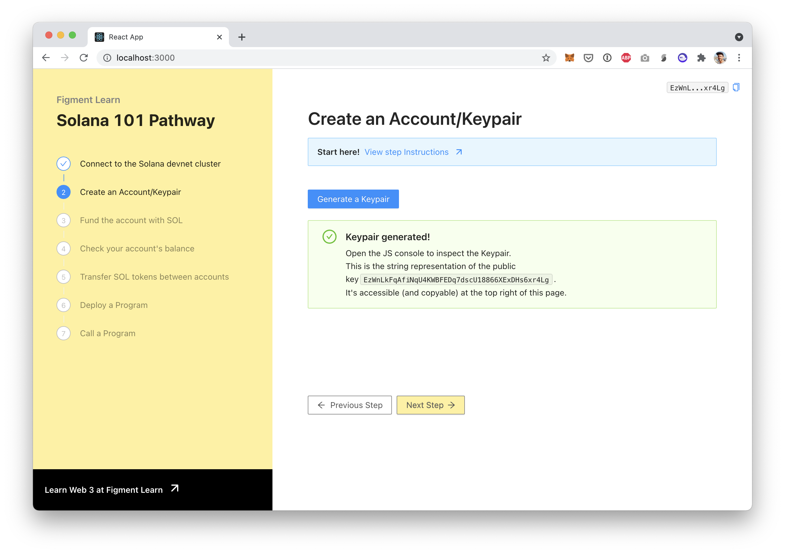

# 2. Create a Keypair

## Accounts and Keypairs

Like with most Web 3 protocols, transactions on Solana happen between _accounts_.  To create an account a client generates a _keypair_, which has a _publicKey_ \(or _address_, used to identify and lookup an account\) and a _secretKey_ used to sign transactions.




**`Account`is deprecated in the `@solana/web3.js` package** so you should use `Keypair` going forward. You might find some tutorials using older version of the package and the `Account` class but most of the times you can replace it with `Keypair`.

That being said, it's still OK to refer to a _keypair_ as an _account_ and we'll be doing this in this tutorial.


## The challenge


In`src/components/Account.jsx`, implement `generateKeypair` and store the keypair object in the state of the parent component `<App />.`Parse the keypair to extract the address as a string and render it in the webpage

**Need some help?** Check out those two links

    → [Generate a`Keypair`](https://solana-labs.github.io/solana-web3.js/classes/keypair.html#constructor)  
    → [Convert a`PublicKey`to a string](https://solana-labs.github.io/solana-web3.js/classes/publickey.html#tostring)


Take a few minutes to figure this out.

You can also ****[**join us on Discord**](https://discord.gg/fszyM7K) ****if you have questions.

Still not sure how to do this? No problem! The solution is below so you don't get stuck.

## The solution




```jsx
const generateKeypair = () => {
  // Generate a Keypair
  // Save it to <App />'s state
}

...

// parse the address (as a string) from the keypair object
const publicKeyStr = "TBD"
```





```jsx
const generateKeypair = () => {
  const keypair = Keypair.generate();
  console.log(keypair);
  setKeypair(keypair);
}

...

const publicKeyStr = keypair && keypair.publicKey.toString();
```




**What happened in the code above?**

* We used the JS API's `Keypair` to generate a keypair
* Once we have it we call `setKeypair` to save it in the state of the parent component
* Once React re-renders, we parse the keypair object to extract the public key using `keypair.publicKey`
* But this value is a `Buffer` so we need to convert it to a string using `PublicKey.toString()`

Once you have the code above saved, the webpage should automatically reload \(React's hot reloading!\) and you should see:



Try and click on "Generate a Keypair" again. And again. And again! Every time it will generate a new one with virtually no risk that someone else creates the same one as you. That's cause the domain of possible addresses is so vast that the probability of two identical addresses being generated is ridiculously small.

Copy and paste the address that was generated \(using the icon to the right of it\).

## Next

Now that we have an account, we can fund it so we can start playing around with tokens!

