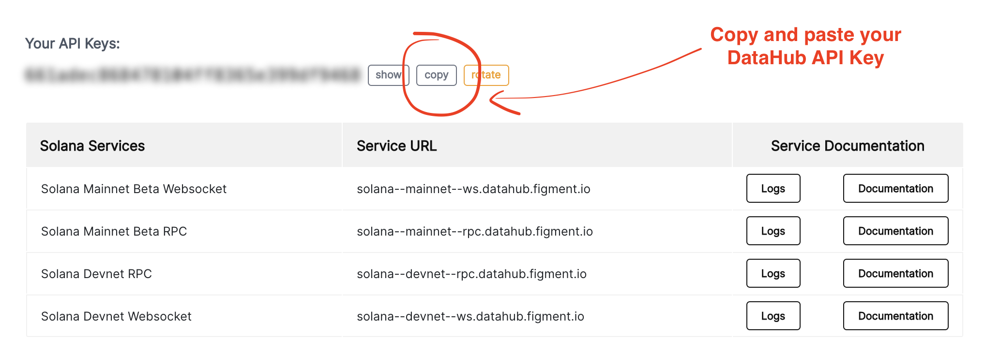

# Setup the project

Start by cloning the repository and install the npm dependencies

```text
git clone https://github.com/figment-networks/learn-solana-dapp.git
cd create-solana-dapp
yarn
```

Create a `.env.local` file at the root of the directory. Copy and paste the content of the existing `.env.example` into the new file and save it to disk.   
The value for `REACT_APP_API_KEY` can be found on the [DataHub Services Dashboard](https://datahub.figment.io/services/solana).



Save the `.env.local` file and run:

```text
yarn start
```

Your default browser should be redirected to `http://localhot:3000` and you will see this :



[**Join us on Discord**](https://discord.gg/fszyM7K) ****if you encounter any issues with the tutorial or have any questions!



