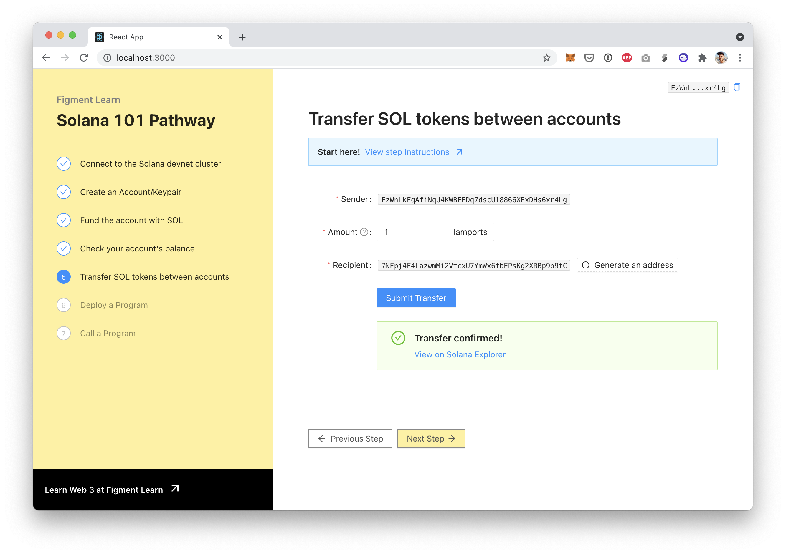
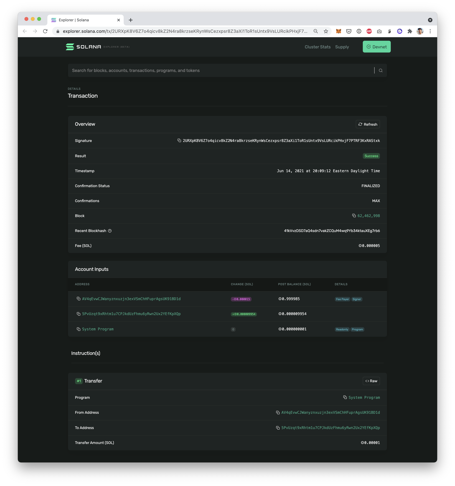

# 5. Transfer SOL tokens

## Sending tokens on Solana

In order to transfer some value __to another account, we need to create and send a signed transaction to the cluster. Once you understand how to do this, you will have a solid foundation on which to interact with other portions of the Solana API.

When a transaction is submitted to the cluster, the Solana runtime will execute a program to process each of the instructions contained in the transaction, in order, and atomically. This means that if any of the instructions fail for any reason, the entire transaction will revert. 



## The challenge


In `src/components/Transfer.jsx,`finish implementing the `transfer()` function.

**Need some help?** Here are a few hints

    →  Read about [sendAndConfirmTransaction\(\)](https://solana-labs.github.io/solana-web3.js/modules.html#sendandconfirmtransaction)  
    →  Read about [adding instructions to Transaction](https://solana-labs.github.io/solana-web3.js/classes/transaction.html#add)  
    → [ Anatomy of a Transaction](https://docs.solana.com/developing/programming-model/transactions)


Take a few minutes to figure this out.

You can also ****[**join us on Discord**](https://discord.gg/fszyM7K) ****if you have questions.

Still not sure how to do this? No problem! The solution is below so you don't get stuck.

## The solution




```jsx
const transfer = (values) => {
  const amountNumber = parseFloat(values.amount);

  if (isNaN(amountNumber)) {
    setError("Amount needs to be a valid number")
  }

  const url = getNodeRpcURL();
  const connection = new Connection(url, { wsEndpoint: getNodeWsURL() });

  const fromPubKey = new PublicKey(values.from);
  const toPubKey = new PublicKey(toAddress);

  const signers = [
    {
      publicKey: fromPubKey,
      secretKey: new Uint8Array(keypair.secretKey)
    }
  ];

  const instructions = SystemProgram.transfer({
    fromPubkey: fromPubKey,
    toPubkey: toPubKey,
    lamports: amountNumber,
  });
  
  // Create a transaction
  // Add instructions
  // Call sendTransaction
  // On success, call setTxSignature and setFetching
};
```





```javascript
const transfer = (values) => {
  const amountNumber = parseFloat(values.amount);

  if (isNaN(amountNumber)) {
    setError("Amount needs to be a valid number")
  }

  const url = getNodeRpcURL();
  const connection = new Connection(url, { wsEndpoint: getNodeWsURL() });

  const fromPubKey = new PublicKey(values.from);
  const toPubKey = new PublicKey(toAddress);

  const signers = [
    {
      publicKey: fromPubKey,
      secretKey: new Uint8Array(keypair.secretKey)
    }
  ];

  const instructions = SystemProgram.transfer({
    fromPubkey: fromPubKey,
    toPubkey: toPubKey,
    lamports: amountNumber,
  });
  
  const transaction = new Transaction().add(instructions);

  setTxSignature(null);
  setFetching(true);

  sendAndConfirmTransaction(
    connection,
    transaction,
    signers,
  ).then((signature) => {
    setTxSignature(signature)
    setFetching(false);
  })
  .catch((err) => {
    console.log(err);
    setFetching(false);
  })
};
```




**What happened in the code above:**

* We created two `PublicKey` addresses for the sender \("from"\) and the recipient \("to"\)
* We created a `signers` array with only one signer: the sender. It contains an object with the signer's `publicKey` and `secretKey`. We hadn't used the `secretKey` that we created a few steps earlier. Now is the time! We use it to sign a transaction so it must stay very secure.
* We create `instructions` for the transactions. From who, to who and what amount.
* We create a `Transaction` object and add the instructions
* We call `sendTransaction` and pass the `transaction` and the `signer`
* On success, we `setTxSignature` - which will allow us to build the Solana Explorer URL - and `setFetching`

Once you've filled in the form, press "Submit" and you should see:



Click on the Solana Explorer link - it will take you straight to the transaction page which should look like:



It's very good practice to look over all the fields one by one to familiarize yourself with the structure of a transaction. This page features the transaction result \(`SUCCESS`\), status \(`FINALIZED`\), the amount sent, the `from` and `to` addresses, the block that included this transaction, the fee that was paid, etc.

## Next

Next, we will look at how to deploy a program written in the Rust language to the Solana cluster.

