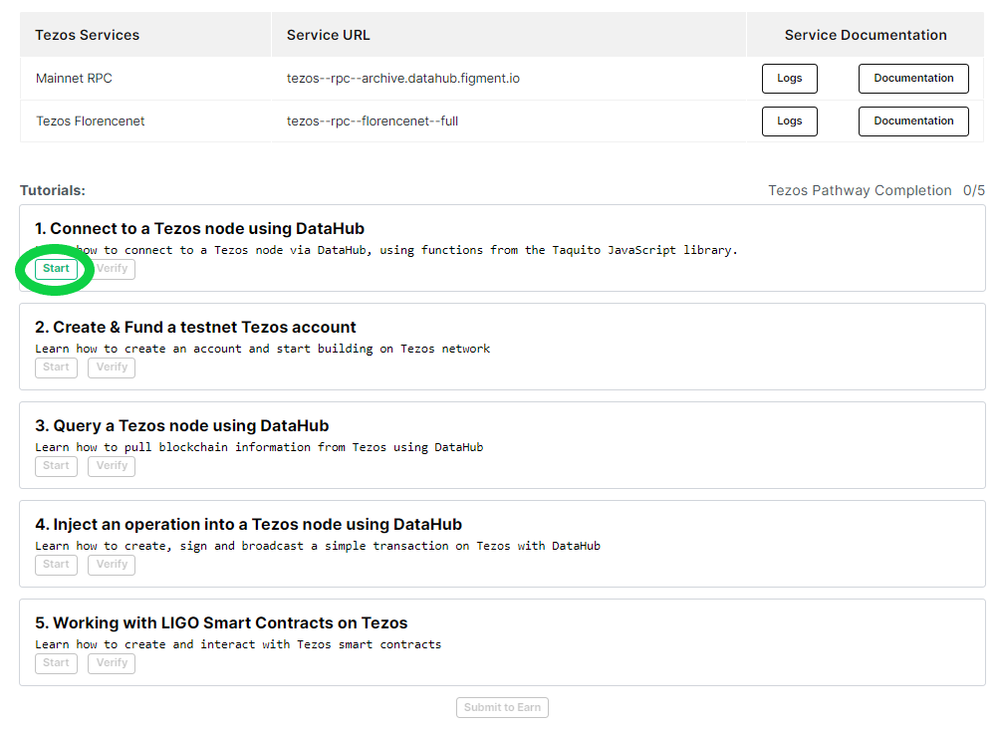
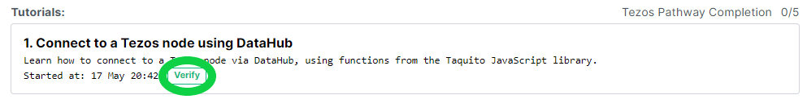

# 🗺 Tezos Pathway

##  Welcome to the Tezos Pathway

Tezos is an open-source platform for assets and applications that can evolve by upgrading itself. Stakeholders govern upgrades to the core protocol, including upgrades to the amendment process itself. ****It benefits from three main characteristics: self-amendment, on-chain governance, and decentralized innovation. ****Learn what makes it unique and build your first project to **earn $20 in XTZ**!

## **🏁** Get started by signing up for DataHub 

Once you are ready, get started by [**setting up an account on DataHub**](https://datahub.figment.io/sign_up?service=tezos) to put your skills to the test and follow-along the tutorials to start building on Tezos. Make sure to click on "Start" on the first tutorial before starting to code!

Verify each tutorial as you complete them and make sure to click on "Submit to earn" when you are done with the five tutorials to access the completion form. 

[**Learn more about DataHub**](https://learn.figment.io/guides/datahub-products)**.** 

\*\*\*\*[**Make sure to read our Terms of Use before starting**](https://learn.datahub.figment.io/terms-of-use)**.** 

##   **Tezos** Pathway Tutorials 

### ​  [Get started by signing up to DataHub](https://datahub.figment.io/sign_up?service=tezos)! 


Make sure to use a browser that does not hide your IP address, we will deny submissions with hidden IPs.   
  
We also do not accept "Google phone numbers" or any online SMS number. 


### 💡 1. Connect to a Tezos node using DataHub



### 💡 2. Create your first Tezos account



### 💡 3. Query the Tezos Network



### 💡 4. Create your first transaction



### 💡 5. Write & deploy your first smart contract



#### [Join our community today](https://discord.gg/PtkKz5) if you want to interact with other Tezos builders and become a part of this growing ecosystem! 

