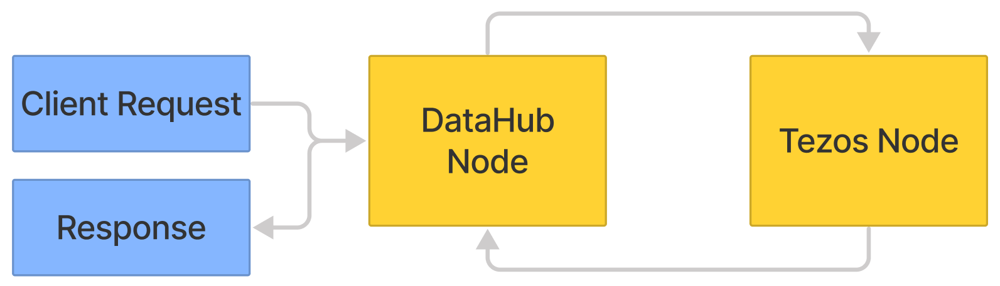

# 1. Connect to a Tezos Node using DataHub

## Introduction

In this series of tutorials, we will cover everything from connecting to a Tezos node using the [Taquito](https://tezostaquito.io) library and [DataHub](http://datahub.figment.io) to deploying smart contracts using the Tezos-specific [LIGO](https://ligolang.org) programming language. [Tezos](https://tezos.com) is a popular blockchain which has a low environmental impact due to its implementation of Proof-of-Stake \(PoS\) consensus algorithm.  
  
****We will be interacting with the Tezos blockchain via DataHub, Figment's enterprise grade infrastructure service which provides reliable access to protocols APIs, for the latest mainnets and testnets. Read more about Datahub [here](https://learn.figment.io/introduction/what-is-datahub).

The Taquito toolkit used in this tutorial has an RPC package, a batch API, and much more - with Taquito, developers can even interact with smart contracts as if they were regular JavaScript objects. View the[ TypeDocs](https://tezostaquito.io/typedoc/modules.html) for a deeper look into what Taquito has to offer.

The Tezos protocol is distributed across many nodes which are composed of both the protocol, which is self-amendable via on-chain governance, and the shell that is responsible for the low-level network communications. The protocol runs the same way on all nodes and is isolated from the shell.

## Prerequisites

* A working knowledge of JavaScript.
* [Node.js](https://nodejs.org/en/download/) must be installed - the latest version is preferable, however on the v12 branch, version 12.20 must be installed to make use of ES6 module import syntax. [npm](https://www.npmjs.com/get-npm) \(Node Package Manager\) is installed alongside node.js, however it is still advisable to check for the presence of npm with `npm -v` in the terminal before proceeding. 



## Setup

### Initialize the project directory & install dependencies



```text
mkdir tezospath
cd tezospath
npm init -y
npm install --save dotenv @taquito/taquito @taquito/rpc @taquito/signer
```



This creates our project directory, changes into it \(making it the working directory\), then runs npm, with the `-y` flag to generate a default `package.json` . Next we will install the dependencies of this project, [dotenv](https://www.npmjs.com/package/dotenv) & the relevant portions of the [Taquito](https://tezostaquito.io/) library for its powerful API and RpcClient.   
  
The project directory should now contain several files and directories in the following structure :

```text
+-- /tezospath
    |
    +-- package.json
    |
    +-- package-lock.json
    |
    +-- /node_modules
        |
        +-- /@taquito  
        +-- /dotenv
```

There will be more subdirectories in `node_modules` because Taquito has its own dependencies. Since we used the `--save` flag when installing, it will be much easier to see which dependencies are installed by looking inside the `package.json`.

### Create .env & .gitignore

Create a new `.env` file and paste the following environment variables into it :



```bash
DATAHUB_URL=https://tezos--rpc--florencenet--full.datahub.figment.io/apikey/API_KEY
BAKER_ADDRESS='tz1aWXP237BLwNHJcCD4b3DutCevhqq2T1Z9'
```



We must replace `API_KEY` at the end of the DataHub URL with a valid API key from the  
[Services Dashboard](https://datahub.figment.io/services/tezos) on DataHub. Refer to [this guide](../../../extra-guides/dotenv-and-.env.md) on `.env` files for more information if this is unclear.

Remember to save `.env` to disk before proceeding. The directory structure has not changed, so the new files inside the project directory will now be :

```text
+-- /tezospath
    |
    +-- .env
    |
    +-- .gitignore (optional, but recommended!)
    |
    +-- package.json
    |
    +-- package-lock.json
    |
    +-- /node_modules
        |
        +-- /@taquito  
        +-- /dotenv
        +-- ...  
```

One last thing : 

* _**We are using the more modern**_ ****[**ES6 `import` syntax**](https://www.digitalocean.com/community/tutorials/js-modules-es6)_,_ therefore we will need to add a line to our `package.json` to prevent a`SyntaxError: Cannot use import statement outside a module` . The `import` keyword was introduced in Node.js v12, a language feature to simplify the use of modules. Alternatively, we could use an `.mjs` file extension for all of the pathway files, however adding this line to `package.json` enables us to keep the `.js` file extension and saves a lot of related hassle with configuration : 



```javascript
"type": "module"
```



Now that this is complete, we are set up and ready to make our connection to a Tezos node using the Taquito library and DataHub.

## Connecting to a Tezos node 

In this tutorial we will learn how to connect to a Tezos node via DataHub, using functions from the [Taquito](https://tezostaquito.io/) JavaScript library. In the Introduction, we set up the project directory and installed the Taquito library into our project using the node package manager. 



Create a new file called `connect.js` and paste the following code \(depending on which module syntax we have decided to use\) :



```javascript
import dotenv from 'dotenv';
import { TezosToolkit } from '@taquito/taquito';
dotenv.config();

async function main() {
  const Tezos = new TezosToolkit(process.env.DATAHUB_URL);

  // 1. use getBalance for a particular account
  Tezos.tz
    .getBalance(process.env.BAKER_ADDRESS)
    .then((balance) => {
      console.log(`Balance is ${balance.toNumber() / 1000000} ꜩ`)
    }).catch((error) => console.log(JSON.stringify(error)));
}

main();
```



The necessary code to interact with Tezos via the toolkit is minimal. By instantiating the toolkit in this manner, we can re-use the constant name `Tezos`  as our connection to the stable infrastructure provided by the DataHub endpoint. 

`getBalance()` is one of many functions defined by the Taquito API. It takes an address, in this case we are supplying the address of a Tezos baker \(`tz1aWXP237BLw...`\) through an environment variable contained in `.env`. In a production environment, this would quite likely be a dynamic value.

Run the code with `node connect.js` :



```text
Balance is 5307561.462379 ꜩ
```



This is the balance of one of the Florence testnet Bakers. The reported balance will be different from this example, of course.

## Troubleshooting


**Here is a list of potential issues and how to address them** :


**ES6 syntax**  
For any and all errors related to the ES6 import syntax; make sure to follow the setup instructions carefully, also check to make sure that if Node.js v12 is installed, that it is v12.20 - there is an incompatibility at v12.22. **Do not** use `require()` syntax when `"type": "module"` has been specified in `package.json`.

**Empty object {} is returned.**  
The most likely cause of this would be a missing `DATAHUB_URL` in `.env`

**401 - Unauthorized**   
It would indicate an invalid DataHub API key.

**400 - Bad Request**  
It would indicate the value supplied to getBalance\(\) is missing. 

**400** - **Failed to parsed an argument in path**  
The value we are supplying to `getBalance()` is the `BAKER_ADDRESS`, therefore we must ensure that the proper environment variable exists in .env

## Next Steps

Congratulations! We have connected to the Tezos blockchain and queried an account balance with a few lines of JavaScript code. We can now proceed to creating an account for use on Florence, the Tezos testnet.

In the next tutorial, we will be creating our first Tezos account on the Florence Testnet, and funding it with some test tokens.

If you had any difficulties following this tutorial or simply want to discuss Tezos with us you can join [**our Discord**](https://discord.gg/fszyM7K) ****or head over to our [**community forums**](https://community.figment.io)**.**

