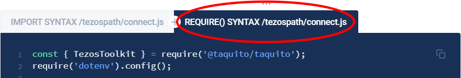

# 1. Connect to a Tezos Node using DataHub

## Introduction

In this series of tutorials, we will cover everything from connecting to a Tezos node using DataHub;   
to deploying smart contracts using the Tezos-specific LIGO programming language. Tezos is a popular blockchain which has a low environmental impact due to its implementation of Proof-of-Stake \(PoS\) consensus algorithm.

Each tutorial will build upon the same basic design pattern which imports the module dependencies, and initializes the TezosToolkit. There is also an RpcProvider which is used to interact with Tezos, again, via the DataHub infrastructure which saves developers a lot of time and hassle in dealing with the often very particular and time-consuming work of keeping the hardware and software working flawlessly.

## Prerequisites

* A working knowledge of JavaScript.
* [Node.js](https://nodejs.org/en/download/) must be installed - the latest version is preferable, however version 12.22.1 _or greater_ must be installed to make use of ES6 module import syntax. [npm](https://www.npmjs.com/get-npm) \(Node Package Manager\) is installed alongside node.js, however it is still advisable to check for the presence of npm with `npm -v` in the terminal before proceeding. 

## Setup

### Initialize the project directory & install dependencies



```text
mkdir tezospath
cd tezospath
npm init -y
npm install --save dotenv ora @taquito/taquito @taquito/rpc @taquito/signer
```



This creates our project directory, changes into it \(making it the working directory\), then runs npm, the [Node Package Manager](https://npmjs.org) with the `-y` flag to generate a default `package.json` . Next we will install the  dependencies of this project, [dotenv](https://www.npmjs.com/package/dotenv) as well as [ora](https://github.com/sindresorhus/ora) - a terminal spinner library to keep us company during the block confirmation times - then finally the relevant portions of the [Taquito](https://tezostaquito.io/) library for its powerful API.   
  
The project directory should now contain several files and directories in the following structure :

```text
+-- /tezospath
    |
    +-- package.json
    |
    +-- package-lock.json
    |
    +-- /node_modules
        |
        +-- /@taquito  
        +-- /dotenv
        +-- /ora
```

There will be more subdirectories in `node_modules` because both ora and Taquito have their own dependencies. Since we used the `--save` flag when installing it is much easier to see which dependencies are installed by looking inside the `package.json`.

```text

```

### Create .env & .gitignore

Create a new `.env` file and paste the following environment variables into it :



```bash
DATAHUB_URL=https://tezos--rpc--florencenet--full.datahub.figment.io/apikey/API_KEY
TEZOS_TESTNET_NODE_URL=https://api.tez.ie/rpc/florencenet
TEZOS_BAKER_ADDRESS='tz1aWXP237BLwNHJcCD4b3DutCevhqq2T1Z9'
```



We must replace `API_KEY` at the end of the DataHub URL with a valid API key from the  
[Services Dashboard](https://datahub.figment.io/services/tezos) on DataHub. Refer to [this guide](../../../extra-guides/dotenv-and-.env.md) on `.env` files for more information if this is unclear.

Also create a new file called `.gitignore` and type in `.env` on a line by itself. This will prevent our API key from being leaked to a public code repository by accident, and is an important safety consideration. 



```text
.env
```



Remember to save both files to disk before proceeding. The directory structure has not changed, so the new files inside the project directory will now be :

```text
+-- /tezospath
    |
    +-- .env
    |
    +-- .gitignore
    |
    +-- package.json
    |
    +-- package-lock.json
    |
    +-- /node_modules
        |
        +-- /@taquito  
        +-- /dotenv
        +-- ...  
```

One last thing : 

* _**If we are choosing to use the more modern ES6**_ **`import`** _**syntax**_, we will need to add a line to our `package.json` to prevent a`SyntaxError: Cannot use import statement outside a module` . The `import` keyword was [introduced in Node.js v12](https://thecodebarbarian.com/nodejs-12-imports#:~:text=js%20introduced%20experimental%20support%20for,both%20of%20the%20below%20items.), a language feature to simplify the use of modules. Alternatively, we could use an `.mjs` file extension for all of the pathway files, however adding this line to `package.json` enables us to keep the `.js` file extension : 



```javascript
"type": "module",
```



* _**If we choose to use the more common `require()` syntax**_, the line above is unnecessary.  The relevant code blocks throughout the tutorial will have an additional tab which illustrates the `require()` syntax. 

For maximum developer happiness, choose _**ONE**_  and use it throughout the tutorial or there _will_ be errors. 



Now that this is complete, we are set up and ready to make our connection to a Tezos node using the TaquitoToolkit and DataHub.

## Connecting to a Tezos node 

In this tutorial we will learn how to connect to a Tezos node via DataHub, using functions from the [Taquito](https://tezostaquito.io/) 1JavaScript library. In the Introduction, we set up the project directory and installed the Taquito library into our project using the node package manager. 


Create a new file called `connect.js` and paste the following code \(depending on which module syntax we have decided to use\) :



```javascript
import dotenv from 'dotenv';
import { TezosToolkit } from '@taquito/taquito';
dotenv.config();

async function main() {
  const Tezos = new TezosToolkit(process.env.DATAHUB_URL);

  // 1. use getBalance for a particular account
  Tezos.tz
    .getBalance(process.env.TEZOS_BAKER_ADDRESS)
    .then((balance) => {
      console.log(`Balance is ${balance.toNumber() / 1000000} ꜩ`)
    }).catch((error) => console.log(JSON.stringify(error)));
}

main();
```



```javascript
const { TezosToolkit } = require('@taquito/taquito');
require('dotenv').config();

async function main() {
  const Tezos = new TezosToolkit(process.env.DATAHUB_URL);

  // 1. use getBalance for a particular account
  Tezos.tz
    .getBalance(process.env.TEZOS_BAKER_ADDRESS)
    .then((balance) => {
      console.log(`Balance is ${balance.toNumber() / 1000000} ꜩ`)
    }).catch((error) => console.log(JSON.stringify(error)));
}

main();
```



The necessary code to interact with Tezos via the Toolkit & ultimately RPC is minimal. By instantiating the Toolkit in this manner, we can re-use the constant name `Tezos`  as our connection to the stable infrastructure provided by the DataHub endpoint. 

`getBalance()` is one of many functions defined by the Taquito API. It takes an address, in this case we are supplying the address of a Tezos baker \(`tz1aWXP237BLw...`\) through an environment variable contained in `.env`. In a production environment, this would quite likely be a dynamic value.

Run the code with `node connect.js` :



```text
Balance is 5307561.462379 ꜩ
```



This is the balance of one of the Florence testnet Bakers. The reported balance will be different than this example, of course.

## Troubleshooting


**Here is a list of potential errors and how to address them** :

* If the only output is `{}` this indicates an empty `error` object being returned. The most likely cause of this would be a missing `DATAHUB_URL`. Related to the `DATAHUB_URL`,  
  a `401 - Unauthorized` response would indicate an invalid DataHub API key.

 

* If the value supplied to `getBalance()`is missing,  a`400` - `Bad Request` error indicates that the value cannot be parsed.

  ```text
  {
    "message": "Http error response: (400) Failed to parsed an argument in path. After \"chains/main/blocks/head/context/contracts/undefined\", the value \"Cannot parse contract id\" is not acceptable for type \"contract_id\"",
    "status": 400,
    "statusText": "Bad Request",
    "body": "Failed to parsed an argument in path. After \"chains/main/blocks/head/context/contracts/undefined\", the value \"Cannot parse contract id\" is not acceptable for type \"contract_id\"",
    "url": "https://tezos--rpc--archive.datahub.figment.io/apikey/92300cde600f7798b2efe2e826b864c8/chains/main/blocks/head/context/contracts/undefined/balance",
    "name": "HttpResponse"
  }
  ```

  The value we are referencing is the `FIGMENT_BAKER_ADDRESS` , therefore we must ensure that the proper environment variable exists in `.env` 


## Next Steps

We can now proceed to creating an account for use on the Tezos testnet.

In the next tutorial, we will be creating our first Tezos account on the Florence Testnet, and funding it with some test tokens.

If you had any difficulties following this tutorial or simply want to discuss Tezos tech with us you can join [**our community**](https://discord.gg/fszyM7K) today! Head over to the [**community forums**](https://community.figment.io) for more in depth discussion and to contribute to the web3 knowledgebase.

