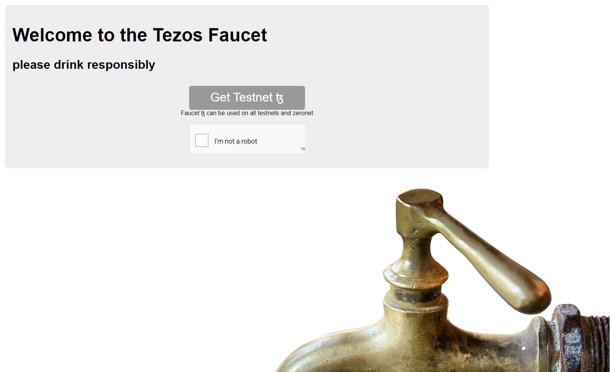
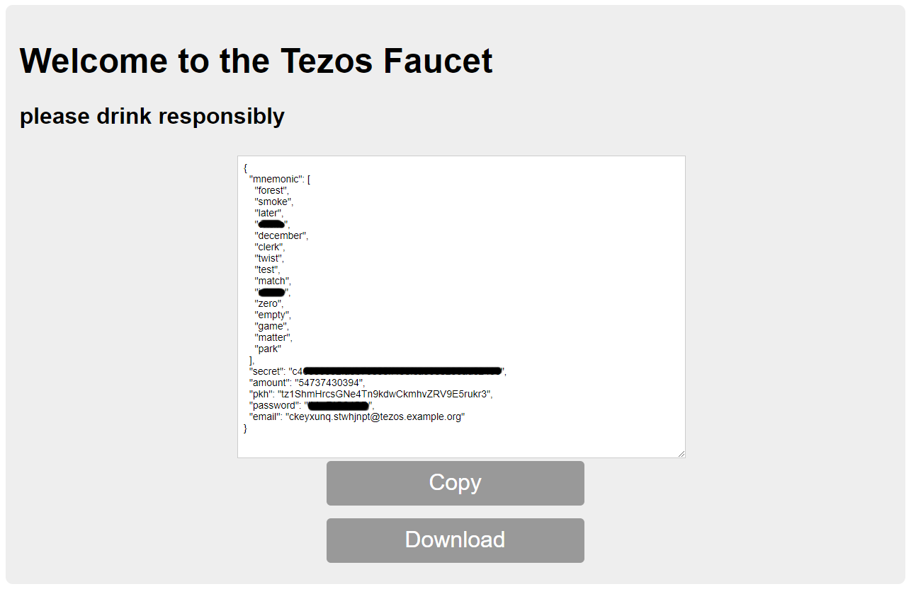
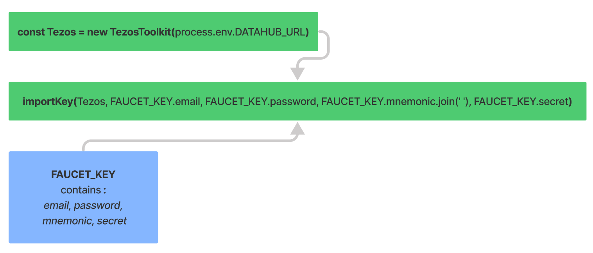

# 2. Create & Fund a testnet Tezos account

## Introduction

A faucet is a way for users to acquire some amount of tokens on a blockchain, typically on a test network, such as the Florence testnet for Tezos. The tokens from the faucet we will be using in this tutorial are not equivalent to the tez on mainnet - there is a difference in how the accounts are derived.

Take all available precautions when dealing with crypto assets. Keeping mnemonic seed phrases and private cryptographic keys safe is an important consideration when dealing with any blockchain, Tezos is no exception.



## Visit the Tezos Faucet

Visit the site [https://faucet.tzalpha.net/](https://faucet.tzalpha.net/) to generate a mnemonic and get some [testnet](https://tezos.gitlab.io/introduction/test_networks.html#florencenet) ꜩ \(tez\).



Show the CAPTCHA who is boss, then click the 'Get Testnet ꜩ' button.  
This will provide a 12-word mnemonic seed phrase and related account details, supplying them to us in JSON format inside a textarea in the browser window, as shown below.



If we choose to download, the filename will match the _public key hash_ \(pkh\) and have a `.json` extension, for example :`tz1LS3AJW2esD13RTgmM2LDtATX8p3tfwCLU.json` .

Create a new file called `account.js` and paste the following code. We will explain it below.



```javascript
let FAUCET_KEY;
export default FAUCET_KEY =
```



We will then need to copy the Faucet Key object, which is everything displayed in the textarea on the faucet website \(or everything in the downloaded `.json` file\) - **including** both the opening _and_ closing curled brackets `{ }`. Then paste it into `account.js` after the [assignment operator](https://developer.mozilla.org/en-US/docs/Web/JavaScript/Reference/Operators/Assignment) '='. Remember to save the file once the Faucet Key is in place.

## Import a Faucet Key

Next, make a new file called `importkey.js` and paste the following code :



```javascript
import dotenv from 'dotenv';
import { TezosToolkit } from '@taquito/taquito';
import { importKey } from '@taquito/signer';
import FAUCET_KEY from './account.js';
dotenv.config();

async function main() {
  const Tezos = new TezosToolkit(process.env.DATAHUB_URL);

  console.log(`Importing account ${FAUCET_KEY.pkh}`);

  importKey(
    Tezos,
    FAUCET_KEY.email,
    FAUCET_KEY.password,
    FAUCET_KEY.mnemonic.join(' '),
    FAUCET_KEY.secret
  ).catch((error) => {
    console.log(JSON.stringify(error, null, 2))
  })
}

main();
```




The `importKey()` function imports our key to sign operations, with the side-effect of  
setting the Tezos instance to use the `InMemorySigner` provider. This is OK for development, however when moving to a production environment it will be necessary to specify a different provider.


`importKey()` takes the following parameters :

* `toolkit` ... This must be an instance of the `TezosToolkit`. We have one : `Tezos`
* `privateKeyOrEmail` ... The private key
* `passphrase` ... The passphrase used to decrypt the keypair. Since we are using a Faucet Key this has already been determined.
* `mnemonic` ... Use of `.join(' ')` places the array elements of the mnemonic together in a string, with the blank space as a separator. 
* `secret` ... This must be a secret which matches the mnemonic.



Run the code with `node importkey.js` :



```text
Importing account tz1NCK57Hr6yisdP8N66vAEw5Q7Jq3VhyDir
```




Be aware that this step can take several moments to complete. Be patient!


## Troubleshooting


**Here is a list of potential issues and how to address them** :


**No error will be thrown and no output in the terminal**  
It is possible to run this code with an invalid or incorrectly formatted BIP39 mnemonic, so we should only use Faucet Keys that come from [https://faucet.tzalpha.net/](https://faucet.tzalpha.net/). No error will be thrown and the terminal output will not change if the mnemonic is incorrect \(i.e. if any of the words are not valid BIP39 words\). In the case of importKey\(\) it only returns a Promise which represents the completion of an asynchronous operation.

**ReferenceError: Tezos is not defined**  
It indicates an issue with the `TezosToolkit`. Check the lines where the toolkit is imported, and where it is instantiated : `const Tezos = new TezosToolkit(process.env.DATAHUB_URL)`

## Next Steps

We can now proceed to querying a Tezos node for blockchain specific information such as the chain constants, block headers, and information about delegators and bakers.

In the next tutorial, we will be querying a Tezos node using DataHub on the Florence Testnet, to determine specific information about the blockchain as well as the blocks being baked on Tezos.

If you had any difficulties following this tutorial or simply want to discuss Tezos with us you can join [**our Discord**](https://discord.gg/fszyM7K) or head over to our ****[**community forums**](http://community.figment.io)**.**

