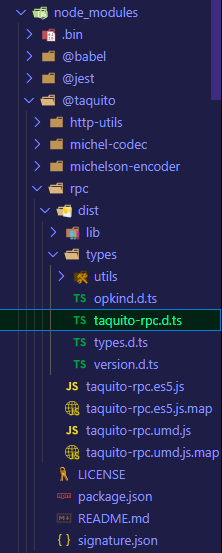

# 3. Query a Tezos node using DataHub

## Introduction

In this tutorial we will cover the basics of the RPC package of Taquito. RPC is a[ request–response](https://en.wikipedia.org/wiki/Request%E2%80%93response) protocol. An RPC is initiated by the client, which sends a request message to a known remote server to execute a specified procedure with supplied parameters. Through the methods available to Taquito's RpcClient, we can query a wealth of information from a Tezos node, including the Delegate and Baker information. We will cover some examples of the output from these queries and examine some of the data.



## Using RpcClient to perform queries

Create a new file called `query.js` and paste the following code. We will explain it below.



```javascript
import dotenv from 'dotenv';
import { RpcClient } from '@taquito/rpc';
dotenv.config();

async function main() {
  const client = new RpcClient(process.env.DATAHUB_URL);
  
  // 1. Get chain constants
  await client.getConstants().then((data) => {
    console.log('-- Constants: ', data) 
  }).catch((err) => console.log(err));

  // 2. Get information about the latest block
  await client.getBlock().then((data) => {
    console.log('-- Chain ID: ', data.chain_id);
    console.log('-- Head block: ', data);
  }).catch((error) => console.log(JSON.stringify(error, null, 2)));

  // 3. Get the Baker that an account has delegated to
  await client.getDelegate(process.env.BAKER_ADDRESS).then((data) => {
    console.log('-- Delegate: ', data);
  }).catch((error) => console.log(JSON.stringify(error, null, 2)));

  // 4. Get information about a Baker
  await client.getDelegates(process.env.BAKER_ADDRESS).then((data) => {
    console.log('-- Baker info: ', data);
  }).catch((error) => console.log(JSON.stringify(error, null ,2)));
}

main();
```




Using the `RpcClient` with the DataHub endpoint, we can easily run many different queries.  
`getConstants()` ,`getBlock()` , `getDelegate()` and `getDelegates()` are only a small number of examples. The full _type definitions,_ a complete listing of all the methods available to `RpcClient` can be found in the `node_modules` subdirectory at :`node_modules/@taquito/rpc/dist/types/taquito-rpc.d.ts` . 



There we can find all of the available methods and their parameters - like `getBlockMetadata()` which returns all the metadata associated with a block;  
 or `injectOperation()` which is used to inject a payload to be broadcast to the network.


Run the code with `node query.js` :



```bash
... <snip>

-- Chain ID:  NetXdQprcVkpaWU
-- Head block:  {
  protocol: 'PsFLorenaUUuikDWvMDr6fGBRG8kt3e3D3fHoXK1j1BFRxeSH4i',
  chain_id: 'NetXdQprcVkpaWU',
  hash: 'BLXVxKkgxws4VvFFJ8aPP3a9kyChoQ8N4VWN2pvmQkePGZoS119',
  header: {
    level: 1470368,
    proto: 9,
    predecessor: 'BLkd1dWiN6pKZtTb5LMBw4fGkuRJuw6zc88rw3rGjahx48GAYh2',
    timestamp: '2021-05-13T22:21:18Z',
    validation_pass: 4,
    operations_hash: 'LLoahscuuHk4Nrrqb7EaicPNoRJpjEGC2vKFHsNCtBnnPr73vzsYQ',
    fitness: [ '01', '00000000000c6fa0' ],
    context: 'CoV4UjWpgiEzTXJkxdh4iWpHPWjJhecAW1HoehizpvbpWs9DWPsE',
    priority: 0,
    proof_of_work_nonce: '31e6641d53d80000',
    seed_nonce_hash: 'nceV9xmB2jJe1ZDk7Fcge3FgkvmJAFdWv5xJcLRKtWNCe5j21m59U',
    signature: 'sigkhwjMaVSGkbJp8saSQrXBMSwkNVRABifXd4RjmdUnjSEaGvfNSZFj9mzUNcy3hMw9VYCWyPpFeWE1F2NkpLaa686HhTwv'
  },
  
... <snip>
```



There will be quite a lot of terminal output when this code is executed. Scroll up in the terminal to see the entire output. There is a wealth of information here, not all of it is immediately useful to new developers however this is the way to look at and engage with the available information.

## Troubleshooting


**Here is a list of potential issues and how to address them** :


**If the terminal output is overwhelming :** It is possible to log only specific properties of an object, such as the error message \(not the entire error object\) for example : `JSON.stringify(error.message, null, 2)`  
This is also true for any of the object properties which exist in the returned values of any of the RPC methods.

## Next Steps

We are now ready to move on to injecting operations into a Tezos node using DataHub

In the next tutorial, we will be creating our first transaction on Tezos, on the Florence Testnet.

If you had any difficulties following this tutorial or simply want to discuss Tezos with us you can join [**our Discord**](https://discord.gg/fszyM7K) ****or head over to our [**community forums**](https://community.figment.io)**.**

