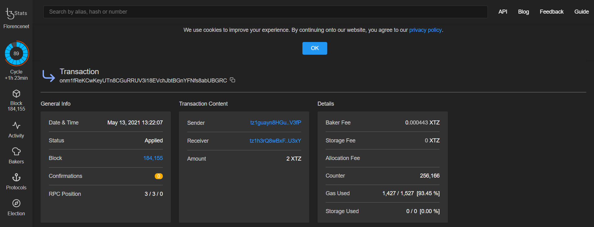

# 4. Inject an operation into a Tezos node using DataHub

To be able to interact with other accounts and send tez, we will want to combine usage of the TezosToolkit and RpcClient. It is the Toolkit which gives us the `transfer()` method, and the RpcClient which gives us 

Create a new file called `send.js` and paste the following code :



```javascript
import dotenv from 'dotenv';
import { TezosToolkit } from '@taquito/taquito';
import { importKey } from '@taquito/signer';
import { RpcClient } from '@taquito/rpc';
import FAUCET_KEY from './account.js';
import ora from 'ora';
dotenv.config();

async function main() {
  const client = new RpcClient(process.env.DATAHUB_URL);
  const Tezos = new TezosToolkit(process.env.DATAHUB_URL);

  // 1. Define relevant constants
  const amount = 0.5;
  const address = 'tz1RcXu53hCWKUU36hSG2y4fAaX8VwAfk2ku';
  const spinner = ora();

  // 2. Import the Faucet Key
  importKey(
      Tezos,
      FAUCET_KEY.email,
      FAUCET_KEY.password,
      FAUCET_KEY.mnemonic.join(' '),
      FAUCET_KEY.secret
  ).catch((error) => console.log(JSON.stringify(error, null, 2)));

  spinner.start();

  // 3. use getBalance for a particular account
  Tezos.tz
    .getBalance(FAUCET_KEY.pkh)
    .then((balance) => {
      spinner.succeed(`Balance of ${FAUCET_KEY.pkh} : ${balance.toNumber() / 1000000} ꜩ`);
      spinner.succeed(`Transferring ${amount} ꜩ to ${address}...`);
      spinner.start()
    }).catch((error) => {
      console.log(JSON.stringify(error, null, 2))
      spinner.fail();
      process.exit(1);
    });
    
    
  // 4. Perform a transfer
  Tezos.contract
    .transfer({
      to: address,
      amount: amount,
      mutez: false
    })
    .then((op) => {
      spinner.succeed(`Waiting for ${op.hash} to be confirmed...`).start()
      return op.confirmation(1).then(() => op.hash);
    }).then((hash) => {
      spinner.succeed(`Operation injected: https://florence.tzstats.com/${hash}`)
      spinner.start();
      Tezos.tz
        .getBalance(FAUCET_KEY.pkh)
        .then((balance) => {
            spinner.succeed(`Post-transfer balance is ${balance.toNumber() / 1000000} ꜩ`)
            process.exit(9);
        }).catch((error) => {
            console.log(JSON.stringify(error, null, 2));
            spinner.fail();
            process.exit(2);
        });
      }).catch((error) => {
          console.log(`Error: ${JSON.stringify(error, null, 2)}`);
          spinner.fail();
          process.exit(3);
      });
}

main();
```



```javascript
const { TezosToolkit } = require('@taquito/taquito');
const { importKey } = require('@taquito/signer');
const { RpcClient } = require('@taquito/rpc');
const FAUCET_KEY = require('./account.js');
const ora = require('ora');
require('dotenv').config();

async function main() {
  const Tezos = new TezosToolkit(process.env.DATAHUB_URL);

  // 1. Define relevant constants
  const amount = 0.5;
  const address = 'tz1RcXu53hCWKUU36hSG2y4fAaX8VwAfk2ku';
  const spinner = ora();

  // 2. Import the Faucet Key
  importKey(
      Tezos,
      FAUCET_KEY.email,
      FAUCET_KEY.password,
      FAUCET_KEY.mnemonic.join(' '),
      FAUCET_KEY.secret
  ).catch((error) => console.log(JSON.stringify(error, null, 2)));

  // 3. Transfer Tezos to another account
  spinner.start();

  // 3a. use getBalance for a particular account
  Tezos.tz
    .getBalance(FAUCET_KEY.pkh)
    .then((balance) => {
      spinner.succeed(`Balance of ${FAUCET_KEY.pkh} : ${balance.toNumber() / 1000000} ꜩ`);
      spinner.succeed(`Transferring ${amount} ꜩ to ${address}...`);
      spinner.start()
    }).catch((error) => {
      console.log(JSON.stringify(error, null, 2))
      spinner.fail();
      process.exit(1);
    });
    
    
  // 4. Perform a transfer
  Tezos.contract
    .transfer({
      to: address,
      amount: amount,
      mutez: false
    })
    .then((op) => {
      spinner.succeed(`Waiting for ${op.hash} to be confirmed...`).start()
      return op.confirmation(1).then(() => op.hash);
    }).then((hash) => {
      spinner.succeed(`Operation injected: https://florence.tzstats.com/${hash}`)
      spinner.start();
      Tezos.tz
        .getBalance(FAUCET_KEY.pkh)
        .then((balance) => {
            spinner.succeed(`Post-transfer balance is ${balance.toNumber() / 1000000} ꜩ`)
            process.exit(9);
        }).catch((error) => {
            console.log(JSON.stringify(error, null, 2));
            spinner.fail();
            process.exit(2);
        });
      }).catch((error) => {
          console.log(`Error: ${JSON.stringify(error, null, 2)}`);
          spinner.fail();
          process.exit(3);
      });
}

main();

```



We are using `ora` to manage the terminal spinner which functions as an indicator of ongoing activity. There is a flexible [batch API](https://tezostaquito.io/docs/batch_API) available in Taquito as well, but we will just go over a single transaction here. A transfer with Taquito must be supplied a `to` address, an `amount` and optionally, a boolean value for `mutez` which specifies if the amount entered is to be treated as mutez. Thus, only the `Tezos.contract.transfer()` call is required, but we will use the Promise based `.then()` syntax to display the terminal spinner, and check the balance of our account after the transfer. The `.catch()` block will enable us to deal with any errors which may occur and display them to the terminal.


From the ligolang.org [documentation](https://ligolang.org/docs/language-basics/math-numbers-tez/) :

_Tezos tokens can be specified in three ways_

* _Units of millionth of_ `tez`_, using the suffix_ `mutez` _after a natural literal, like_ `10000mutez` _or_ `0mutez`_;_
* _Units of_ `tez`_, using the suffix_ `tz` _or_ `tez`_, like_ `3tz` _or_ `3tez`_;_
* _Decimal amounts of_ `tz` _or_ `tez`_, like_ `12.3tz` _or_ `12.4tez`_._


Run the code with `node send.js` :



```text
✔ Transferring 0.5 ꜩ to tz1LS3AJW2esD13RTgmM2LDtATX8p3tfwCLU
✔ Balance of tz1NCK57Hr6yisdP8N66vAEw5Q7Jq3VhyDir : 23481.305502 ꜩ
✔ Waiting for opGNHBzRWPz5b3HZJvVH5FAAt21oxKajaS7mdeEUpCwYE5YZcpY to be confirmed
✔ Operation injected: https://florence.tzstats.com/...
✔ Post-transfer balance is 23480.805059 ꜩ
```



Some patience may be required, as the transaction may take a few minutes to be confirmed. The `ora` dependency enables us to have a cheerful spinner to keep us company in the terminal and let us know that progress is being made. When the output `Operation injected:` appears, following the link will bring us to the \(testnet specific\) [Florence tzstats.com](https://florence.tzstats.com) block explorer to view information about the completed transaction :



## Troubleshooting


**Here is a list of potential errors and how to address them** :

* 


## Next Steps

We can now proceed to working with LIGO smart contracts on Tezos.

In the next tutorial, we will be deploying a smart contract on the Florence Testnet, then we will interact with it via the Tezos contract API.

If you had any difficulties following this tutorial or simply want to discuss Tezos tech with us you can  
join [**our community**](https://discord.gg/fszyM7K) today! Head over to the [**community forums**](https://community.figment.io) for more in depth discussion and to contribute to the web3 knowledgebase.

