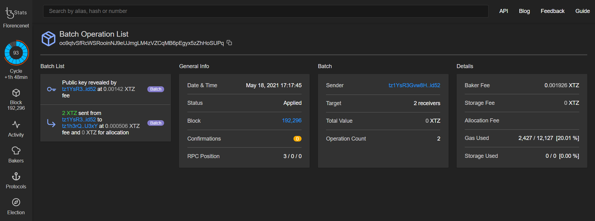

# 4. Inject an operation into a Tezos node using DataHub

## Introduction

In this tutorial we will learn how to transfer an amount of Tezos tokens from our account to another account. Token transfers are the simplest function on most blockchains, and one of the most common. 

The role of TezosToolkit here is to provide a simplified way of dealing with the lifecycle of an RPC request. It would be possible to implement the transfer functionality for ourselves, however it is preferable to utilize the toolkit for the flexible functionality and ease of use that it provides.  
****



## Transferring Tezos tokens

To be able to interact with other accounts and send tez, we will use the Taquito API. It is the toolkit which gives us the `transfer()` method.

Create a new file called `send.js` and paste the following code. We will explain it below.



```javascript
import dotenv from 'dotenv';
import { TezosToolkit } from '@taquito/taquito';
import { importKey } from '@taquito/signer';
import FAUCET_KEY from './account.js';
dotenv.config();

async function main() {
  const Tezos = new TezosToolkit(process.env.DATAHUB_URL);
  
  const AMOUNT_TO_SEND = 2;
  const RECIPIENT = 'tz1RcXu53hCWKUU36hSG2y4fAaX8VwAfk2ku';
  
  importKey(
    Tezos,
    FAUCET_KEY.email,
    FAUCET_KEY.password,
    FAUCET_KEY.mnemonic.join(' '),
    FAUCET_KEY.secret
  ).catch((error) => console.error(error, null, 2));

  console.log(`Transfering ${AMOUNT_TO_SEND} ꜩ to ${RECIPIENT}...`);
  Tezos.contract
    .transfer({ to: RECIPIENT, amount: AMOUNT_TO_SEND })
    .then((operation) => {
      console.log(`Waiting for ${operation.hash} to be confirmed...`);
      return operation.confirmation(1).then(() => operation.hash);
    })
    .then((hash) => console.log(`Operation injected: https://florence.tzstats.com/${hash} ...`))
    .catch((error) => console.log(`Error: ${JSON.stringify(error, null, 2)}`));
}

main();
```



There is a [batch API](https://tezostaquito.io/docs/batch_API) available in Taquito for sending multiple transactions at once, but we will just go over a single transaction here. A transfer with Taquito must be supplied a recipient address, and an amount of tez to be transferred. Optionally, a boolean value for `mutez` which specifies if the amount entered is to be treated as mutez \(micro-tez\). The `.then()` and `.catch()` blocks will enable us to perform the console logging and deal with any errors which may occur, displaying them to the terminal.


From the ligolang.org [documentation](https://ligolang.org/docs/language-basics/math-numbers-tez/) :

_Tezos tokens can be specified in three ways_

* _Units of millionth of_ `tez`_, using the suffix_ `mutez` _after a natural literal, like_ `10000mutez` _or_ `0mutez`_;_
* _Units of_ `tez`_, using the suffix_ `tz` _or_ `tez`_, like_ `3tz` _or_ `3tez`_;_
* _Decimal amounts of_ `tz` _or_ `tez`_, like_ `12.3tz` _or_ `12.4tez`_._


Run the code with `node send.js` :



```text
Transfering 2 ꜩ to tz1h3rQ8wBxFd8L9B3d7Jhaawu6Z568XU3xY...
Waiting for oo9qtvSfRcWSRooinNJ9eUJmgLM4zVZCqMB6pEgyx5zZhHoSUPq to be confirmed...
Operation injected: https://florence.tzstats.com/ ...
```



Some patience may be required, as the transaction may take a few minutes to be confirmed. We need to wait for a baker to include our transaction in the next block, and return to us a hash of the transaction. When the output `Operation injected:` appears, following the link will bring us to the \(testnet specific\) [Florence tzstats.com](https://florence.tzstats.com) block explorer to view information about the completed transaction:



This batch operation is meant to occur, although we did not use the batch API in this case. You can read more about wallet operations such as revealing public keys [here](https://tezosguides.com/wallet_integration/basics/operations/#reveal). Reveal is the first operation that needs to be sent from a new address. This will reveal the public key associated with an address, so that anyone can verify the signature for the operation and any future operations. The reveal will only happen once per account.

## Troubleshooting

_Coming soon._

## Next Steps

We can now proceed to working with LIGO smart contracts on Tezos.

In the next tutorial, we will be deploying a smart contract on the Florence Testnet, then we will interact with it via the Tezos contract API.

If you had any difficulties following this tutorial or simply want to discuss Tezos with us you can join [**our Discord**](https://discord.gg/fszyM7K) ****or head over to our [**community forums**](https://community.figment.io)**.**

