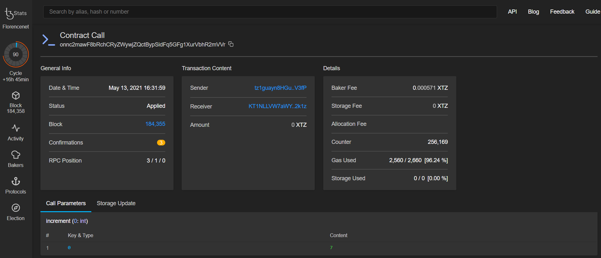

# 5. Working with LIGO Smart Contracts on Tezos

## LIGO and Michelson

Although it is beyond the scope of this tutorial to teach the specific syntax of LIGO or Michelson, we will cover the deployment of compiled Michelson code to Tezos. There are three different flavors of [LIGO](https://ligolang.org/docs/intro/introduction/), the one we will focus on in this tutorial is [ReasonLIGO](https://ide.ligolang.org/) because it is very similar in syntax to JavaScript. This is because it is based on a popular modelling language called [ReasonML](https://reasonml.github.io/docs/en/what-and-why).

For curious readers, there are many interesting things to be learned about these languages with the resources in the [References](references.md) section.  
  
This is the same code used in the  ReasonLIGO documentation as an example smart contract :



```javascript
type storage = int;

/* variant defining pseudo multi-entrypoint actions */

type action =
  | Increment(int)
  | Decrement(int);

let add = ((a,b): (int, int)): int => a + b;
let sub = ((a,b): (int, int)): int => a - b;

/* real entrypoint that re-routes the flow based on the action provided */

let main = ((p,storage): (action, storage)) => {
  let storage =
    switch (p) {
    | Increment(n) => add((storage, n))
    | Decrement(n) => sub((storage, n))
    };
  ([]: list(operation), storage);
};
```



Although similar in some ways to JavaScript, ReasonLIGO is based on [ReasonML](https://reasonml.github.io/) and as such does not have the same language features or exact syntax. The above contract is dissected and explained quite well in the [official ligolang.org documentation](https://ligolang.org/docs/advanced/first-contract), so we will not get into detail here.

When compiled to [Michelson](https://tezos.gitlab.io/michelson-reference/) code, it looks like this :

```ocaml
parameter (or (int %decrement) (int %increment)) ;
storage int ;
code { UNPAIR ; IF_LEFT { SWAP ; SUB } { ADD } ; NIL operation ; PAIR }
```

`%increment` and `%decrement` clearly match the Increment and Decrement actions from the original ReasonLIGO code. These are effectively the method names we will use to _call_ the functionality of the contract.


From the [tezos.gitlab.io](https://tezos.gitlab.io/introduction/howtouse.html#transfers-and-receipts) documentation : 

_A Michelson contract is expressed as a pure function, mapping a pair_ `(parameter, storage)` _to a pair_ `(list_of_operations, storage)`_. However, when this pure function is applied to the blockchain state, it can be seen as an object with a single method taking one parameter_ \(`parameter`\)_, and with a single attribute_ \(`storage`\)_. The method updates the state_  
 \(the storage\)_, and submits operations as a side effect._


Michelson code is made up of sequential instructions like `UNPAIR` and `IF_LEFT` . It is not necessary to learn the specifics of Michelson code unless formally verifying contracts or performance tuning, so do not be overly concerned with this syntax for now. Reading documentation and further experimentation is a great way to learn. 

We will now compose the Michelson code into JSON format prior to deploying it. 

Create a new file called `counter.js` and paste the following code :



```go
let CONTRACT_JSON;

export default CONTRACT_JSON = [ { "prim": "parameter",
    "args":
      [ { "prim": "or",
          "args":
            [ { "prim": "int", "annots": [ "%decrement" ] },
              { "prim": "int", "annots": [ "%increment" ] } ] } ] },
  { "prim": "storage", "args": [ { "prim": "int" } ] },
  { "prim": "code",
    "args":
      [ [ { "prim": "UNPAIR" },
          { "prim": "IF_LEFT",
            "args":
              [ [ { "prim": "SWAP" }, { "prim": "SUB" } ],
                [ { "prim": "ADD" } ] ] },
          { "prim": "NIL", "args": [ { "prim": "operation" } ] },
          { "prim": "PAIR" } ] ] } ]
```



Although this file has a `.js` file extension, it is not really the JavaScript we are concerned with. Here we are looking at the JSON formatted Michelson code shown earlier. This is our smart contract, ready to be sent down the wire. The formatting and indentation are largely for readability, although it may make it slightly difficult to follow. Let us break it down quickly for better understanding :

The `[ ]` square brackets denote an array, which is comprised of `{ }` objects that contain `"key": "value pairs"`. Where it may become confusing is at the end of lines, where there are alternating `]` and `}` brackets - Do not be thrown off by this. Every open bracket will have a matching bracket to close the scope of whatever is inside. This formatting is also not something that needs to be done manually. This can be automatically generated by selecting to output the Michelson in JSON format on [https://ide.ligolang.org/](https://ide.ligolang.org/) .

We can now easily deploy our compiled smart contract to Tezos using a few simple lines of JavaScript.

## Deploy a compiled Michelson contract to Tezos

Create a new file called `deploy.js` and paste the following code :



```javascript
import dotenv from 'dotenv';
import { TezosToolkit } from '@taquito/taquito';
import { InMemorySigner, importKey } from '@taquito/signer';
import FAUCET_KEY from './faucet.js';
import CONTRACT_JSON from './counter.js';
import ora from 'ora';
dotenv.config();

async function main() {
  const Tezos = new TezosToolkit(process.env.DATAHUB_URL);
  const spinner = ora(); 

  // 1. Deploy the contract
  spinner.start();
  importKey(
    Tezos,
    FAUCET_KEY.email,
    FAUCET_KEY.password,
    FAUCET_KEY.mnemonic.join(" "),
    FAUCET_KEY.secret
  ).then(async () => {
    return Tezos.contract.originate({
      code: CONTRACT_JSON,
      storage: 0
    })
  }).then((op) => {
    return op.contract()
  }).then((contract) => {
    spinner.succeed(`Deployed at: ${contract.address}`);
    process.exit(0)
  }).catch((error) => {
   spinner.fail(`Error: ${JSON.stringify(error, null, 2)}`);
   process.exit(0);
  });
}

main();
```



```javascript
const { TezosToolkit } = require('@taquito/taquito');
const { importKey } = require('@taquito/signer');
const { RpcClient } = require('@taquito/rpc');
const FAUCET_KEY = require('./account.js');
const CONTRACT_JSON = require('./counter.js');
require('dotenv').config();

async function main() {
  const Tezos = new TezosToolkit(process.env.DATAHUB_URL);
  const spinner = ora(); 

  // 1. Deploy the contract
  spinner.start();
  importKey(
    Tezos,
    FAUCET_KEY.email,
    FAUCET_KEY.password,
    FAUCET_KEY.mnemonic.join(" "),
    FAUCET_KEY.secret
  ).then(async () => {
    return Tezos.contract.originate({
      code: CONTRACT_JSON,
      storage: 0
    })
  }).then((op) => {
    return op.contract()
  }).then((contract) => {
    spinner.succeed(`Deployed at: ${contract.address}`);
    process.exit(0)
  }).catch((error) => {
   spinner.fail(`Error: ${JSON.stringify(error, null, 2)}`);
   process.exit(0);
  });
}

main();
```



The asynchronous code here can be slightly confusing because of the [method chaining](https://x-team.com/blog/javascript-method-chaining/) `.then()` syntax, however it is logically broken down in sequence : 

* `importKey()` has the side effect of setting the TezosToolkit instance to use the `InMemorySigner` provider.
* _then_ an __asynchronous, anonymous arrow function expression will execute the `Tezos.contract.originate()` __function_._ This deploys the Michelson contract code to the Tezos blockchain, from the `CONTRACT_JSON` in `counter.js`. The storage property is also set to `0`.
* _then_ the resulting operation \(`op`\) object is used to provide the contract abstract \(`.contract()`\) of the newly originated contract. _See below_ for an example of what this looks like.
* _then_ the contract abstract can be logged, along with specific properties such as the deployment address.
* catch any potential errors and pass them through `JSON.stringify` for formatting when logging the error to the terminal.

Notice that each instance of `.then()` is passing along its return value to the next one in the chain. The final `.then()` statement where the console logging occurs does not have a return value, thus `.catch()` will be used next to handle any errors which may occur.  

Run the code with `node deploy.js` . Be aware that it may take several moments for the deployment to complete :



```ocaml
✔ Deployed at: KT1CGobBo8pUX8E676KYCpc8waBLUiUxk223
```



To get more verbose output we would simply console log the `contract` object instead of the `contract.address`

## Interact with a deployed contract

Create a new file called `call.js` and paste the following code :



```javascript
import dotenv from 'dotenv';
import { TezosToolkit } from '@taquito/taquito';
import { importKey } from '@taquito/signer';
import FAUCET_KEY from './faucet.js';
import ora from 'ora';

// Load environment variables
dotenv.config();

async function main() {
  const Tezos = new TezosToolkit(process.env.DATAHUB_URL);
  const spinner = ora(); 
  
  // 1. Import the Faucet Key
  spinner.start();
  importKey(
    Tezos,
    FAUCET_KEY.email,
    FAUCET_KEY.password,
    FAUCET_KEY.mnemonic.join(" "),
    FAUCET_KEY.secret
  ).then(async () => {
    // Replace with deployed contract address :
    return Tezos.contract.at('KT1ECSt8FzxAtHxoxi4xN1JwkKUbBe4TS9kz')
  }).then((contract) => {
    const i = 7;
    spinner.succeed(`Incrementing storage value by ${i}`);
    return contract.methods.increment(i).send();
  }).then((op) => {
    spinner.succeed(`Awaiting confirmation of ${op.hash}`);
    return op.confirmation(3).then(() => op.hash);
  }).then((hash) => {
    spinner.succeed(`Operation injected: https://florence.tzstats.com/${hash}`)
  }).catch((error) => {
    spinner.fail(`Error: ${JSON.stringify(error, null, 2)}`)
  });
}

main();
```



```javascript
const { TezosToolkit } = require('@taquito/taquito');
const { importKey } = require('@taquito/signer');
const FAUCET_KEY = require('./account.js');
const ora = require('ora');
require('dotenv').config();

// Load environment variables
dotenv.config();

async function main() {
  const Tezos = new TezosToolkit(process.env.DATAHUB_URL);
  const spinner = ora(); 
  
  // 1. Import the Faucet Key
  spinner.start();
  importKey(
    Tezos,
    FAUCET_KEY.email,
    FAUCET_KEY.password,
    FAUCET_KEY.mnemonic.join(" "),
    FAUCET_KEY.secret
  ).then(async () => {
    // Replace with deployed contract address :
    return Tezos.contract.at('KT1ECSt8FzxAtHxoxi4xN1JwkKUbBe4TS9kz')
  }).then((contract) => {
    const i = 7;
    spinner.succeed(`Incrementing storage value by ${i}`);
    return contract.methods.increment(i).send();
  }).then((op) => {
    spinner.succeed(`Awaiting confirmation of ${op.hash}`);
    return op.confirmation(3).then(() => op.hash);
  }).then((hash) => {
    spinner.succeed(`Operation injected: https://florence.tzstats.com/${hash}`)
  }).catch((error) => {
    spinner.fail(`Error: ${JSON.stringify(error, null, 2)}`)
  });
}

main();
```



We must supply the address of our newly deployed contract to `Tezos.contract.at(' ')` , placing it between the `' '` single quotes. Failure to maintain both single quotes will cause a `SyntaxError: Invalid or unexpected token` when the code is run. Supplying an address _without_ quotes will log an empty error object : `Error: {}` when run.

Next, using `contract.methods.increment(i).send()` will pass a value of 7 to the `increment()` method of the deployed contract. The operation \(op\) is then available and we can retrieve the hash with `op.hash`. The return value, `op.confirmation(3).then(() => op.hash)` is a bit of a clever way to express waiting for 3 block confirmations before returning the hash. `confirmation()` optionally takes interval and timeout values, however we are not using them here.

Run the code with `node call.js` . Be aware that it may take several moments to be confirmed, though the ora spinner will indicate that the process is ongoing :



```bash
✔ Incrementing storage value by 7
✔ Awaiting confirmation of oo1dKmibBsHeFgxg6TzE2mDSxQyhXsbFtbsYtsVAQ6UvsQLTrPL
✔ Operation injected: https://florence.tzstats.com/...
```





## Example contract abstraction



```ocaml
ContractAbstraction {
  address: 'KT1CGobBo8pUX8E676KYCpc8waBLUiUxk223',
  script: { code: [ [Object], [Object], [Object] ], storage: { int: '0' } },
  storageProvider: <ref *1> RpcContractProvider {
    context: Context {
      _rpc: 'https://api.tez.ie/rpc/florencenet',
      _signer: [InMemorySigner],
      _proto: undefined,
      _config: [Object],
      tz: [RpcTzProvider],
      estimate: [RPCEstimateProvider],
      contract: [Circular *1],
      batch: [RPCBatchProvider],
      wallet: [Wallet],
      _rpcClient: [RpcClient],
      _forger: [RpcForger],
      _injector: [RpcInjector],
      operationFactory: [OperationFactory],
      _walletProvider: [LegacyWalletProvider],
      _parser: [MichelCodecParser],
      _packer: [RpcPacker]
    },
    estimator: RPCEstimateProvider {
      context: [Context],
      ALLOCATION_STORAGE: 257,
      ORIGINATION_STORAGE: 257
    },
    contractProviderTypeSymbol: Symbol(taquito--provider-type-symbol)
  },
  entrypoints: { entrypoints: { increment: [Object], decrement: [Object] } },
  chainId: 'NetXxkAx4woPLyu',
  methods: { increment: [Function: method], decrement: [Function: method] },
  views: {},
  schema: Schema {
    root: IntToken {
      val: [Object],
      idx: 0,
      fac: [Function: createToken],
      createToken: [Function: createToken]
    },
    [Symbol(taquito-schema-type-symbol)]: true
  },
  parameterSchema: ParameterSchema {
    root: OrToken {
      val: [Object],
      idx: 0,
      fac: [Function: createToken],
      createToken: [Function: createToken]
    }
  }
}
```



## Troubleshooting


**Here is a list of potential errors and how to address them** :

* 


## Conclusion

In this tutorial we have covered the basics of LIGO, which comes in three different flavours. We also illustrated the ease of deploying compiled Michelson code to Tezos using the Taquito API. 

## Next Steps

Congratulations! We have completed the Tezos Pathway, all the way from initial setup to being able to deploy smart contracts. We are now empowered to learn and build on Tezos, using the dedicated infrastructure of DataHub. It is time to head to the References section and explore the LIGO documentation, or perhaps dive straight into the RPC documentation. For more savvy developers who are already eager to get started on their next dapp on Tezos to earn **$20 worth of TEZ**, we welcome everyone who is interested to join the Figment Learn community today!

If you had any difficulties following this tutorial or simply want to discuss Tezos tech with us you can join us on our ****[**developer discord**](https://discord.gg/fszyM7K) ****or ****head over to the [**community forums**](https://community.figment.io) for more in depth discussion and to contribute to the web3 knowledgebase.

